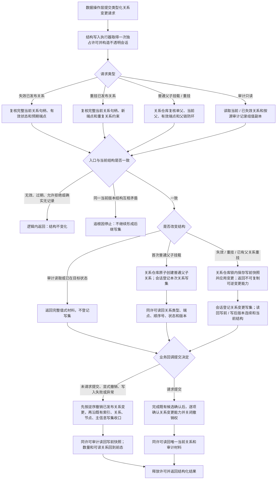

# 已发布关系可逆换代与普通父子重挂代码逻辑流程图 v0.1

更新时间：2026-07-14

## 依据

```text
AGENTS.md
规范/4010_子规范_统一仓库稳定句柄与通用关系索引边界.md
规范/4040_子规范_不透明结构事务候选确认撤销与最后发布.md
规范/5110_子规范_需求树生长机制_20260720.md
规范/5230_子规范_任务筹办与执行边界_20260720.md
规范/5300_子规范_方法登记选择与执行规则_20260720.md
规范/详细设计/仓库底层与服务数据操作分层纠偏详细设计.md
规范/详细设计/需求父子原子挂载与重挂详细设计.md
规范/详细设计/通用方法召回登记规格索引复判排序详细设计.md
海中鱼巣/核心/关系仓库.h
海中鱼巣/核心/关系仓库.cpp
海中鱼巣/核心/会话.结构写入.ixx
实施记录/20260714_SERVICE-DATA-S5_需求任务方法旧计划归并与实际接口复核_Codex断点清单.md
```

## 说明

本图表达 `#277 / CORE-SESSION-S4` 的窄核心前置。当前不透明结构写入会话能创建并精确撤销本次主信息、节点、关系、索引和候选 I64 写集，但不能在同一独占许可内安全地失效或重挂已经发布的关系，也不能把普通父子首次挂载 / 重挂纳入会话收口。

需求父子更新、任务生命周期换代、重筹办失效旧方法选择和方法生命周期重挂都依赖该能力。旧带令牌关系入口不能直接暴露给新服务层，也不能在数据操作层通过无令牌路径嵌套取得许可。

## 流程图



## 非成功返回二分

```text
逻辑内返回：
- 无效句柄、错误仓库、版本过期、错误端点、重复关系、普通父子自身挂载或成环。
- 当前父已经是目标父，或关系已经由业务层判定为无需再次变更。
- 审计读取确实没有指定记录。
- 全部发生在结构变化前，或只返回幂等值式材料。

追根因解决：
- 当前完整句柄、仓库当前记录、审计记录和端点互相矛盾。
- 关系变更后版本不单调、状态 / 端点不符合请求或普通父子出现多父。
- 撤销后写前记录、版本、端点、状态、有效关系数量或正反向读取不能回到前态。
- 会话释放许可前无法确认或撤销可逆变更能力。
```

## 关键边界

```text
1. 可逆变更能力只服务已发布关系的调用期收口，不是新的关系事实、关系候选类型或领域授权。
2. 能力不可默认构造、不可复制，移动后源对象失效；析构不得隐式写仓库。
3. 失效 / 重挂在关系仓库锁内保存精确写前和写后记录；撤销只接受同仓库、同完整令牌和精确写后版本。
4. 普通父子单父和防环继续由关系仓库裁决，领域服务不得重复实现移动算法。
5. 会话不导出原始令牌、许可、仓库、锁、可变记录或恢复函数。
6. 普通删除继续使用独占严格删除合同；本批不增加删除恢复，不修改旧共享兼容入口。
7. 不修改结构事务协调器、事务接线或许可强度，不新增线程、异步、工作队列或缓存。
8. 本图不实施需求、任务、方法业务，不登记 757 或 760。
```
