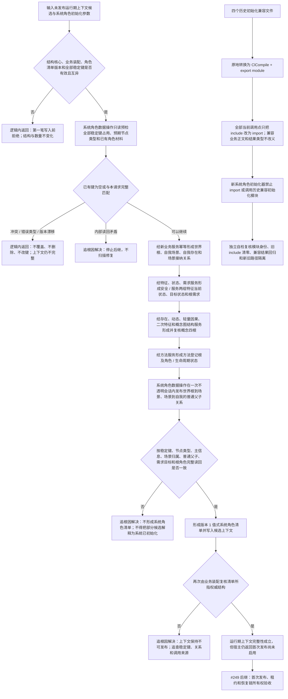

# 系统角色初始化与历史兼容初始化调用迁移代码逻辑流程图

更新时间：2026-07-14

## 依据

```text
AGENTS.md
规范/仓库与服务分层事务边界规范.md
规范/代码文件建立归属与模块命名规范.md
规范/详细设计/运行期组合器与线程路由去令牌详细设计.md
计划/已完成计划/20260713_SERVICE-COMPOSER-S1_运行期组合器与线程路由去令牌代码实施切片_v0.1.md
实施记录/20260714_SERVICE-COMPOSER-S1_运行期组合器与线程路由去令牌代码实施_Codex断点清单.md
当前 装配.运行期业务、启动.运行期上下文、四个历史初始化文件及全部 include 调用点
```

## 说明

本图表达 `#250 / DQ-142` 重做后的第一轮代码逻辑：唯一运行期上下文候选通过唯一运行期业务装配内部的系统角色初始化器，按显式稳定键形成世界根、自我场景、自我存在、两个根需求、概念四根和方法登记根等系统角色；只有全部角色、关系和主键映射权威读回一致后，才把版本 1 系统角色清单写入候选上下文。

本图同时把四个历史初始化 `.ixx` 转换为兼容真模块，并把当前 `#include` 调用迁为 `import`。兼容模块不进入新系统角色初始化路径，不获得运行期上下文发布权。

## 流程图



## 关键边界

```text
1. 系统角色清单只定位已有权威结构；名称、日志、显示、SQL 和遍历顺序不得发现或裁决系统角色。
2. 旧语素初始化的 18 个显示项不是系统角色，不进入新上下文完整性。
3. 旧世界树坐标主信息槽位直写不迁入新路径；坐标后续必须由特征体系专项承接。
4. 服务步骤已经独立提交的结构必须是稳定键可复核的完整业务事实；后继失败时不发布系统角色清单，也不把这些结构解释为已完成系统初始化。
5. 无效参数和已知键冲突必须在第一笔写入前发现；前置通过后的内部不一致归追根因解决。
6. #250 不发布运行期上下文、不生成租约、不切换生产入口、不迁移旧自我线程正文。
7. 四个历史初始化模块只做编译身份和调用方式迁移，不成为新代码范例，也不计旧能力迁移完成。
```
