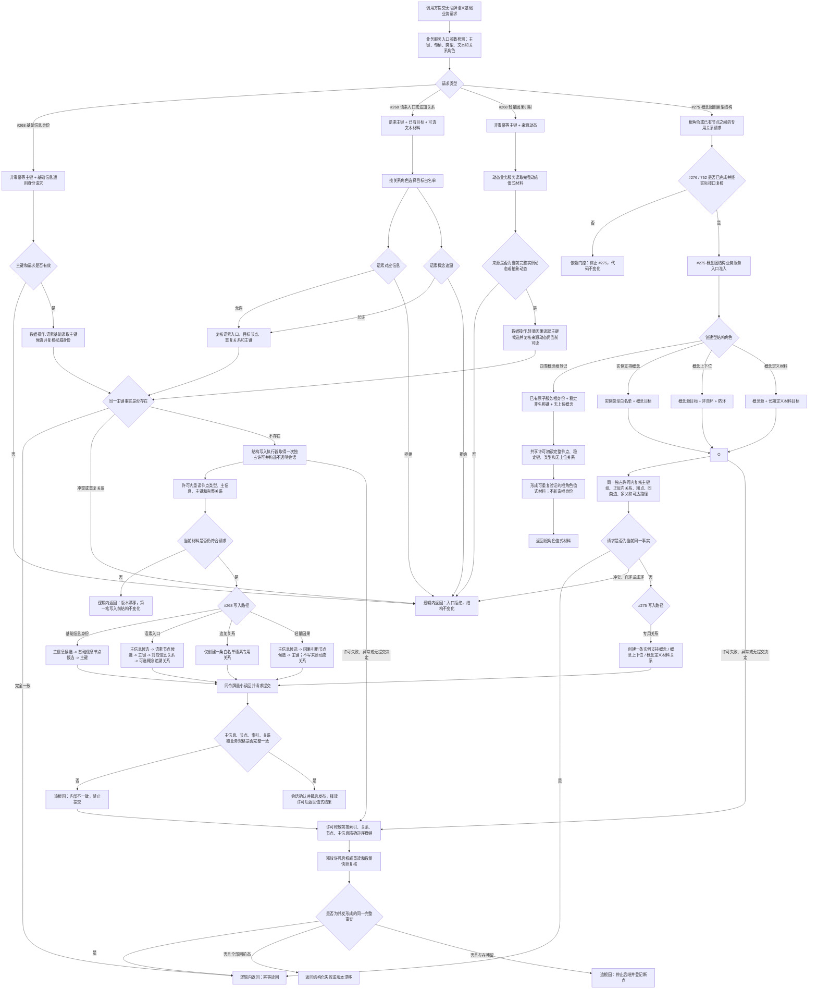

# 语义基础服务分层迁移代码逻辑流程图 v0.1

更新时间：2026-07-14

## 依据

```text
AGENTS.md
规范/仓库与服务分层事务边界规范.md
规范/详细设计/语素服务入口材料准入详细设计.md
规范/详细设计/基础信息入账详细设计.md
规范/详细设计/关系仓库详细设计.md
流程图/20260708_外部材料语素请求准入代码逻辑流程图_v0.1.md
流程图/20260708_基础信息入账代码逻辑流程图_v0.1.md
实施记录/20260713_ARCH-LAYER-S0_仓库服务双路径与调用点事实复核_Codex断点清单.md
实施记录/20260713_SERVICE-DATA-S1_不透明结构写入会话与执行器代码实施_Codex断点清单.md
实施记录/20260713_SERVICE-DATA-S2_状态动态服务分层迁移代码实施_Codex断点清单.md
实施记录/20260714_SERVICE-DATA-S3_特征体系服务分层迁移代码实施_Codex断点清单.md
海中鱼巣/领域/世界服务.h
海中鱼巣/领域/语素服务.h
海中鱼巣/领域/概念图服务.h
海中鱼巣/领域/因果服务.h
海中鱼巣/领域/统计服务.h
```

## 说明

本图裁决原 `#268 / SERVICE-DATA-S4` 的过宽范围。第一轮把可由当前不透明结构写入会话闭合的基础信息身份、语素入口多关系和轻量因果引用保留在 `#268`；把概念图创建型结构拆为独立 `#275 / CONCEPT-DATA-S1`。JY-331 实际接口复核确认 `#275` 还需要 `#276 / CORE-SESSION-S3` 先补同许可节点主键组和按目标来源关系记录组读取。概念生命周期、固定点、失效、重挂、删除和统计缓存不进入这些切片。

## 流程图



## 白名单

```text
语素对应信息目标：基础信息、存在、场景、特征、抽象状态、抽象动态、二次特征、因果引用、需求、任务、方法。
语素概念追溯目标：基础信息、存在、特征、抽象状态、抽象动态、二次特征、因果引用。
第一轮明确拒绝：特征值、实例状态、实例动态，以及未列入对应关系角色的其它节点类型。
文本只做语素入口准入材料，不写主信息名称、不生成显示标题、不成为机器事实。
```

## 非成功返回二分

```text
逻辑内返回：
- 主键为 0、句柄无效、文本不符合最小词单元规则、节点类型不在对应白名单。
- 主键已绑定不同事实、专用关系已存在、概念上下位自环或可证明成环。
- 写前重读发现版本漂移，且尚未发生第一笔写入。

追根因解决：
- 入口已经通过并进入写入后，候选身份、关系、索引或读回结果不符合内部预期。
- 同一根主键、语素主键或因果主键出现矛盾的当前事实。
- 失败收口后仍存在可读节点、关系、索引、孤儿主信息或数量增长。
```

## 关键边界

```text
1. 只有数据操作层导入结构写入执行器；业务服务和组合器不暴露仓库、原始令牌、许可、会话或候选。
2. 关系仓库继续权威承载语素对应信息、语素概念追溯和三类概念专用关系；索引只召回候选。
3. 轻量因果引用只以来源动态作为入口证据，不持久化来源动态关系，不形成稳定因果结论。
4. 四类概念根身份分别由对应基础信息原子业务服务创建；#275 只复核稳定键、类型和无上位关系并形成根角色值式材料，不绕过原子服务新造根节点。
5. #276 只补会话同许可节点主键组和按目标来源关系记录组值式读取，不增加概念语义、不修改仓库或事务 ABI。
6. #275 只有在 #276、752 完成并再次实际接口复核通过后才能实施；许可外反向扫描或防环结果不得作为写入授权。
7. #275 只覆盖概念图创建型关系结构。固定点、生命周期、重挂、失效、物理删除、概念安全删除、用途统计和活动快照替换转后继专项。
8. 统计服务是非权威缓存，不得混入 #268 或 #275 的结构事实写入会话。
7. 不修改既有世界、语素、概念图、因果、统计兼容服务，不迁移生产调用，不恢复 #214 或 #257。
```
