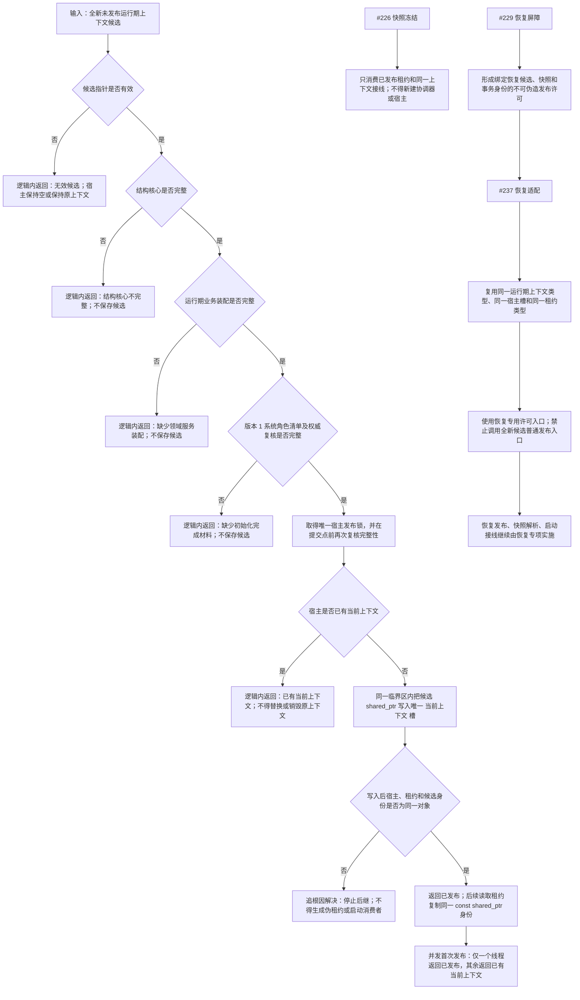

# 运行期上下文首次发布租约与恢复链单一所有权代码逻辑流程图

更新时间：2026-07-14

## 依据

```text
AGENTS.md
规范/4030_子规范_基础信息服务分层与领域写授权.md
规范/4040_子规范_不透明结构事务候选确认撤销与最后发布.md
规范/设计执行双窗口交互规范.md
规范/详细设计/系统角色初始化与历史兼容初始化调用迁移详细设计.md
计划/已完成计划/20260713_SERVICE-COMPOSER-S1_运行期组合器与线程路由去令牌代码实施切片_v0.1.md
计划/已完成计划/20260712_INIT-MOD-S1_历史初始化真模块迁移代码实施切片_v0.1.md
实施记录/20260714_INIT-MOD-S1_系统角色初始化与历史兼容初始化调用迁移代码实施_Codex断点清单.md
当前 海中鱼巣/启动.运行期上下文.ixx 及其全部 尝试发布 调用点
恢复专项 #226、#229、#237 现行计划与恢复详细设计
```

## 说明

本图表达 `#249 / DQ-141 / 680` 重做后的代码逻辑：只启用全新完整运行期上下文候选的一次首次发布，由唯一宿主持有同一 `shared_ptr`，后续租约只读引用同一上下文身份。无效、不完整、重复或并发落败候选均不改变宿主。

本图同时冻结恢复链所有权，但不实现恢复：`#226` 未来只从已发布租约取得快照冻结来源；`#229` 形成恢复专用不可伪造发布许可；`#237` 只能把恢复候选适配到同一上下文类型、同一宿主发布槽和同一租约类型。恢复候选不得调用本批全新候选普通发布入口绕过屏障。

## 流程图



## 关键边界

```text
1. #249 只实现全新完整候选首次发布、同身份租约和并发单赢家，不实现 HYSNAP01、解析、恢复候选、恢复许可、恢复算法或启动恢复分支。
2. 运行期上下文、宿主、发布槽、租约类型、协调状态和业务装配所有者各只有一套；禁止建立恢复专用平行宿主。
3. 普通发布入口的语义固定为“全新候选首次发布”。未来恢复路径必须携带 #229 能力并走 #237 专用适配，不能复用普通入口。
4. 候选完整性由结构核心、运行期业务装配、版本 1 系统角色清单和权威复核共同裁决；日志、显示、SQL、名称和历史初始化返回值不参与。
5. 发布提交点只有写入唯一 当前上下文 槽；发布前任何逻辑内返回均不改变宿主，不写业务结构。
6. 发布前置通过后，宿主保存身份、租约身份或并发结果出现矛盾属于追根因解决，不能降格为普通失败。
7. #249 不切换入口生产对象，不启动线程、SQL、控制面板或 D455，不自动恢复 #214、#257 或兼容写迁移。
8. #249 完成后只解除 #226、#229、#237 对主装配所有权合同的前置；各恢复计划仍须满足自身全部依赖并重做实际接口复核。
```
