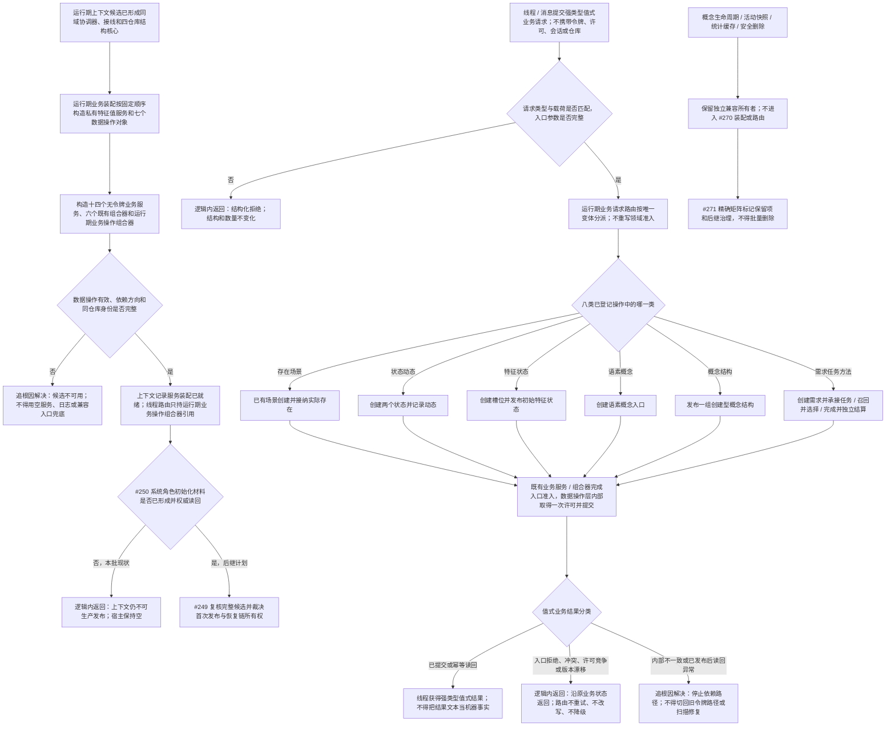

# 运行期组合器与线程路由去令牌代码逻辑流程图

更新时间：2026-07-14

## 依据

```text
AGENTS.md
规范/仓库与服务分层事务边界规范.md
规范/详细设计/仓库底层与服务数据操作分层纠偏详细设计.md
计划/已完成计划/20260713_EXIST-SCENE-S1_存在场景首组分层垂直样例代码实施切片_v0.1.md
计划/已完成计划/20260713_SERVICE-DATA-S2_状态动态服务分层迁移代码实施切片_v0.1.md
计划/已完成计划/20260713_SERVICE-DATA-S3_特征体系服务分层迁移代码实施切片_v0.1.md
计划/已完成计划/20260713_SERVICE-DATA-S4_语义基础服务分层迁移代码实施切片_v0.1.md
计划/已完成计划/20260714_CONCEPT-DATA-S1_概念图创建型结构服务分层迁移代码实施切片_v0.1.md
计划/已完成计划/20260713_SERVICE-DATA-S5_需求任务方法服务分层迁移代码实施切片_v0.1.md
实施记录/20260714_SERVICE-DATA-S5_需求任务方法服务分层迁移代码实施_Codex断点清单.md
当前启动.运行期上下文、入口、初始化和线程路由代码事实
```

## 说明

本图表达 `#270 / DQ-162` 第一轮代码逻辑：唯一运行期业务装配拥有已经实施验证的七个数据操作对象、十四个无令牌业务服务和六个组合器；线程侧只提交强类型值式请求，由运行期业务操作组合器分派到既有组合入口。原始结构事务令牌、许可、会话和仓库引用不得进入请求、结果、线程或组合器公开面。

本图不迁移旧自我治理路由正文，不初始化系统角色，不发布生产运行期上下文，也不接入概念生命周期、统计缓存或概念安全删除兼容路径。

## 流程图



## 非成功返回二分

```text
逻辑内返回：请求类型或载荷不匹配、参数写前拒绝、许可竞争、版本漂移、幂等冲突，以及系统角色初始化尚未完成导致的上下文不可发布。
追根因解决：装配成员同仓库身份不一致、入口准入后内部结果异常、已发布结构读回不一致、路由结果类型与请求类型不对应，或为了成功而回退到旧令牌路径。
```

## 关键边界

```text
1. 运行期业务装配只拥有 #265-#269、#275 已形成的新分层对象；不拥有线程、宿主、租约、控制面板、SQL、快照或外设。
2. 线程路由只接收和返回强类型值式材料，不取得、保存、比较或传递原始结构事务能力。
3. 路由只做请求类型匹配和顶层分派；业务准入仍由对应业务服务 / 组合器负责，事务收口仍由数据操作层和执行器负责。
4. #270 只形成隔离替代路径，不修改旧自我治理领域路由、概念命名治理路由或历史初始化文件，不声明生产调用迁移完成。
5. 运行期上下文在 #250 系统角色材料形成前继续不可发布；#270 不把“服务对象构造成功”冒充“业务初始化完成”。
6. 概念生命周期、统计缓存和安全删除继续由现有独立兼容所有者负责；本批不新增平行实现，也不把它们纳入组合器。
7. 线程不是动作来源；路由请求不自动等同于动作授权、动作动态或世界事实。
```
