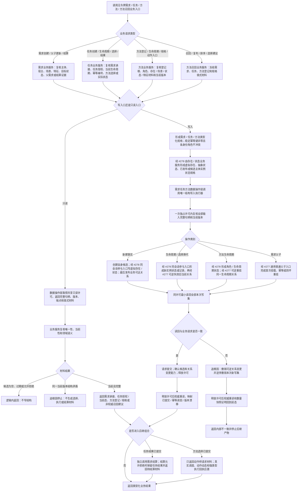

# 需求任务方法服务分层迁移代码逻辑流程图 v0.1

更新时间：2026-07-14

## 依据

```text
AGENTS.md
规范/3100_根规范_需求_20260720.md
规范/3200_根规范_任务_20260720.md
规范/3300_根规范_方法_20260720.md
规范/4030_子规范_基础信息服务分层与领域写授权.md
规范/4040_子规范_不透明结构事务候选确认撤销与最后发布.md
规范/详细设计/需求创建与目标状态详细设计.md
规范/详细设计/需求父子原子挂载与重挂详细设计.md
规范/5200_子规范_任务根据需求初始化_20260720.md
规范/5230_子规范_任务筹办与执行边界_20260720.md
规范/详细设计/方法系统详细设计.md
规范/详细设计/通用方法召回登记规格索引复判排序详细设计.md
规范/详细设计/任务回执实际结果状态结果回写代码逻辑详细设计.md
规范/详细设计/需求结算代码逻辑详细设计.md
计划/已完成计划/20260713_SERVICE-DATA-S5_需求任务方法服务分层迁移代码实施切片_v0.1.md
实施记录/20260714_SERVICE-DATA-S5_需求任务方法旧计划归并与实际接口复核_Codex断点清单.md
流程图/20260714_存在状态候选写入规格与同会话参与者代码逻辑流程图_v0.1.md
规范/详细设计/过期设计/存在状态候选写入规格与同会话参与者详细设计.md
计划/已完成计划/20260714_SERVICE-DATA-S5-PRE_存在状态候选写入规格与同会话参与者代码实施切片_v0.1.md
实施记录/20260714_SERVICE-DATA-S5_存在状态同会话合同漂移与前置设计_Codex断点清单.md
实施记录/20260714_SERVICE-DATA-S5-PRE_存在状态候选写入规格与同会话参与者代码实施_Codex断点清单.md
实施记录/20260714_SERVICE-DATA-S5_存在状态正式接口复核与重新发布_Codex断点清单.md
```

## 说明

本图表达 `#269 / SERVICE-DATA-S5` 的隔离新分层路径。它不是把旧 `需求服务.h`、`任务服务.h`、`方法服务.h` 和 `方法召回服务.h` 包一层，也不迁移线程路由或真实方法执行；它以新的无令牌业务服务、一个服务专用数据操作层和明确组合器重建需求、任务、方法的权威结构入口。

`#277 / CORE-SESSION-S4 / 757` 和 `#278 / SERVICE-DATA-S5-PRE / 758` 均已完成归档。设计窗口已从正式提交逐签名确认：已发布关系可逆换代、候选节点窄判断、存在 / 状态构造权封闭规格和四个同会话参与入口均符合本图合同。`#269 / DQ-161` 现按 `JY-335` 重新发布为当前待执行，760 尚未实施。

## 流程图



## 业务边界

```text
需求：
- 创建完整目标状态需求、概念命名需求权威目标材料、需求父子首次挂载 / 重挂、需求结算记录和只读承接材料。
- 需求目标继续是状态节点；I64 只作为状态材料。

任务：
- 创建任务承接壳、生命周期当前态 / 历史、承接授权、筹办方法选择、实际结果状态和完成基础入口。
- 任务结果写入与需求结算是两个提交边界；结算失败不回滚已完成任务。

方法：
- 方法登记根、方法首 / 条件 / 结果 / 动作入口角色、活跃 / 失效生命周期、条件 / 结果规格和关系材料。
- 召回、复判、排序和建议是非权威值式材料；任务服务才拥有选择提交。

后置：
- 线程调度、真实方法执行、动作动态、强类型执行回执、名称绑定、方法学习和生产主装配接线。
```

## 非成功返回二分

```text
逻辑内返回：
- 无效句柄、错误节点类型、非零幂等键缺失、目标状态 / 承接 / 授权 / 生命周期 / 规格材料缺失。
- 正常版本漂移、候选为空、召回无命中、条件不可判定、排序无唯一建议。
- 精确重复请求映射幂等读回；异义重复映射幂等冲突。
- 所有入口拒绝都在第一笔结构变化前完成。

追根因解决：
- 写前完整材料与同许可重读在同一版本下矛盾。
- 任一新身份、状态、关系、索引、关系换代或读回不符合类型化写入规格。
- 生命周期出现多个当前关系、任务选择出现多个有效发布、需求普通父子出现多父或方法登记 / 规格失去唯一性。
- 失败后仍可读到本次半结构，或可逆关系变更、数量快照、正反向读取不能回到前态。
```

## 关键边界

```text
1. 业务服务公开面不出现结构事务令牌、许可、仓库、锁、会话、候选或执行器。
2. 只有 数据操作.需求任务方法 新生产模块导入结构写入执行器并持四仓库引用；它可以调用 #278 原子数据操作参与入口，但不得解释或复制存在 / 状态内部结构。
3. 旧无令牌、带令牌、候选写路径继续保留为兼容事实；#269 不修改或删除旧头文件，不迁移既有生产调用。
4. #277 只提供通用关系变更能力；#278 只提供存在 / 状态原子规格和同会话参与入口，二者都不裁决需求、任务、方法语义。
5. 方法召回索引和排序结果不成为机器事实；命中后必须重读关系句柄、版本和有效端点。
6. 动作桥只输出请求材料，不执行动作、不创建动态；线程不是动作来源。
7. #214、#224、#225、#248-#250 按归并裁决继续暂停、重设计或转 #270，不在本图恢复。
8. 本次修订只证明 #277 / #278 正式接口与本图一致；阶段 757、758 已由各自正式产物独立验证。本图不证明 #269 代码、构建、运行、生产调用迁移或阶段 760 已完成。#273 已独立完成归档，但不属于 #269 允许范围。
```
