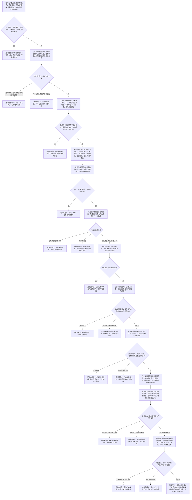

# 任务执行调度与强类型回执代码逻辑流程图

更新时间：2026-07-15

状态：JY-341 / #224 专项施工流程图 / 依赖 #271、DQ-163、780 / 不构成代码已实现声明

## 依据

```text
AGENTS.md
规范/000_项目规则总纲.md
规范/仓库与服务分层事务边界规范.md
规范/多线程防锁机制规范.md
规范/代码文件建立归属与模块命名规范.md
规范/详细设计/需求任务方法服务分层迁移详细设计.md
规范/详细设计/运行期组合器与线程路由去令牌详细设计.md
实施记录/20260715_COMPAT-CLOSURE-S1_精确兼容入口与调用点矩阵.md
海中鱼巣/领域/服务.任务.ixx
海中鱼巣/领域/服务.方法.ixx
海中鱼巣/领域/服务.状态.ixx
海中鱼巣/领域/服务.动态.ixx
海中鱼巣/领域/组合.状态动态.ixx
海中鱼巣/领域/数据操作.状态动态.ixx
海中鱼巣/线程/任务管理线程.ixx
海中鱼巣/线程/任务工作线程.ixx
海中鱼巣/线程/任务结果回执协议.ixx
```

## 说明

本图只表达 `TASK-EXECUTION-S1`：从筹办中任务冻结完整执行请求，经两阶段强类型队列进入受控执行，形成实际状态、动作动态和非权威强类型回执。任务最终结果、任务完成和需求结算仍归后继 `#225`。

第一轮只支持一个显式配置稳定动作键的“任务目标状态值变化”适配器。动作入口只提供身份与来源准入；适配器不得扩为任意函数表、外部执行器或真实外设分派。

## 流程图



## 关键边界

```text
1. 函数入口先检测非法参数并返回来源问题，不在函数内部修补参数或兜底生成结构。
2. 任务执行组合器、线程路由和协议公开面不得出现原始结构事务令牌、许可、会话、执行器或仓库。
3. 队列候选只是并发控制能力，不是机器事实；只有确认后的请求可被工作线程消费。
4. 队列锁内不得调用领域服务、数据操作、日志、弹窗、持久化或用户回调。
5. 线程不是动作来源。实际状态和动态由状态动态组合器及其数据操作层写入。
6. 第一轮适配器只允许一个构造时显式配置的稳定动作键，不建立任意函数注册表。
7. 新实际状态和动作动态必须在同一不透明会话中提交；任一步失败不得留下可读孤立结果状态。
8. 成功回执仍是非权威证据，不记录任务最终结果，不完成任务，不结算需求。
9. 旧运行消息请求、旧模拟普通回执和传统带令牌服务保持兼容，不作为本图新路径的执行依据。
10. #224 依赖 #271、DQ-163、780；#214 用户暂停不再是 #224 的业务或阶段前置。
```
