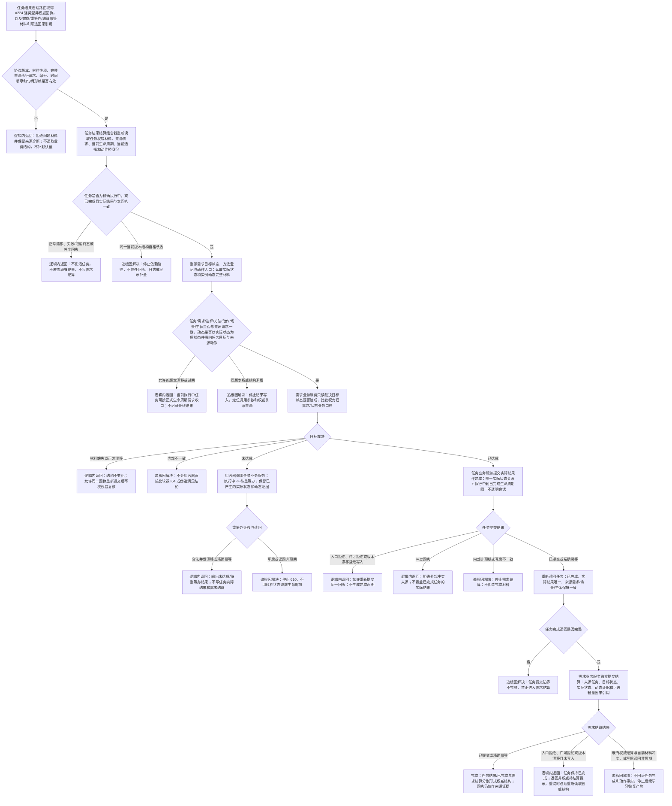

# 任务结果完成与需求独立结算代码逻辑流程图

更新时间：2026-07-15

状态：JY-351 / #224、DQ-116、600 已完成 / 正式接口复核通过 / #225 当前首个待执行 / 610 未实施 / 不构成代码已实现声明

## 依据

```text
AGENTS.md
规范/0050_项目通用机器逻辑与禁止性规则总纲_20260721.md
规范/4040_子规范_不透明结构事务候选确认撤销与最后发布.md
规范/4050_子规范_入口拒绝逻辑内结果与内部逻辑错误.md
规范/5160_子规范_需求正式结算记录与唯一结论.md
规范/5210_子规范_任务状态特征集合与阶段关联_20260720.md
规范/5230_子规范_任务筹办与执行边界_20260720.md
规范/代码文件建立归属与模块命名规范.md
规范/详细设计/需求任务方法服务分层迁移详细设计.md
规范/详细设计/任务执行调度与强类型回执详细设计.md
海中鱼巣/领域/服务.需求.ixx
海中鱼巣/领域/服务.任务.ixx
海中鱼巣/领域/服务.方法.ixx
海中鱼巣/领域/服务.状态.ixx
海中鱼巣/领域/服务.动态.ixx
海中鱼巣/领域/数据操作.需求任务方法.ixx
海中鱼巣/线程/任务结果回执协议.ixx
```

## 说明

本图只表达 `TASK-RESULT-S1`：消费 `#224` 形成的强类型非权威执行回执，再次重读任务、需求、方法、动作、状态和动态权威材料；目标未达成时把执行中任务转入待重筹办，目标达成时通过任务服务原子提交实际结果和已完成生命周期，再由需求服务独立结算。

回执、待结算提示和线程队列都不是机器事实。是否允许重试，只由“任务已完成且实际结果一致、需求仍未结算”的权威读回裁决。

## 流程图



## 关键边界

```text
1. 函数入口先发现并拒绝非法参数来源，不在函数内部补句柄、补编号或降级使用兼容路径。
2. 新生产公开面不得出现原始结构事务令牌、许可、会话、执行器、仓库或锁。
3. 跨任务、需求、方法、状态和动态的流程归任务结果结算组合器，不新增任务结果业务服务。
4. 回执只提供待复核来源；组合器必须从业务服务重新取得任务、需求、方法、动作、状态和动态材料。
5. 目标状态是否达成由需求业务服务按状态业务材料裁决；组合器和任务服务不得直接解释裸 I64。
6. 目标未达成时不绑定任务实际结果、不完成任务、不结算需求；已产生的状态和动态作为权威场景证据保留。
7. 任务实际结果与已完成生命周期由现有任务业务入口在一个不透明会话提交，不拆成线程侧多步写入。
8. 任务完成与需求结算是两个提交边界；结算失败不得回滚已完成任务或动作事实。
9. 待结算提示是可丢弃值式材料。再次处理同一回执时，必须以已完成任务和未结算需求的权威读回重新裁决。
10. 轻量因果引用只作可选证据，不参与目标满足裁决。
11. 第一轮保持隔离路径，不修改运行期业务装配、运行期上下文、传统任务管理上行桥或恢复链。
12. #224、DQ-116、600 已完成；`357c30a` 已确认新版回执、完整来源冻结请求和锁内出队后值式交接满足本图。执行窗口仍须从正式提交复核阶段 610 和三个新模块未占用，漂移时以原 #225 / DQ-117 退回。
```
