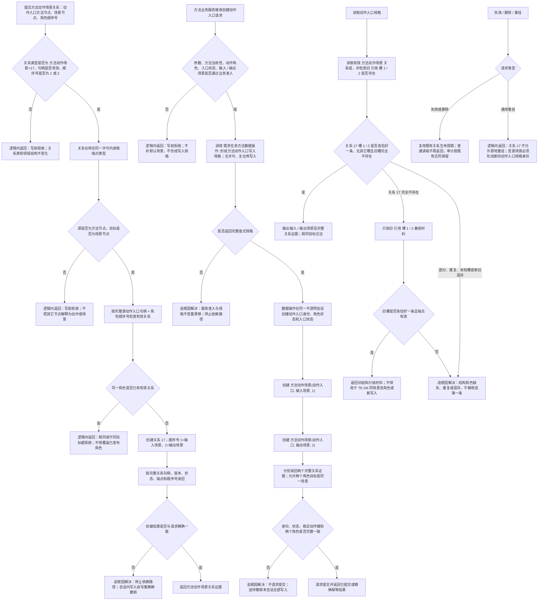

# 方法动作场景角色关系代码逻辑流程图

更新时间：2026-07-15

状态：JY-347、JY-349 / #279 专项施工流程图 / QR-183、QR-184 已裁决 / 不构成代码已实现声明

## 依据

```text
AGENTS.md
规范/节点类型与关系类型枚举规范.md
规范/详细设计/关系仓库详细设计.md
规范/动作入口规范.md
规范/详细设计/动作入口详细设计.md
规范/详细设计/需求任务方法服务分层迁移详细设计.md
规范/详细设计/服务模块单一声明所有权与规格构造详细设计.md
流程图/20260715_服务模块单一声明所有权与规格构造代码逻辑流程图_v0.1.md
实施记录/20260715_TASK-EXECUTION-S1_同场景动作双角色关系唯一性合同漂移_Codex断点清单.md
实施记录/20260715_METHOD-ACTION-REL-S1_服务模块ABI链接漂移_Codex断点清单.md
海中鱼巣/核心/句柄.h
海中鱼巣/核心/关系仓库.cpp
海中鱼巣/领域/数据操作.需求任务方法.ixx
```

## 说明

本图只表达 `METHOD-ACTION-REL-S1`：追加专用关系 `方法动作场景 = 17`，使一个动作入口方法节点能够以输入、输出两个独立角色指向同一场景。普通 `引用` 的现有唯一性保持不变，TE-D6 的“输入 / 输出场景都等于任务场景”保持不变。

新写入只使用关系 17。既有普通引用槽 1 / 2 只保留严格只读兼容，不回写、不自动迁移，也不能作为 #224 同场景双角色的权威承载。

JY-349 修订后，方法业务服务不再直接调用私有 `方法动作入口写入规格` 构造函数，而是在完成业务准入后调用 `需求任务方法数据操作::形成方法动作入口写入规格`。规格形成入口不取得许可、不读写仓库；它返回完整值式规格后，数据操作才进入一次许可内的正式写入。

## 流程图



## 关键边界

```text
1. 关系 17 的方向固定为“动作入口方法节点 -> 场景节点”；仓库只验证节点类型和角色槽，动作入口业务角色由需求任务方法数据操作层复核。
2. 顺序号 1 是输入场景角色，顺序号 2 是输出场景角色；有效唯一键为关系类型 + 完整源句柄 + 顺序号。
3. 同一目标可跨两个角色复用；同一角色第二目标或相同目标重复均写前拒绝。
4. 普通引用继续按关系类型 + 源 + 目标拒绝重复，不把顺序号加入普通关系全局唯一键。
5. 新写入不得再以普通引用槽 1 / 2 承载动作场景；旧结构只读兼容不自动迁移、不双写。
6. 关系 17 不允许通用原地重挂。失效、删除和审计沿既有关系生命周期，不新增仓库 ABI。
7. 数据操作多步写入任一内部非预期都不返回有效动作入口，且必须由同一会话撤销到数量和可读结构前态。
8. 本图不实现任务调度、线程队列、状态动态写入、强类型回执、任务完成或需求结算。
9. 服务类只由服务模块拥有；写入规格只由数据操作模块拥有。不得用跨模块服务前置声明、服务友元、旧 BMI 或文本包含实现绕过完整链接。
```
