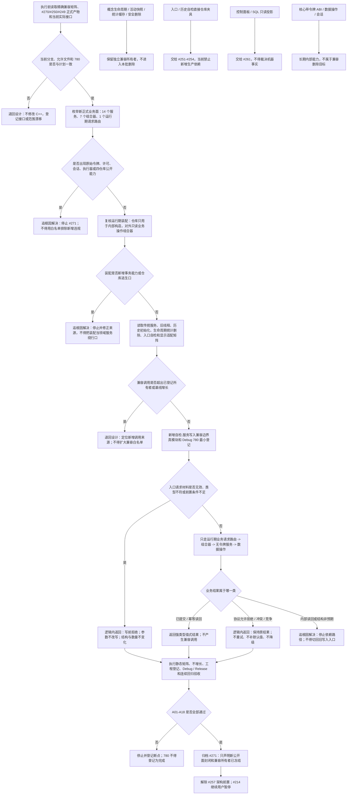

# 服务写入兼容路径精确收口代码逻辑流程图

更新时间：2026-07-15

## 依据

```text
AGENTS.md
规范/4030_子规范_基础信息服务分层与领域写授权.md
规范/4040_子规范_不透明结构事务候选确认撤销与最后发布.md
规范/详细设计/运行期组合器与线程路由去令牌详细设计.md
计划/已完成计划/20260713_SERVICE-COMPOSER-S1_运行期组合器与线程路由去令牌代码实施切片_v0.1.md
计划/已完成计划/20260712_INIT-MOD-S1_历史初始化真模块迁移代码实施切片_v0.1.md
计划/已完成计划/20260712_RUNTIME-TXN-S3_主装配事务与恢复链所有权端到端验收切片_v0.1.md
实施记录/20260715_COMPAT-CLOSURE-S1_精确兼容入口与调用点矩阵.md
当前领域、线程、入口、界面和适配代码事实
```

## 说明

本图表达 `#271 / DQ-163` 第一轮代码逻辑：先冻结新正式业务公开面，再按精确矩阵识别数据操作内部能力、运行期装配、传统服务、旧线程、历史初始化、自检夹具、生命周期 / 统计 / 安全删除以及只读显示适配。第一轮只新增边界自检和静态不增长门禁，不修改或删除生产兼容路径。

本图中的“收口”是权力边界收口，不是把仍有真实调用的传统服务批量删除。非法参数必须在业务入口发现来源并拒绝，不能在函数内部补默认值或切回兼容路径兜底。

## 流程图



## 非成功返回二分

```text
逻辑内返回：执行前接口不满足计划、入口请求参数无效、句柄或类型不符、前置关系不足、协议允许的拒绝 / 冲突 / 竞争，以及静态兼容基线未改变。
追根因解决：正式公开面出现原始事务能力、装配出现仓库逃生口、入口准入后结构写入或读回非预期、为获得成功而切回传统服务，或无法证明失败后结构不变化。
```

## 关键边界

```text
1. 正式新业务公开面固定为 14 个服务、7 个组合器和 1 个运行期业务请求路由；原始令牌和仓库能力命中必须为 0。
2. 数据操作、执行器、会话、四仓库带令牌 ABI 和运行期装配内部构造是正式内部能力，不是兼容删除对象。
3. 17 个传统服务头、旧线程、四个历史初始化兼容模块、概念生命周期 / 统计 / 安全删除及历史自检仍有真实调用；第一轮不得批删或改义。
4. 自检只验证边界和不增长，不在运行期扫描并修复结构，不给非法请求补默认值。
5. #271 完成只解除 #257 的架构前置；#214 仍由用户暂停，#224/#225、#251-#254 和生命周期 / 统计 / 删除后继不自动完成。
6. 控制面板和 SQL 只读投影不参与机器事实写入，也不作为兼容写入成功证据。
```
