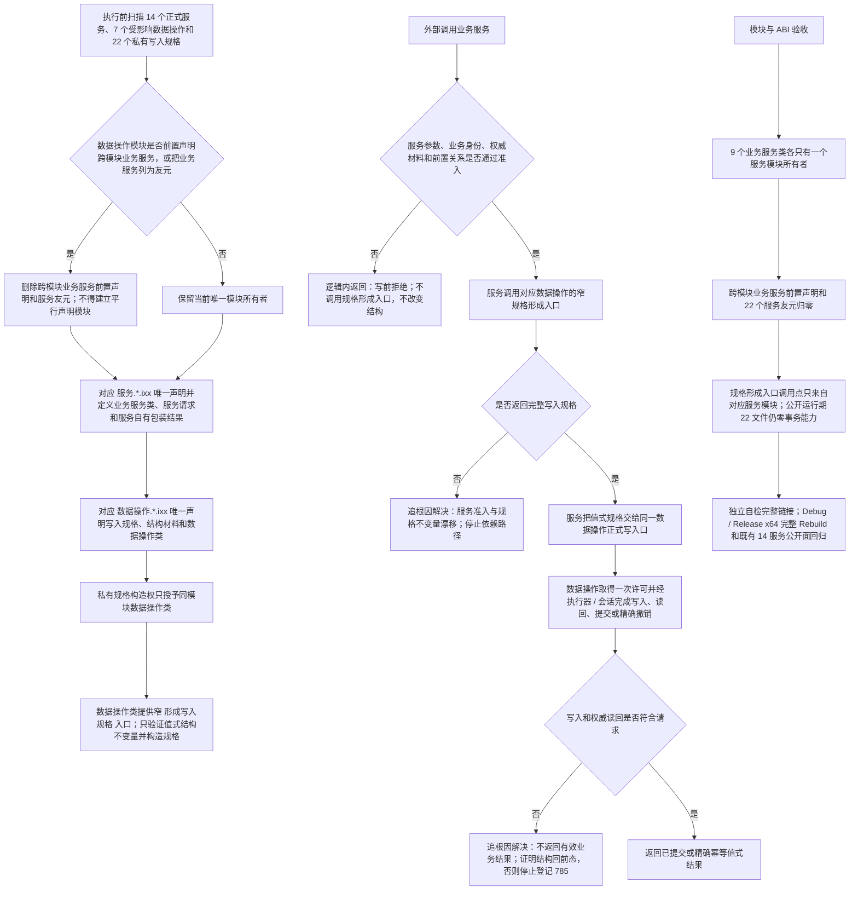

# 服务模块单一声明所有权与规格构造代码逻辑流程图

更新时间：2026-07-15

状态：JY-349 / QR-184 已裁决 / #279 配套施工流程图 / 不构成代码已实现声明

## 依据

```text
AGENTS.md
规范/代码文件建立归属与模块命名规范.md
规范/4030_子规范_基础信息服务分层与领域写授权.md
规范/4040_子规范_不透明结构事务候选确认撤销与最后发布.md
规范/详细设计/仓库底层与服务数据操作分层纠偏详细设计.md
实施记录/20260715_COMPAT-CLOSURE-S1_精确兼容入口与调用点矩阵.md
实施记录/20260715_METHOD-ACTION-REL-S1_服务模块ABI链接漂移_Codex断点清单.md
海中鱼巣/领域/数据操作.*.ixx
海中鱼巣/领域/服务.*.ixx
```

## 说明

本图解决 #279 独立自检暴露的 C++ 命名模块 ABI 漂移。当前 7 个数据操作模块导出了 9 个业务服务类前置声明，并以 22 个跨模块服务友元开放私有规格构造；对应服务类又在各自 `服务.*.ixx` 中定义，导致同名实体可能附着到不同命名模块。

JY-349 不新建平行服务声明模块。业务服务类及其请求 / 结果只由对应服务模块声明和定义；写入规格、结构材料及规格构造入口只由对应数据操作模块拥有。

## 流程图



## 关键边界

```text
1. 服务类、服务请求和服务自有包装结果的唯一所有者是对应 服务.*.ixx；数据操作模块不得再次前置声明这些实体。
2. 写入规格、数据操作状态 / 结果、结构材料和数据操作类的唯一所有者是对应 数据操作.*.ixx；服务可按值返回但不得重复声明。
3. 私有规格构造权只授予同模块数据操作类；不得把构造函数改为 public，也不得把自检或组合器设为友元。
4. 窄规格形成入口不取得许可、不读写仓库、不请求提交、不解释上层业务；业务准入仍由服务负责。
5. 形成入口必须接收结构字段或数据操作自有值式类型，不接收服务模块定义的请求 / 结果，避免形成反向 import。
6. 运行期正式公开面仍是 14 个业务服务、7 个组合器和 1 个请求路由；数据操作与规格形成入口不向运行期调用方逃生。
7. 本图不删除传统服务头，不修改核心事务 ABI、仓库锁、许可强度或业务结构，不恢复非权威 stash。
8. 本图与方法动作场景关系图共同构成原 #279 的完整施工上游，不新增计划编号、队列编号或阶段号。
```
