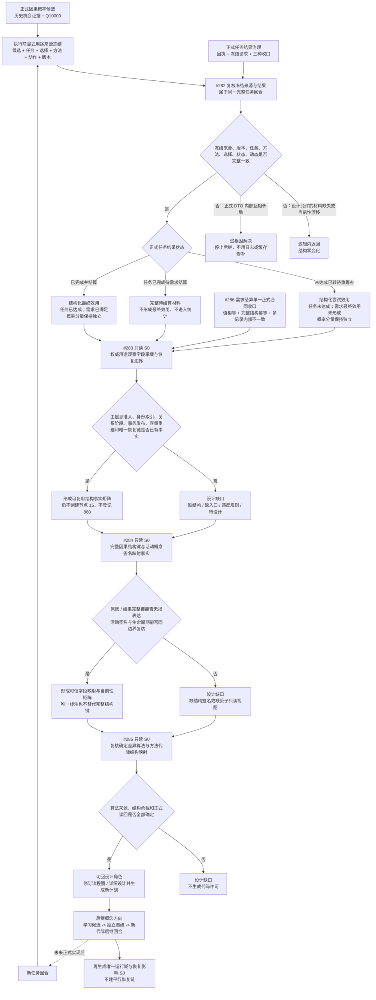

# 因果用途观察与方法学习无环接线流程图

更新时间：2026-07-16

施工元数据：JY-369 二次修订 / #282-#286 / DQ-174-DQ-178 / 只有 #282 新增代码阶段 850；#283-#285 为纯只读 S0，#286 复用 610 / 760

历史状态：本图只保留 JY-369 时期的 S0 路由证据；JY-371、JY-373、JY-375 已完成三项 S0，现行设计由 `流程图/20260716_因果用途观察与方法学习无环接线流程图_v0.2.md` 取代。

## 依据

```text
AGENTS.md
规范/0050_项目通用机器逻辑与禁止性规则总纲_20260721.md
规范/4010_子规范_统一仓库稳定句柄与通用关系索引边界.md
规范/4040_子规范_不透明结构事务候选确认撤销与最后发布.md
规范/4060_子规范_非权威缓存统计失效与确定重建.md
规范/4330_子规范_因果用途观察证据账与阶段推进.md
规范/5160_子规范_需求正式结算记录与唯一结论.md
规范/5340_子规范_方法学习晋级新代际与任务回合同轮隔离.md
规范/详细设计/任务结果完成与需求独立结算详细设计.md
规范/详细设计/动态证据窗口聚类与因果概率候选详细设计.md
计划/已完成计划/20260711_CAUSAL-USE-S0_因果用途观察与方法学习接线当前事实复核计划_v0.1.md
实施记录/20260711_CAUSAL-USE-S0_因果用途观察与方法学习接线当前代码事实复核_Codex断点清单.md
海中鱼巣/领域/材料.因果模式.ixx
海中鱼巣/领域/组合.任务结果结算.ixx
```

## 说明

本图描述当前可安全发布的施工顺序，不把候选结构写成当前实现事实。`Q10000` 只表达原因后结果模式在既有证据中的发生概率；现有任务冻结请求没有记录“本回合实际采用哪个因果候选”。#282 只建立执行前冻结与纯值效用合同，#286 收口需求结算；随后 #283-#285 依次做结构承载 / 恢复、因果键 / 概念签名和学习 / 代际只读 S0，完成后再由设计角色生成真正可编码的后继计划。

## 流程图



## 关键边界

```text
1. `节点类型::用途观察记录 = 15` 仅为 #283 待复核候选；能否作为长期证据账项，须由主信息准入、身份索引、事务发布、容量 / 编解码与唯一恢复链事实共同裁决。
2. 是否复用既有关系类型、端点 / 顺序号 / 基数及是否建立专用数据操作层，均由 #283 只读 S0 取证；当前不形成关系或数据操作层实施合同。
3. 当前代码没有“任务回合采用因果候选”的冻结映射；没有执行前显式用途来源冻结时只能逻辑返回，禁止事后把任意候选与任意结果配对。
4. 结构化结果效用不压成单一分数；Q10000、任务达成、需求结算、观察阶段分别保存。
5. 待结算材料不得被解释为最终用途效用，也不得进入统计或学习；其权威承载、幂等定位与恢复方式由 #283 只读 S0 复核。
6. 节点 15、主信息格式、双索引、关系阶段、容量、编解码和恢复均是 #283 的待复核候选，不是当前代码许可。
7. 当前概念签名不能预设可无损表达原因 / 结果完整结构键；#284 只读 S0 完成前不得生成概念映射或统计投影代码计划。
8. 当前没有可执行的方法差异推导算法或代际结构映射；#285 只读 S0 完成前不得生成学习、晋级、后继代际或恢复代码计划。
9. 后继设计仍必须保持：晋级通过后只由方法业务服务登记新代际，当前回合零反写；恢复只进入既有唯一运行期链。非权威投影和候选能否从未来权威结构重建，须由 #283-#285 的事实矩阵证明。
10. 所有中途非成功返回严格区分逻辑内返回与追根因解决；权威结构自相矛盾不得作为普通失败继续推进。
11. 日志、控制台、SQL、控制面板、线程局部去重和普通 bool 不承载用途、效用、学习或方法事实。
```
