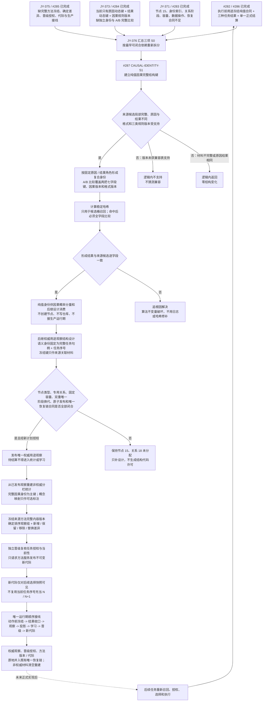

# 因果用途观察与方法学习无环接线流程图 v0.2

更新时间：2026-07-16

施工元数据：JY-376 / #287 / DQ-179 / 阶段 860 由新计划重新授权；旧 860、870 草案从未登记

## 依据

```text
AGENTS.md
规范/0050_项目通用机器逻辑与禁止性规则总纲_20260721.md
规范/1190_根规范_因果_20260720.md
规范/4010_子规范_统一仓库稳定句柄与通用关系索引边界.md
规范/4040_子规范_不透明结构事务候选确认撤销与最后发布.md
规范/4330_子规范_因果用途观察证据账与阶段推进.md
规范/5340_子规范_方法学习晋级新代际与任务回合同轮隔离.md
规范/详细设计/过期设计/因果用途观察与方法学习无环接线详细设计.md
实施记录/20260716_CAUSAL-USE-S2_权威用途观察结构承载与恢复边界当前代码事实复核_Codex断点清单.md
实施记录/20260716_CAUSAL-CONCEPT-MAP-S0_因果完整结构键与活动概念签名映射当前事实复核_Codex断点清单.md
实施记录/20260716_METHOD-LEARN-S0_方法学习算法与方法代际结构映射当前事实复核_Codex断点清单.md
海中鱼巣/领域/材料.因果模式.ixx
海中鱼巣/领域/算法.因果模式.ixx
海中鱼巣/领域/材料.用途事件.ixx
海中鱼巣/领域/算法.用途事件.ixx
```

## 说明

本图把三项 S0 的真实结论改画为后继设计输入，不再把 #283—#285 画成尚未发生的判断分支。当前唯一范围闭合、可登记实施的是纯值 `因果完整结构键`：完整保留原因动态键、结果动态键和因果规则版本，提供版本准入、A/B 全字段比较和仅用于召回的稳定哈希。节点 15、关系 18、权威用途账、统计、学习、晋级、代际、生产接线和恢复仍须逐段获得独立合同。

## 流程图



## 当前实施边界

```text
1. #287 只形成纯值 `因果完整结构键`、版本兼容、A/B 全字段比较和召回哈希；阶段 860 是本新计划的重新授权，不继承旧用途观察草案。
2. 原因和结果角色固定有序；交换两把动态键得到不同身份。每把动态键的七字段和自己的规则版本都必须保留。
3. 哈希、名称、类型、概念句柄、冻结键、时间戳和节点编号都不能替代完整身份比较。
4. 权威用途观察的语义唯一身份候选固定为完整任务句柄 + 任务序号；物理索引方案仍须后继设计，冻结键不再被预设为权威主键。
5. 节点 15 和关系 18 继续未分配。只有固定容量、字段分流、角色基数、双重唯一、阶段换代、专用数据操作、原子发布和恢复合同全部闭合后，后继计划才可锁定枚举。
6. 当前活动概念签名对复合因果身份有损。概念映射第一版只可作为非权威可选标注，不得成为统计、学习或观察主键。
7. 当前方法条件 / 结果没有进入执行冻结，来源版本不是方法内容版本，选择生命周期不是父代，传统父 / 前 / 后方法关系不是代际。
8. 任务序号只参与用途观察回合身份，不得当作方法代际 N / N+1；后继可见性必须另建方法登记 / 选择快照合同。
9. 权威材料只能进入既有唯一运行期和唯一恢复链；不得建立第二事实账、第二上下文、第二宿主或第二恢复路径。
10. 所有中途非成功返回继续按“逻辑内返回 / 追根因解决”二分；接受完整正式材料后出现内部矛盾必须追根因。
```
