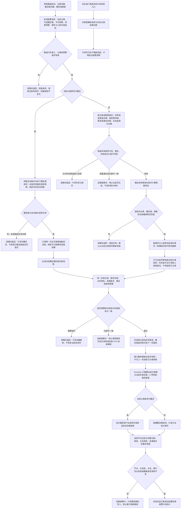

# 显示分类与当前概念根按需只读投影流程图 v0.1

日期：2026-07-16

决策：JY-358

## 依据

```text
实施记录/20260716_PANEL-PROJECTION-S2_S0当前接口事实扫描_Codex断点清单.md
流程图/20260711_控制面板六类真实树只读显示流程图_v0.1.md
规范/详细设计/控制面板六类真实树只读显示详细设计.md
规范/详细设计/数据仓库关系查询二级索引与性能治理详细设计.md
当前控制面板服务、概念图服务和控制面板窗口正式代码
```

## 说明

六项是显示分类，不是六棵物理树。生产窗口一次只请求当前分类；概念分类一次只请求当前活动概念根。旧六类完整入口保留为兼容回归，但不再作为生产刷新路径。根页只在真实根边界切换，每页整体替换，不把多次读取拼成同一机器快照。

## 流程图



## 关键边界

1. 六项分类继续是世界、概念、语素、需求、任务和方法；不建立六套仓库、六套身份或六个物理根。
2. 概念结构保持四个活动根、多父共享节点和图关系；当前页只生成一个当前概念根，重复投影仍按路径保留同一稳定句柄。
3. 任务、方法分类可通过现有需求、任务服务读取上游根身份，但不得构造、发布或缓存上一分类完整树。
4. 非概念分类没有统一活动版本。游标只绑定确定根身份组；每页都是独立当前读取并整体替换，禁止宣称跨页权威快照一致。
5. 旧六类入口保留原义以证明兼容，不得成为按需失败后的生产兜底，否则会恢复六类全量生成。
6. 控制面板服务和窗口只持有值式人读材料，不写仓库、不签发许可、不传递原始令牌、不把显示缓存当作机器事实。
7. #258 未发布，#261 不读取失败 WIP，不要求关系二级索引，也不修改关系仓库或概念图服务。
8. 性能完成以结构证据判断：未请求分类不得参与候选完整性，单概念根不得生成其它三根。耗时只可记录，不能单独证明优化完成。
