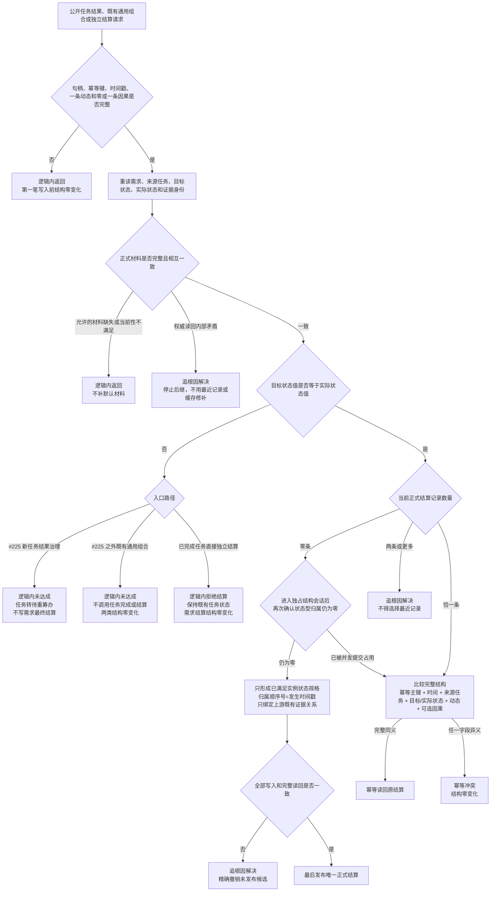

# 需求结算单一正式合同语义收口流程图

更新时间：2026-07-16

施工元数据：JY-369、JY-370 / #286 / DQ-178 / QR-186 已关闭 / 复用既有自检阶段 610 与 760，不新增代码阶段

## 依据

```text
AGENTS.md
规范/3100_根规范_需求_20260720.md
规范/4320_子规范_状态转换因果与目标投影层级_20260720.md
规范/5120_子规范_需求任务单目标与方法多结果归类_20260720.md
规范/5160_子规范_需求正式结算记录与唯一结论.md
规范/详细设计/需求结算记录详细设计.md
海中鱼巣/领域/服务.需求.ixx
海中鱼巣/领域/数据操作.需求任务方法.ixx
海中鱼巣/领域/组合.需求任务方法.ixx
海中鱼巣/领域/组合.任务结果结算.ixx
海中鱼巣/领域/组合.运行期业务操作.ixx
```

## 说明

本图描述经 JY-370 修订后的目标合同收口施工顺序，不把目标写成当前实现事实。第一轮正式结算只接收上游已创建的一条动态和零或一条因果引用，需求服务只复核、需求数据操作只绑定。当前 #225 任务结果组合路径已使用值相等裁决并在未达成时转待重筹办，但公开 `提交独立结算` 仍可写 `未满足`，数据操作只按结论幂等，需求读取仍会从多条状态归属中选择“最近结算”，既有通用组合入口 `完成任务并独立结算`（#225 新结果治理路径之外）也会先完成任务再结算。

## 流程图



## 关键边界

```text
1. 第一轮唯一可持久化正式结论为已满足；未满足只表示本次任务结果未达成，不是需求最终结算节点。
2. 幂等必须比较完整 `需求正式结算材料`，不能只比较结论、状态值、主键哈希或最近时间；可选因果句柄只能全零或完整有效。
3. 第二条正式结算是内部结构矛盾，不得按时间、关系编号或创建序号选择一条继续。
4. 首次写入在独占结构会话内再次确认状态型归属为零；并发占用后退出写入并重读，按完整材料裁决幂等 / 冲突。需求到结算状态的归属顺序号必须等于结算发生时间戳。
5. 第一轮固定一条上游已创建动态和零或一条上游已创建因果引用；需求服务只复核，需求数据操作只绑定，多证据集合后置专项。
6. #225 新任务结果治理路径继续负责未达成转待重筹办；组合.需求任务方法必须在任务完成前复核值相等，未达成时任务和需求结算都保持结构零变化；已完成任务直接独立结算只拒绝本次结算。
7. 组合.运行期业务操作只继续转发收口后的组合入口，本切片不修改其公开签名。
8. 需求服务.h 的 >=、证据不足和最近记录属于历史兼容路径，本切片不修改，也不得据此宣称全部兼容路径已经治理。
9. 写入后不一致属于追根因解决；日志、控制台、缓存和显示不得修补结算事实。
```
