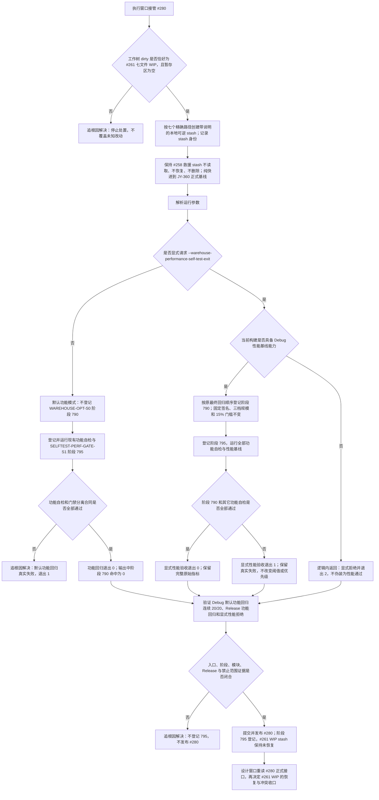

# 默认功能回归与显式性能验收分离流程图 v0.1

日期：2026-07-16

决策：JY-360

## 依据

```text
实施记录/20260716_PANEL-PROJECTION-S2_既有性能基线阻断完整回归_Codex断点清单.md
实施记录/20260713_WAREHOUSE-OPT-S0_关系查询与并发性能基线代码实施_Codex断点清单.md
海中鱼巣/入口.cpp
海中鱼巣/自检.运行器.ixx
海中鱼巣/核心/自检.关系仓库性能基线.ixx
```

## 说明

默认功能回归与显式性能验收使用同一正式二进制和同一中央自检总成，但不再共享同一个环境敏感成功条件。默认 `--self-test-exit` 不登记阶段 790；显式 `--warehouse-performance-self-test-exit` 保持阶段 790、固定三档签名、15% 稳定门槛、原执行顺序和真实退出码。分离不改变性能算法、阈值或 #257 已归档事实。

## 流程图



## 关键边界

1. `--self-test-exit` 是确定性功能回归入口，不登记约五分钟、环境敏感的关系仓库性能基线。
2. `--warehouse-performance-self-test-exit` 是唯一显式性能验收入口；它继续运行原阶段 790，不改变固定种子、1k / 10k / 100k、结构签名、三轮稳定或 15% 门槛。
3. 性能模式退出 1 是真实验收失败，不影响功能模式对无关代码切片的完成判断，也不得被改写为通过。
4. Release 必须显式拒绝性能模式并退出 2，不得静默跳过 790 后返回成功。
5. 阶段 795 只验证模式分离、登记和退出码合同，不复制性能算法，不产生第二套性能事实。
6. #261 七文件 WIP 先精确 stash，#280 完成后保持未恢复；恢复必须等待设计窗口基于正式接口重新发布 #261。
7. #258 四文件救援 stash 继续禁止读取、恢复、修改、提交或删除。
8. 本专项属于 NEW-05 代码模块与入口治理，不计入旧能力迁移完成度，也不证明性能优化。
