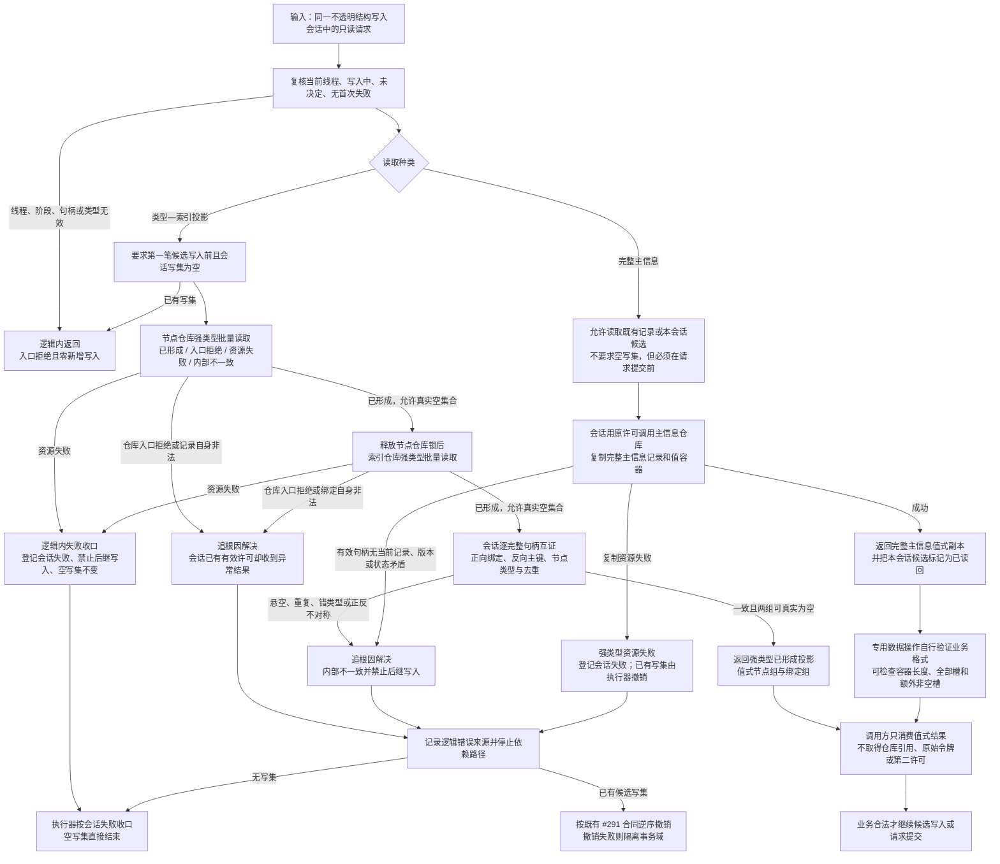

# 不透明结构写入会话完整主信息与强类型投影失败归因流程图

更新时间：2026-07-17

状态：JY-384 设计候选 / #292、DQ-184 待执行 / #290 v0.3 依赖门控 / 阶段 761、880 未登记

## 依据

```text
实施记录/20260717_CAUSAL-USE-O1-S2-D1_权威用途观察结构承载与事务发布恢复第二次实施前设计审计矩阵.md
实施记录/20260717_CAUSAL-USE-O1-S2-D1_权威用途观察结构承载与事务发布恢复第二次实施前设计审计_Codex断点清单.md
规范/详细设计/不透明结构写入会话许可内探测计量与全参与者原子收口详细设计.md
计划/已完成计划/20260717_CORE-SESSION-S5_许可内物理探测计量与全参与者原子收口代码实施切片_v0.1.md
海中鱼巣/核心/节点仓库.h
海中鱼巣/核心/节点仓库.cpp
海中鱼巣/核心/索引仓库.h
海中鱼巣/核心/索引仓库.cpp
海中鱼巣/核心/会话.结构写入.ixx
```

## 说明

本图只补通用结构会话的读取失败归因和完整主信息值式读回。核心层不解释 O1、FNV、15 槽、角色、容量或 2048 字节；这些业务语义仍由后继专用数据操作负责。

全部中途非成功按“逻辑内返回 / 追根因解决”二分。写前资源失败可以零结构变化返回，但必须阻止后继写入；写入后完整主信息读回复制失败必须进入追根因撤销，不能伪装成空记录或缺槽。

## 流程图



## 关键边界

```text
1. “已形成 + 空集合”是唯一真实零记录；入口拒绝、资源失败和内部不一致不得携带可消费空集合。
2. 节点仓库和索引仓库各自在本仓锁内形成值式副本，返回后释放锁；会话不得同时持两个仓库锁。
3. 会话已经通过自身查询门禁后，仓库再返回入口拒绝属于合同异常，必须映射为内部不一致，不能回退为业务空结果。
4. 完整主信息读取返回主信息记录和值容器的值式副本；调用方才能证明容器长度、空槽和额外非空槽，不能只逐槽读取 0—14 后猜测“恰好 15 槽”。
5. 完整主信息读取允许在当前会话候选写入后、请求提交前执行，并承担候选读回标记；投影读取仍只允许第一笔写入前的空写集阶段。
6. 资源失败必须显式可见并锁死后继写入；写后资源失败沿既有全量撤销和域隔离合同收口。
7. 核心接口不得出现 O1、用途观察、FNV、节点 15、关系 18、角色、1024、2048、65536 或 128 MiB 业务解释。
8. 本图不授权修改主信息仓库公开面，不授权仓库 / 原始令牌穿透数据操作，不登记 880，不实现 O1-S2。
9. #292 完成并登记 761 后，仍须由设计角色逐签名复核并形成 JY-385，才能重新执行 #290 v0.3。
```
