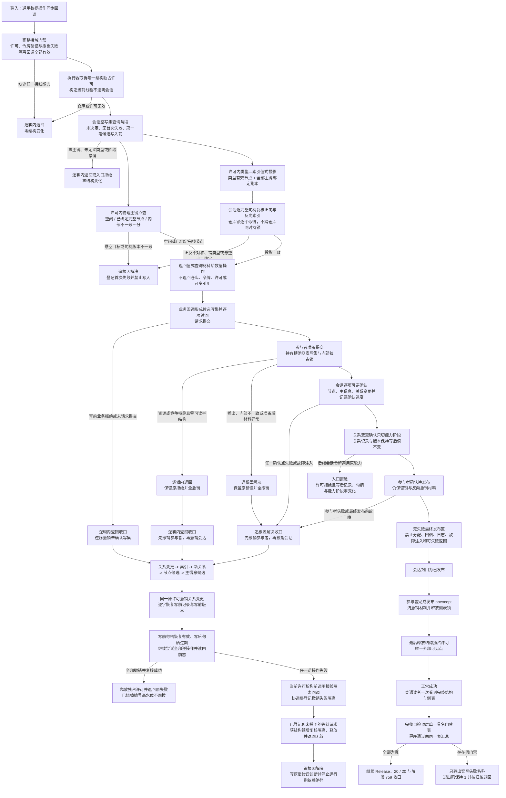

# 不透明结构写入会话许可内探测计量与全参与者原子收口代码逻辑流程图

更新时间：2026-07-17

状态：`fd52113` 已使 CORE-SESSION-S4-A10 与聚合 A14 通过，但完整自检仍无具名失败归因地退出 1 / `已接域()` 隔离回调门禁被弱化 / JY-382 v0.3、E118 重新派发 / 阶段 759 未登记

## 依据

```text
AGENTS.md
规范/仓库与服务分层事务边界规范.md
规范/详细设计/权威用途观察结构承载与事务发布恢复详细设计.md
实施记录/20260717_CAUSAL-USE-O1-S2-D1_权威用途观察结构承载与事务发布恢复实施前设计审计矩阵.md
实施记录/20260717_CAUSAL-USE-O1-S2-D1_权威用途观察结构承载与事务发布恢复实施前设计审计_Codex断点清单.md
实施记录/20260717_CORE-SESSION-S5_许可内物理探测计量与全参与者原子收口代码实施_Codex断点清单.md
海中鱼巣/核心/会话.结构写入.ixx
海中鱼巣/核心/执行器.结构写入.ixx
海中鱼巣/核心/结构事务接线.数据.h
海中鱼巣/核心/协调.结构事务.ixx
海中鱼巣/领域/参与者.特征值原始材料.ixx
```

## 说明

本图只固定通用结构底座：第一笔候选写入前的许可内物理主键点查、类型—索引值式投影，以及从参与者准备到唯一许可释放之间的可逆确认、完整撤销和撤销失败隔离。核心层不知道 O1、FNV、关系角色或 2048 字节业务预算；节点 15、关系 18、15 槽、用途观察数据操作、HYSNAP01 和阶段 880 均不在 #291 范围。

全部中途非成功只允许落入“逻辑内返回”或“追根因解决”。撤销失败不允许普通返回后继续运行，而是先把事务域置为隔离，拒绝后续许可，再停止依赖路径。

## 流程图



## 关键边界

```text
1. 查询只允许当前创建线程、写入中、未决定、无首次失败且第一笔候选写入之前；不得许可外扫描或取得第二许可。
2. 物理主键点查必须显式区分空闲、已绑定完整节点、入口拒绝和内部不一致；optional 空值不得同时表示多种语义。
3. 类型—索引投影只返回通用值式结构材料；O1 所有者、角色 1、FNV、1024、2048 和 128 MiB 的解释只能留在后继用途观察专用数据操作。
4. 确认阶段保持可逆；关系变更确认只切能力阶段，不改变关系记录或版本。同一原许可撤销时逐字恢复写前记录与写前版本，写前句柄恢复有效，写后句柄立即过期；许可内未发布写后版本不按已发布历史版本解释。
5. 参与者固定为准备、确认待发布、完成发布、撤销四段；完成发布为 noexcept 且不做可失败工作。
6. 锁序固定为结构独占许可 -> 参与者侧表独占锁；接域 `特征值服务` 的全部生产侧表读写必须先取得结构许可，再取侧表锁，唯一运行期装配必须传入同一接线。
7. 唯一可见点是结构独占许可最后释放；参与者先解锁不构成提前可见，因为普通读者仍被结构许可阻挡。
8. 撤销失败时不回拨编号 / 创建序号高水位，也不在线修补；必须隔离整个事务域。隔离既拒绝尚未登记的新请求，也让已登记未授予请求在获锁后二次复核并返回无效。
9. 参与者准备阶段只有资源 / 竞争拒绝且未产生可读半结构时可逻辑内返回；抛出、内部不一致或准备后材料异常必须追根因，二者均先全撤销。
10. Debug 故障注入覆盖每个确认点、参与者准备 / 确认和最终发布前；最终发布区内禁止故障点。
11. 跨会话按域编号、运行期纪元、许可序号、许可类型和活动线程拒绝；拒绝必须保持写后记录、写后句柄和能力阶段零变化。原许可释放后退出活动表，旧能力自然失效。
12. #291 不实现节点 15、关系 18、15 槽、O1 专用账、快照恢复、统计、学习、业务生产接线或阶段 880；只允许唯一运行期装配把既有结构接线传入特征值服务。
13. `已接域()` 必须同时要求撤销失败隔离回调；任何包装接线必须完整转发该回调。缺一项即接线无效，不得以弱化生产门禁兼容旧自检。
14. 完整自检的 `程序通过` 必须由单一“门禁名称 + 既有布尔值”表汇总；失败输出只做人读归因，不改变门禁真值、退出码、阶段登记或业务状态。
```
