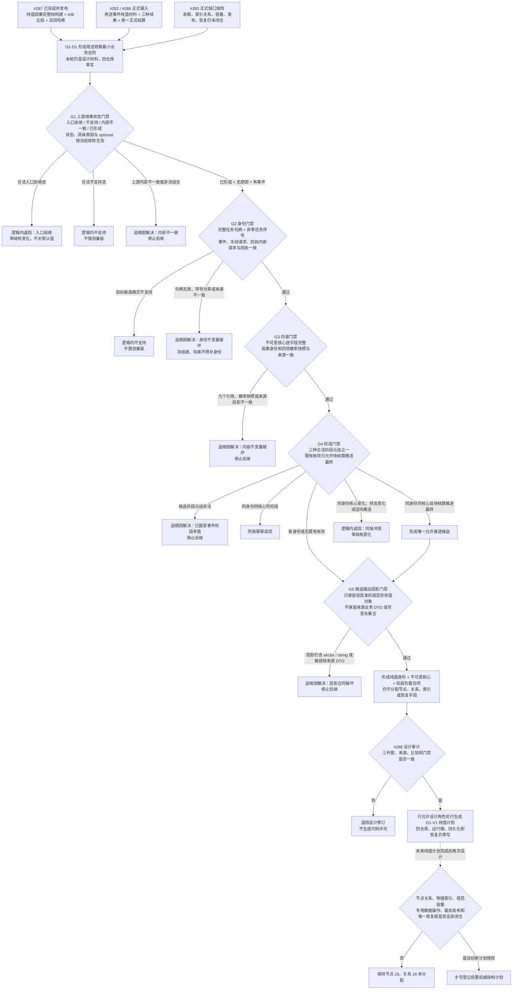

# 权威用途观察最小业务合同流程图 v0.1

更新时间：2026-07-17

施工元数据：JY-377 / #288 / DQ-180；本图只形成 O1-D1 设计审计输入，不登记代码阶段，870 继续未登记

## 依据

```text
AGENTS.md
计划/计划索引.md
规范/000_项目规则总纲.md
规范/节点类型与关系类型枚举规范.md
规范/仓库与服务分层事务边界规范.md
规范/因果用途观察与方法学习无环接线规范.md
规范/详细设计/因果用途观察与方法学习无环接线详细设计.md
实施记录/20260716_CAUSAL-USE-S2_权威用途观察结构承载与恢复边界当前代码事实复核_Codex断点清单.md
计划/已完成计划/20260716_CAUSAL-IDENTITY-S1_因果完整结构键与比较哈希代码实施切片_v0.1.md
实施记录/20260716_CAUSAL-IDENTITY-S1_因果完整结构键与比较哈希代码实施_Codex断点清单.md
海中鱼巣/领域/材料.用途事件.ixx
海中鱼巣/领域/算法.用途事件.ixx
海中鱼巣/领域/材料.因果模式.ixx
海中鱼巣/领域/算法.因果模式.ixx
海中鱼巣/线程/协议.任务执行请求.ixx
海中鱼巣/线程/任务结果回执协议.ixx
```

## 说明

#287 已完成并发布纯值 `因果完整结构键`、显式版本兼容、原因 / 结果有序 A/B 全字段比较和召回哈希。O1-D1 不把另一个纯值 DTO 宣称为权威用途观察，也不直接进入仓库实施；它先固定未来观察的语义身份、不可变核心、阶段负载、比较裁决和固定形状边界，再由 #288 独立审计这些合同是否足以支持后继纯值计划。

节点 15、关系 18、物理索引、规范编码字节、事务 API、最后发布点、恢复格式和新自检阶段均未在本图中锁定。

## 流程图



## 最小业务合同

```text
语义身份 = 完整任务句柄（仓库编号 + 节点编号 + 版本号）+ 非零任务序号。
冻结键只作来源关联；请求号、幂等键、回执号、批次号、时间戳、哈希和因果完整结构键均不替代观察身份。
不可变核心保存固定形状的来源引用与观察时历史概率快照；完整回执、完整结算 DTO、完整机会证据组、待结算提示、文本和缓存不得直接进入。
阶段负载只允许“尝试未达成 / 待结算 / 最终已结算”三种合法元组。
同账唯一允许变化为：同身份、同不可变核心的待结算阶段推进为合法最终已结算阶段。
```

## 关键边界

```text
1. 本图与 #288 都是文档治理，不修改 C++、工程或运行期，不登记 870。
2. 固定形状约束候选输出投影，不拒绝合法来源输入。输出不得保留可变长集合、完整冻结请求、完整回执、完整结算 DTO 或完整机会证据组；完整节点句柄和因果完整结构键属于允许的固定形状值对象。不预设 C++ ABI sizeof、规范编码字节数或仓库容量常数。
3. #287 完整因果键是不可变核心中的观察内容字段，也是后继统计身份候选，不是用途观察语义主键。
4. “同身份异完整内容即冲突”改为“不可变核心 + 阶段负载”比较；合法待结算推进不得被误判为异内容冲突。
5. 已发布层同一语义身份出现多个当前记录必须追根因，不扫描选优、不静默删除。
6. 写入开始后的读回、确认、发布、撤销或恢复不符合合同必须追根因并停止；只有正式事务合同已经证明时才能宣称精确撤销。
7. 节点 15、关系 18、主信息槽、物理索引键、关系顺序号、容量数值、事务 API、最后发布点和恢复段均继续待审计。
8. 任务序号只参与观察回合身份，不得充当方法代际 N / N+1。
```
