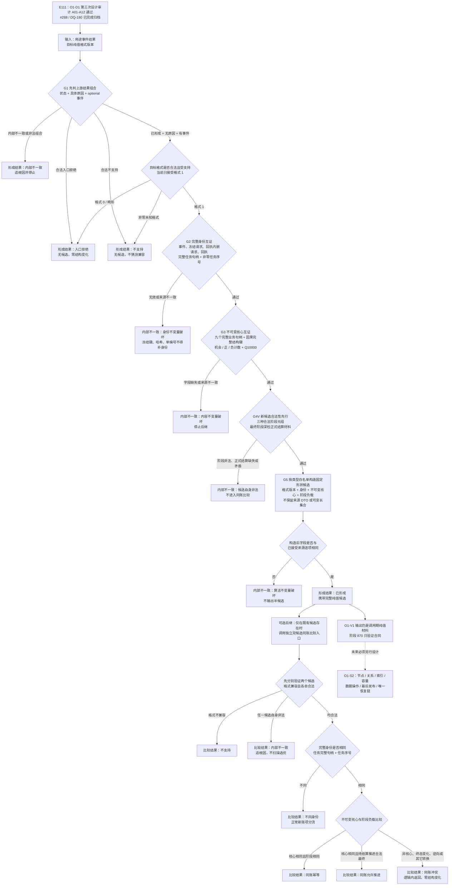

# 权威用途观察纯值合同流程图 v0.1

更新时间：2026-07-17

施工元数据：JY-380 / #289 / DQ-181 / WIN-0001-E112；本图只授权 O1-V1 纯值形成与同账比较，预期 Debug 自检阶段 870

## 依据

```text
AGENTS.md
计划/计划索引.md
规范/0050_项目通用机器逻辑与禁止性规则总纲_20260721.md
规范/规范目录.md
规范/代码文件建立归属与模块命名规范.md
规范/1190_根规范_因果_20260720.md
规范/4330_子规范_因果用途观察证据账与阶段推进.md
规范/5340_子规范_方法学习晋级新代际与任务回合同轮隔离.md
规范/详细设计/过期设计/因果用途观察与方法学习无环接线详细设计.md
规范/详细设计/过期设计/权威用途观察最小业务合同详细设计.md
实施记录/20260717_CAUSAL-USE-O1-D1_权威用途观察最小业务合同第三次设计审计矩阵.md
实施记录/20260717_CAUSAL-USE-O1-D1_权威用途观察最小业务合同第三次设计审计_Codex断点清单.md
计划/已完成计划/20260716_CAUSAL-USE-S1_用途事件与结构化结果效用裁决代码实施切片_v0.1.md
计划/已完成计划/20260716_DEMAND-SETTLEMENT-S1_需求结算单一正式合同语义收口代码实施切片_v0.1.md
计划/已完成计划/20260716_CAUSAL-IDENTITY-S1_因果完整结构键与比较哈希代码实施切片_v0.1.md
海中鱼巣/领域/材料.用途事件.ixx
海中鱼巣/领域/算法.用途事件.ixx
海中鱼巣/领域/材料.因果模式.ixx
海中鱼巣/领域/算法.因果模式.ixx
```

## 说明

E111 已证明 O1-D1 的来源身份、不可变核心、三种阶段、候选合法性先行、同账比较后置和非成功唯一分类一致。O1-V1 据此只形成固定形状纯值候选和强类型比较结果；候选不是权威用途观察记录，不进入四仓库、结构事务、线程、运行期、持久化或恢复。

生产类型由新模块 `材料.用途观察` 单一拥有，形成与比较算法由新模块 `算法.用途观察` 单一拥有，自检由独立 `自检.用途观察` 模块承载。既有用途事件模块只作为只读输入所有者，不反向依赖用途观察。

## 流程图



## 关键边界

```text
1. 形成结果与同账比较结果是两套独立的强类型状态 / 原因 / 结果合同；形成成功不自动表示已发布，比较结论不执行写入。
2. 候选合法性永远先于身份、核心和阶段转换比较；新候选或既有候选自身非法只归内部不一致追根因。
3. 最终阶段必须沿事件结果来源中的正式结算材料深检，保存 `正式结算.结算状态.状态节点`；`最近结算状态` 只作兼容投影互证。
4. 哈希不参与 O1-V1 同账裁决；#287 因果完整结构键哈希仍只用于其自身召回，命中后必须完整比较。
5. 输出固定形状，不保留 vector、string、完整冻结请求、完整回执、完整结算 DTO、完整机会证据组或待结算提示。
6. 生产模块不得 import 四仓库、结构事务、数据操作执行器、线程路由 / 线程状态、运行期、持久化、恢复、日志、显示、SQL、D455、体素或外设模块；只允许只读消费 `用途事件结果` 已嵌套的冻结协议材料。
7. 节点 15、关系 18、物理索引、容量、事务发布和恢复继续未授权；O1-S2 不随 #289 自动生成。
8. 目标格式 0 是请求畸形并入口拒绝；非零未知格式才是不支持。候选比较先判格式非零，再判格式兼容，畸形候选不得降格为不支持。
```
