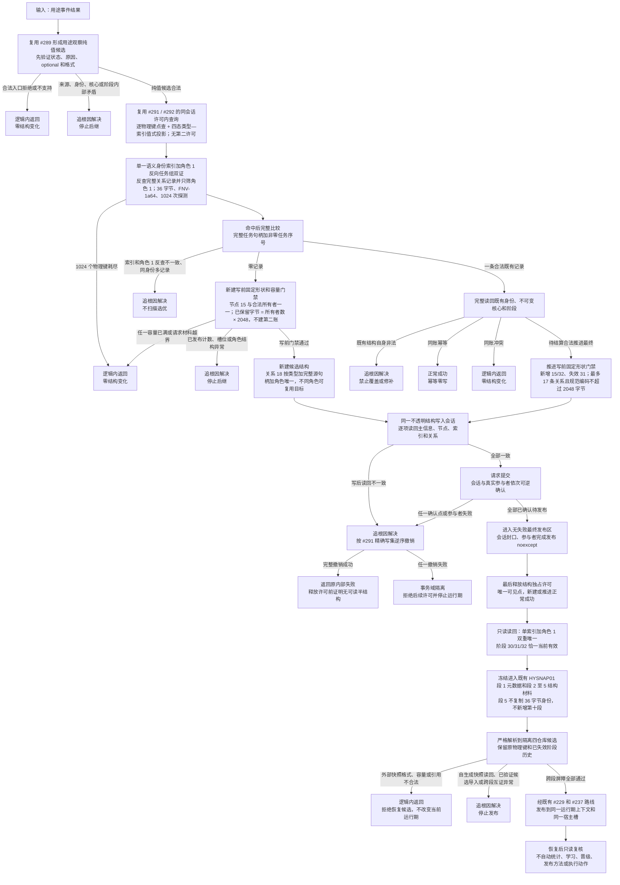

# 权威用途观察结构承载与事务发布恢复流程图

更新时间：2026-07-17

状态：#290 v0.4 第四次审计已由 `77fd4de` 完成 / #293 已由 `4ae8d07` 完成 / JY-388 已归档 #293 / A01—A20 与 Debug 阶段 880 已闭合 / HYSNAP01 与生产接线仍未实施

## 依据

```text
实施记录/20260716_CAUSAL-USE-S2_权威用途观察结构承载与恢复边界当前代码事实复核_Codex断点清单.md
规范/详细设计/权威用途观察最小业务合同详细设计.md
规范/详细设计/权威用途观察纯值合同详细设计.md
规范/4010_子规范_统一仓库稳定句柄与通用关系索引边界.md
规范/4020_子规范_主信息身份生命周期与字段边界.md
规范/4040_子规范_不透明结构事务候选确认撤销与最后发布.md
规范/4330_子规范_因果用途观察证据账与阶段推进.md
规范/5340_子规范_方法学习晋级新代际与任务回合同轮隔离.md
规范/详细设计/权威状态快照隔离恢复与运行期上下文一次发布详细设计.md
海中鱼巣/领域/材料.用途观察.ixx
海中鱼巣/领域/算法.用途观察.ixx
```

## 说明

本图固定 O1-S2 的完整物理合同。#293 已实现从输入到唯一许可释放及完整读回的运行期子段：节点 15、关系 18、15 槽、单索引双证、用途观察专用数据操作和业务服务已经形成正式代码与验收证据。HYSNAP01 冻结、解析、隔离恢复和同宿主发布仍由 #226—#230、#237—#239 承担；运行期结构完成不等于恢复或生产接线完成。

全部中途非成功只允许落入“逻辑内返回”或“追根因解决”。正常新建、同账幂等和待结算合法推进属于正常成功，不属于非成功返回。

## 流程图



## 关键边界

```text
1. 设计候选分配节点类型 15 为用途观察记录、关系类型 18 为用途观察证据角色；#290 审计通过前不得改枚举或仓库代码。
2. 主信息格式 1 恰好 15 个非空 I64 槽，只承载固定原始标量；全部节点句柄只由关系 18 承载，不在主信息复制。
3. 关系角色 1 至 14 构成不可变身份与核心；角色 15 只在最终阶段存在；30、31、32 分别表示尝试、待结算、最终且恰一当前有效。
4. 角色 30、31 的目标必须等于角色 9 的实际状态；角色 32 的目标必须等于角色 15 的正式结算状态。
5. 关系 18 的当前唯一键固定为“关系类型 + 完整源句柄 + 顺序号 / 角色”；不同角色允许复用同一目标，9 与 30 / 31、15 与 32 必须可共存，不能套用通用“类型 + 源 + 目标”重复拒绝。
6. 角色 1 反查必须读取完整关系记录并只筛选关系 18、顺序号 1、当前有效和目标任务匹配的记录，再读回源观察完整身份；不得用未筛角色的来源节点组代替。
7. 待结算推进最终只允许新增角色 15 和 32 并失效 31；同一观察生命周期最多 17 条关系记录，失效 31 保留审计历史，推进后规范编码仍不得超过 2048 字节。
8. 每个任务最多 1024 条用途观察；全局最多 65536 条；每个合法 O1 所有者固定预留 2048 字节，已保留字节按“所有者数 × 2048”派生并做溢出检查，不新增字节账；全部容量检查发生在第一笔写入前。
9. 只有一个权威语义身份物理索引。冻结键和因果哈希不作为 O1 索引或身份；索引命中后必须完整比较。
10. 领域服务不得接收仓库、原始令牌、许可或通用写入会话；用途专用数据操作只解释 #291 提供的通用值式查询并负责本领域候选，执行器负责可逆确认、全参与者撤销、无失败最终发布和许可释放。
11. O1 复用段 1 既有元数据子项，结构记录只进入段 2—5；段 5 只保存最终物理键和探测元数据，36 字节身份由段 2 / 4 重建，不建立第二事实账、第二恢复链、第二运行期上下文或第二宿主。
12. #291 / 759、#292 / 761 与 JY-385 均已完成；#290 第四次审计已由 `77fd4de` 证明 M0—M5、A01—A16 全部通过并由 JY-387 归档。#293 已由 `4ae8d07` 实现并经 JY-388 归档；节点 15、关系 18、运行期 O1 和 Debug 阶段 880 已形成正式事实。
13. 本图不授权统计、概念映射、方法学习、晋级、代际、生产接线或自动行动。
14. #293 不实施 W—Y 的 HYSNAP01 路线；恢复仍由 #226—#230、#237—#239 按原依赖和允许 / 禁止文件实施，不得借 #293 建立第十段或第二恢复链。
```
