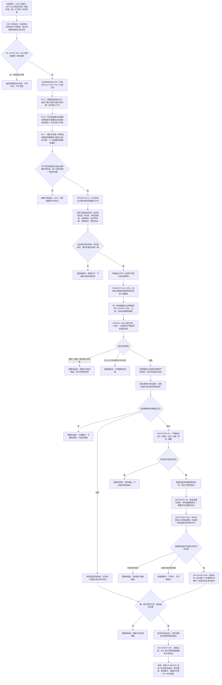

# 权威状态快照隔离恢复与运行期上下文一次发布流程图 v0.2

更新时间：2026-07-18

## 施工元数据

```text
图类型：施工流程图 / JY-390 当前物理合同修订
当前可执行计划：#295 / DQ-187 / PERSIST-S1-P0 纯只读事实复核
设计门控计划：#226 / DQ-118 / PERSIST-S1-B v0.2
绑定详细设计：规范/详细设计/权威状态快照隔离恢复与运行期上下文一次发布详细设计.md
替代关系：本图替代 20260711 v0.1 作为当前施工路由；v0.1 只保留历史证据
验证方式：MD / HTML Mermaid 同源、严格规范检查、git diff 检查
```

## 依据

```text
AGENTS.md
规范/000_项目规则总纲.md
规范/001_规则迁移清单.md
规范/代码文件建立归属与模块命名规范.md
规范/迁移路线权力分层规范.md
实施记录/20260718_PERSIST-S1-D1_权威冻结与九段物理合同实施前设计审计矩阵.md
实施记录/20260718_PERSIST-S1-D1_权威冻结与九段物理合同实施前设计审计_Codex断点清单.md
计划/20260718_PERSIST-S1-P0_生产运行期所有权与概念活动承载当前事实复核计划_v0.1.md
计划/20260718_PERSIST-S1-B_HYSNAP01规范编码与原子文件发布代码实施切片_v0.2.md
```

## 说明

v0.2 把旧“一个 #226 同时解决所有权、冻结、编码和发布”的路线拆开。当前先由 #295 只读冻结生产旧栈消费者与概念活动字段；设计角色随后生成窄 P0 代码计划。只有生产入口真实使用唯一运行期上下文、段 9 已有新运行期唯一所有者后，才实施 PERSIST-S1-A 同冻结材料；#226 只承担 PERSIST-S1-B 规范编码、严格自读和原子文件发布。

恢复仍在外部快照严格解析后构造隔离候选，通过屏障后发布到同一空宿主。任何阶段都不得用旧入口对象、空段、日志、SQL 或显示补齐机器事实。

## 流程图



## 关键边界

```text
1. #295 只冻结事实，不修改生产调用，也不直接裁决最终文件许可。
2. P0 必须证明生产入口实际持有唯一上下文；宿主 / 租约自检通过不等于生产已经切换。
3. 旧概念图服务不进入新装配。段 9 必须有新运行期唯一所有者或已实现的确定性重建参与者，禁止伪造空段。
4. O1 继续复用段 2—5且无第十段；本路线不接 O1 统计、学习、晋级、代际或自动动作。
5. PERSIST-S1-A 冻结内只复制和值式复核；排序、编码、校验和文件 I/O 全在冻结外。
6. #226 只消费不可变九段材料，不修改仓库、领域服务、运行期上下文或生产所有权。
7. HYSNAP01 仍固定九类必需段、显式小端、规范顺序、段校验和跨段摘要；索引候选必须带唯一所有者声明。
8. 外部坏快照逻辑拒绝；当前写入方自读失败、内部冻结矛盾或已验证导入失败追根因。
9. 恢复只在隔离候选完成，外部文件、SQL、日志、显示、缓存和事件段不裁决当前事实。
10. 全新与恢复共用同一空宿主首次发布槽；已有上下文时拒绝，首版不在线热替换。
11. 发布后才启动线程；SQL 审计和只读控制面板最后启动且不能修复领域事实。
12. 新生产逻辑与自检必须是真模块并分离；入口只保留最小 import、一次调用和总结果。
13. 完成上述路径仍不证明事件重放、断电耐久、跨版本迁移、任务恰好一次或旧持久化能力迁移。
```
