# 权威状态快照隔离恢复与运行期上下文一次发布流程图 v0.3

更新时间：2026-07-19

## 施工元数据

```text
图类型：施工流程图 / JY-391 依赖顺序 + JY-403 原子初始化 + JY-407 / JY-411 IFC 同名类型隔离 + JY-416 P0-A 早期排他分流 + JY-421 / JY-422 / JY-425 / JY-441 后继路由修订
当前路由：#296—#299、#304 已完成；#310 / #305 第二批并行，集成后 #301 串行，再按 #306 -> #307 -> #302 -> #309 -> #303 推进
后继计划：#301—#310 / DQ-193—DQ-202；#300 继续暂停，#226 继续设计门控
设计门控计划：#226 / DQ-118 / PERSIST-S1-B v0.4
绑定详细设计：规范/详细设计/权威状态快照隔离恢复与运行期上下文一次发布详细设计.md
替代关系：本图替代 20260718 v0.2 作为恢复主施工路由；JY-441 子图替代 JY-425 第二批段，v0.1、v0.2 和旧子图只保留历史证据
验证方式：MD / HTML Mermaid 同源、严格规范检查、git diff 检查
```

## 依据

```text
AGENTS.md
规范/000_项目规则总纲.md
规范/001_规则迁移清单.md
规范/代码文件建立归属与模块命名规范.md
规范/迁移路线权力分层规范.md
实施记录/20260718_PERSIST-S1-P0_生产运行期所有权与概念活动承载当前事实矩阵.md
实施记录/20260718_PERSIST-S1-P0_生产运行期所有权与概念活动承载当前事实复核_Codex断点清单.md
实施记录/20260718_PERSIST-S1-P0-C_概念活动唯一所有者代码实施_Codex断点清单.md
实施记录/20260718_WB-296-01_接口漂移断点集成记录.md
实施记录/20260718_WB-296-02_第二次接口漂移断点集成记录.md
实施记录/20260718_WB-296-03_第三次接口漂移断点集成记录.md
实施记录/20260718_WB-296-04_第四次接口漂移断点集成记录.md
项目记忆/设计记录/20260718_PERSIST-S1-P0-C_JY-407同名根类别IFC隔离修订.md
项目记忆/设计记录/20260718_PERSIST-S1-P0-C_JY-411第四消费调用点隔离修订.md
项目记忆/设计记录/20260718_PERSIST-S1-P0-A_JY-416实际接口复核与早期排他分流修订.md
计划/已完成计划/20260718_PERSIST-S1-P0_生产运行期所有权与概念活动承载当前事实复核计划_v0.1.md
```

## 说明

#295 已完成并证明：生产入口仍是旧栈；新宿主 / 租约只在自检；段 9 的三生命周期角色、完整规范签名和活动版本仍是旧对象私有权威。v0.3 不允许先发布缺少段 9 所有者的生产上下文，因此先完成 P0-C，再由 P0-A 建立排他的全新运行期启动通道。

迁移期用显式新运行期通道和旧默认通道互斥，禁止同一进程把两套对象都当当前事实。B5 完成前默认行为仍走旧通道；B5 完成后默认切到新通道，旧大段只保留 Debug 自检 / 兼容证据。#214 对应的概念命名写路径继续用户暂停；它不进入默认生产可达图时，不阻塞 B5 与快照主链，也不据此获得恢复许可。

WB-296-01 的正式 S0 断点已由 `70534d7` 集成到 main：阶段 890 的真实专项接线位于 `入口.cpp`，通用 `自检.运行器.ixx` 不拥有专项登记表。JY-399 因此只允许入口在现有 Debug 自检宏内增加模块 import、一个值式结果槽、890 一次登记和最终具名汇总；入口不承载专项正文，Release 零专项文本。

WB-296-02 的第二次 S0 断点已由 `889ff28` 集成到 main：阶段 660、680、690 的既有夹具仍把“只初始化系统角色即完整并可发布”作为前置。JY-403 将这三套夹具纳入 v0.3，并固定新旧生命周期类型隔离、fresh-only 参数和单一不透明结构会话原子初始化；不得通过弱化 `完整()`、推导测试主键或在恢复路径猜测 fresh 材料规避迁移。

WB-296-03 的第三次 S3 断点已由 `ab5fbfc` 集成到 main：`概念图算法.h` 的规范 `概念根类别 : uint32_t` 与旧 `数据操作.概念图结构.ixx` 导出的同名 `概念根类别 : uint8_t` 在运行期业务装配 IFC 汇合后触发 C1117 / C4789。JY-407 把旧创建型概念结构链的内部类型机械改名为 `概念结构根类别`，只允许同步数据操作、服务和专项自检三文件；数值、关系 9 / 10 / 11、公开业务行为和规范签名所有权均不改变。机械改名必须先通过 Debug / Release Rebuild 与既有阶段 755，再继续新活动模块。

WB-296-04 的第四次 S1 断点已由 `cef8d7c` 集成到 main：`自检.运行期组合分层.ixx:199` 仍直接以旧类型构造创建型概念结构请求。JY-411 将该第四消费文件纳入 v0.5，只允许单点同步为 `概念结构根类别::存在`；阶段 770 的其它场景和断言不变。机械隔离前置改为四文件、Debug / Release Rebuild、完整自检以及阶段 755 / 770 同时通过。

JY-416 以 `main@60f3ca7` 复核 #297：现有上下文 / 宿主 / 租约接口足以完成首发，实际漂移只在所有权和时序。`自检.运行器.ixx` 不拥有专项登记，阶段 900 必须由入口 Debug 路径登记；显式 `--runtime-context` 又必须在旧栈构造前早分流。因此生产会话唯一持有宿主 / 租约，显式分支只真实首发后退出，阶段 900 只在默认 Debug 自检路径运行，两条路径不在同一进程同时构造。

JY-421 已把 P0-B 纠正为 `#298 串行 -> #299 / #302 两路并行 -> #301 串行 -> #309 汇合 -> #303 默认切换`。JY-422 进一步把相同的当前接口事实应用到 #304—#307：通用 `自检.运行器.ixx` 只提供阶段化运行机制，不拥有专项 import、结果槽、阶段登记或具名汇总；970 / 980 / 990 / 1000 分别由对应计划在 `入口.cpp` 既有 Debug 自检路径做最小接线，专项正文仍留在独立自检真模块，Release 零专项文本。

## 流程图

```mermaid
flowchart TD
    A["#295 已完成：旧入口是当前生产所有者；新上下文无概念活动所有者"] --> D1["JY-391 归档 #295；登记 #296—#307 窄计划"]
    D1 --> S0R["WB-296-01 S0：890 专项接线实际位于入口；纯断点已集成 main@70534d7"]
    S0R --> D2["JY-399 修订 #296 v0.2：入口只获 Debug import、结果槽、890 一次登记和最终具名汇总"]
    D2 --> S0R2["WB-296-02 S0：660 / 680 / 690 仍按仅系统角色即完整；纯断点已集成 main@889ff28"]
    S0R2 --> D3["JY-403 修订 #296 v0.3：隔离运行期枚举、单会话原子初始化并迁移三套既有夹具"]
    D3 --> S0R3["WB-296-03 S3：规范根类别与旧模块同名不同宽度实体在装配 IFC 汇合；纯断点已集成 main@ab5fbfc"]
    S0R3 --> D4["JY-407 修订 #296 v0.4：旧创建型概念结构内部类型机械改名为概念结构根类别"]
    D4 --> S0R4["WB-296-04 S1：运行期组合分层仍有第四个旧类型显式调用；纯断点已集成 main@cef8d7c"]
    S0R4 --> D5["JY-411 修订 #296 v0.5：第四消费调用点只做单点机械同步"]
    D5 --> C0{"全仓只有一个规范概念根类别；旧四文件行为与阶段 755 / 770 是否保持"}
    C0 -->|"否"| RIFC["追根因解决：停止新活动装配，不隐藏 IFC 或改动关系语义"]
    C0 -->|"是"| P0C["#296 P0-C fresh-only：同一不透明结构会话写入三抽象状态角色与四条生命周期关系；完整读回后发布活动材料"]
    P0C --> C1{"参数有效、fresh 基线成立且活动根 / 登记重建精确一致"}
    C1 -->|"外部参数不满足"| L0["逻辑内返回：零写入且不发布概念活动材料"]
    C1 -->|"正式 fresh 前置后结构既存或内部矛盾"| R0["追根因解决：整会话回滚并停止生产首发依赖"]
    C1 -->|"是"| T0["660 / 680 / 690：系统角色后拒绝发布；显式活动初始化后才完整并保持原回归语义"]
    T0 --> S0A["JY-416 P0-A 复核：宿主接口足够；900 登记在入口；显式分支必须早于旧栈构造"]
    S0A --> P0A["#297 P0-A v0.2：生产会话唯一持有宿主；早期新通道构造、初始化、首发并持有同身份租约"]
    P0A --> A1{"新通道与旧默认通道是否互斥；租约是否有效且同身份"}
    A1 -->|"请求模式无效 / 已有宿主"| L1["逻辑内返回：不回退另一通道、不形成双所有者"]
    A1 -->|"发布后身份不一致"| R1["追根因解决：停止消费者改接"]
    A1 -->|"是"| B0["#298 P0-B0：一次扩展当前可达的值式查询、任务执行和结果治理正式公开合同"]

    B0 --> B1["#299 P0-B1：概念命名上行桥与任务管理上行桥改为租约值式只读"]
    B0 --> B4["#302 P0-B4：SQL 审计与控制面板只消费租约值式投影"]
    B0 --> B2["#300 P0-B2：概念命名写路径"]
    B2 --> PAUSE["#214 用户暂停 + 架构重设计门控：保持不可达兼容，不进入当前关键路径"]

    B1 --> BP{"#299 / #302 两路任务是否按冻结批次集成并通过完整验证"}
    B4 --> BP
    BP -->|"否"| L2["依赖门控：不得启动 B3 或切默认入口"]
    BP -->|"是"| B3["#301 P0-B3：从新 main 串行改接自我治理权威写路径"]
    B3 --> J309["#309 串行汇合：统一登记 920 / 940 / 950 并验证同一租约"]
    J309 --> G0{"汇合阶段是否通过；B2 是否在默认生产路径静态不可达"}
    G0 -->|"否"| L2
    G0 -->|"是"| B5["#303 P0-B5：默认入口切新运行期；旧局部栈只保留 Debug 自检 / 兼容证据"]
    B5 --> G1{"默认生产是否只有一个上下文 / 宿主 / 租约；旧对象是否不再可达写机器事实"}
    G1 -->|"否"| R2["追根因解决：#304 以后继续门控"]
    G1 -->|"是"| W0["JY-422：970—1000 专项阶段均由入口 Debug 最小接线；通用运行器保持不变"]
    W0 --> A0["#304 PERSIST-S1-A0：索引所有者合同与入口登记 970"]

    A0 --> A2["#305 PERSIST-S1-A1：四仓库全部记录、身份、高水位导出与入口登记 980"]
    A2 --> A3["#306 PERSIST-S1-A2：侧表、角色、登记、活动导出与入口登记 990"]
    A3 --> A4["#307 PERSIST-S1-A3：正式租约同域独占九段冻结与入口登记 1000"]
    A4 --> F1{"参与者集合、冻结身份、索引所有者和九段是否精确一致"}
    F1 -->|"否"| R3["追根因解决：释放许可，不编码内部矛盾"]
    F1 -->|"是"| E1["#226 PERSIST-S1-B：规范小端编码、严格值式自读与同卷原子发布"]

    E1 --> E2["CREATE_NEW 临时文件 -> 写穿 -> 当前格式严格自读并逐值比较"]
    E2 --> E3{"提交点前结果"}
    E3 -->|"路径 / 权限 / 空间等允许失败"| L3["逻辑内返回：清理本次临时候选，旧正式快照保持"]
    E3 -->|"写入方无法读回自己的文件"| R4["追根因解决：不得替换旧快照"]
    E3 -->|"完整"| E4["同卷替换正式快照并最终严格读回；仅此时返回已发布"]

    E4 --> S1["启动调用方显式选择：全新初始化或从指定快照恢复"]
    S1 --> S2{"启动策略是否明确且互斥"}
    S2 -->|"否"| L4["逻辑内返回：不猜模式、不删除快照、不启动线程"]
    S2 -->|"全新"| N1["构造完整全新候选；复用同一空宿主首次发布合同"]
    S2 -->|"恢复"| Q1["RECOVERY-S1：严格校验总头 / 段表 / 九段 / 长度 / 校验 / 摘要"]
    Q1 --> Q2{"外部文件是否受支持"}
    Q2 -->|"否"| L5["逻辑内拒绝：丢弃候选，不回退全新初始化"]
    Q2 -->|"是"| Q3["按指定身份构造隔离四仓库；索引只暂存候选"]
    Q3 --> Q4["RECOVERY-S2：恢复侧表与角色；所有者重算索引；重建并比较概念活动"]
    Q4 --> Q5["RECOVERY-S3A：任务中断收口与跨段屏障；形成绑定候选身份的发布许可"]
    Q5 --> Q6{"隔离候选是否完整且无防复活冲突"}
    Q6 -->|"外部材料无效"| L6["逻辑内返回：丢弃整个隔离候选"]
    Q6 -->|"当前实现内部矛盾"| R5["追根因解决：不发布、不扫描修复"]
    Q6 -->|"是"| U1["RECOVERY-S3B：适配为同一运行期上下文类型并消费同一空宿主恢复发布能力"]

    N1 --> U2{"唯一宿主是否为空；候选是否完整"}
    U1 --> U2
    U2 -->|"否"| L7["逻辑内拒绝：首版不在线热替换"]
    U2 -->|"是"| U3["首次发布成功后，所有消费者只取得同身份租约"]
    U3 --> U4["RECOVERY-S3C：线程后启；SQL 审计和控制面板最后只读启动"]
    U4 --> Z["完成：受控 HYSNAP01 发布 / 启动恢复路径；事件重放、断电耐久、跨版本与恰好一次仍后置"]
```



## 关键边界

```text
1. P0-C 先于 P0-A；不得把缺少概念活动所有者的上下文发布为生产完整上下文。
2. 迁移期新旧启动通道互斥；显式新通道不是默认切换，B5 前不得双构造、双写或旧失败后回退新通道。
3. 生产版本 1 参数是项目正式稳定配置，不复用任何自检起始主键、阶段号或临时域编号。
4. P0-B0 只建立当前关键路径需要的正式值式公开合同；#214 对应命名写合同不借机恢复。
5. #300 / P0-B2 保持用户暂停和不可达兼容；只有用户恢复 #214 且重做三件套后才可执行。
6. B5 的判断依据是默认生产可达写入集合；编译存在但默认不可达的兼容模块不成为当前运行期所有者，也不取得快照许可。
7. PERSIST-S1-A 拆成索引所有者、四仓库导出、侧表 / 角色 / 登记 / 活动导出和统一冻结四个机械切片。
8. O1 继续只复用段 2—5并在领域登记声明无私有侧表；不接统计、学习、晋级、代际或第十段。
9. 冻结内只复制和值式复核；排序、编码、校验和文件 I/O 全在冻结外。
10. 外部坏快照逻辑拒绝；当前写入方自读失败、冻结参与者矛盾或发布身份不一致追根因。
11. 全新与恢复共用同一空宿主发布槽；已有上下文时拒绝，首版不在线热替换。
12. SQL、控制面板、日志和显示只做人读 / 审计材料，不裁决机器事实或恢复。
13. 新生产逻辑与自检必须是真模块并分离；#296 入口只允许 Debug 条件下的自检模块 import、一个结果槽、890 一次登记和最终具名汇总，专项正文不得进入入口，Release 零专项文本。
14. 新数据类型使用 `运行期概念生命周期阶段`；旧 `概念图服务.h::概念生命周期阶段` 继续隔离，不转换、不比较、不接入新装配。
15. fresh 初始化必须在一个不透明结构写入会话内完成三抽象状态角色、四条生命周期关系和完整读回；任一步失败都不得留下可读半结构。
16. 阶段 660、680、690 必须保留原阶段、并发规模和非活动语义，只把发布前置改为“系统角色后不完整 -> 显式活动初始化 -> 完整”。
17. 旧创建型概念结构链只把 `概念根类别` 机械改名为 `概念结构根类别`；三个所有者文件和 `自检.运行期组合分层.ixx` 的单一消费点构成四文件闭合，底层值、关系 9 / 10 / 11、字段语义以及阶段 755 / 770 不变，且不得与规范 `概念根类别` 互转或比较。
18. 完成上述路径仍不证明事件重放、断电耐久、跨版本迁移、任务恰好一次或旧持久化能力迁移。
19. #297 不修改通用自检运行器；阶段 900 只由入口在默认 Debug 自检路径登记，显式新通道不运行中央阶段总成。
20. `--runtime-context` 在首个旧仓库对象构造前排他分流；P0-A 无生产消费者，成功首发并复核租约后直接退出，不启动常驻循环、线程、SQL、控制面板或快照。
21. #304—#307 各自拥有对应专项自检模块和入口 Debug 最小接线；`自检.运行器.ixx` 为禁止修改文件，不得把 970 / 980 / 990 / 1000 的专项登记表或正文迁入通用运行器。
22. #226 当前 v0.4 只继承完成后的九段 DTO 与上述接线边界，仍是禁止执行的设计复核门控；#307 完成后必须按真实接口再次修订。
```

## JY-441 当前路线替换子图

以下子图替代上文从 B0 到 A4 的旧顺序以及 JY-425 的第二批段；其余编码、隔离恢复和一次发布部分保持不变。完整消费者边界见 `20260719_生产运行期B3合同补齐与仓库导出并行后串行改接流程图_v0.7.md`。


