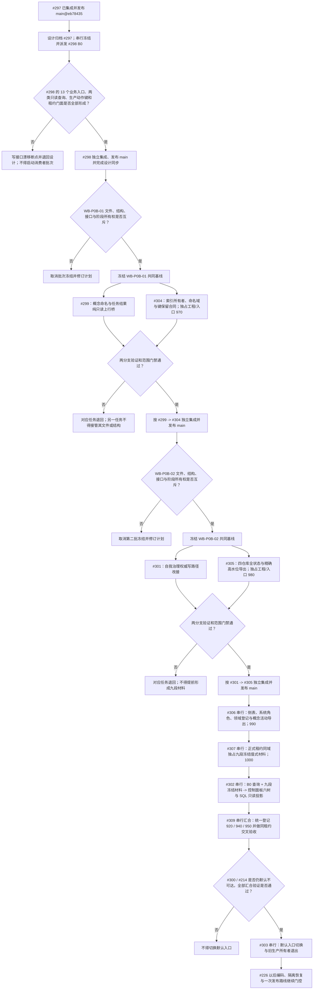

# 生产运行期公共合同双批并行与值式投影串行汇合流程图 v0.6

更新时间：2026-07-18

## 依据

```text
规范/多工作树并发与集成规范.md
规范/详细设计/权威状态快照隔离恢复与运行期上下文一次发布详细设计.md 第 21 节
计划/20260718_PERSIST-S1-P0-B0_运行期关键路径值式公开合同代码实施切片_v0.1.md（正文 v0.4）
实施记录/20260718_WB-297-01_R2_排他生产运行期首发与租约持有集成记录.md
项目记忆/并行工作树登记表.md
JY-425
```

## 说明

本图替代 v0.5 的当前执行路线。#297 已由 `main@eb78435` 正式集成。实际接口复核确认：#298 只足以提供概念命名与任务结果复核两类值式查询，以及任务执行 / 结果结算业务入口；完整控制面板六树和 SQL 审计投影还需要 #305—#307 形成的可枚举九段冻结值式材料。因此 #302 不再与 #299 提前并行。

当前并行拆为两个文件和结构所有权互斥批次：#299 与 #304 并行，随后 #301 与 #305 并行；#306、#307、#302、#309、#303 依次串行汇合。

## 流程图



## 关键边界

```text
1. #298 是 B0 唯一公共接口提供者；完成值式合同不等于形成完整结构枚举。
2. WB-P0B-01 只包含 #299 / #304；#304 独占工程文件和入口阶段 970。
3. WB-P0B-02 只包含 #301 / #305；#305 独占工程文件和入口阶段 980。
4. #299 只读、#301 权威写；两者不得声明并行未发布 ABI，也不得复制 B0 DTO。
5. #302 必须同时消费 B0 查询和 #307 九段冻结值式材料；不得从两个查询结果伪造六树或 SQL 全状态。
6. #306、#307、#302、#309、#303 按顺序串行；920、940、950 仍只由 #309 登记。
7. #303 之前旧生产路径可以保留兼容可达；#303 之后默认生产只允许新运行期，失败不得回退旧写路径。
8. #300 / #214 继续暂停；不得借 #298、#299、#302 或 #309 恢复概念命名写路径。
9. 任务分支完成不等于计划完成；必须经独立集成、main 发布和设计归档。
10. 当前只允许先冻结 #298；两个并行批次都必须在各自公共前置进入 main 后另行复核和登记。
```
