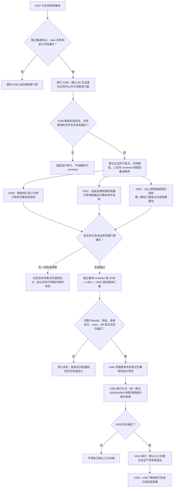

# 生产运行期消费者三路并行与串行汇合流程图 v0.4

更新时间：2026-07-18

状态：历史设计 / 已由 JY-421 和 v0.5 两路并行流程图替代 / 不作为当前执行依据

## 依据

```text
规范/多工作树并发与集成规范.md
规范/详细设计/权威状态快照隔离恢复与运行期上下文一次发布详细设计.md
计划/20260718_PERSIST-S1-P0-B0_运行期关键路径值式公开合同代码实施切片_v0.1.md
计划/20260718_PERSIST-S1-P0-B1_运行期纯只读上行桥代码实施切片_v0.1.md
计划/20260718_PERSIST-S1-P0-B3_自我治理权威写路径改接代码实施切片_v0.1.md
计划/20260718_PERSIST-S1-P0-B4_SQL控制面板值式投影代码实施切片_v0.1.md
项目记忆/并行工作树登记表.md
JY-420
```

## 说明

本图只设计 P0-B 消费者改接的并行路线。#297 尚待独立集成，#298 尚未实施，因此图中的三路并行批次当前只是依赖门控候选；只有 #298 正式进入 `main`、设计角色逐签名复核并登记共同冻结基线后，才能创建任务 worktree。

## 流程图



## 关键边界

```text
1. #298 是唯一公共接口提供者；#299、#301、#302 不互相提供接口。
2. 三个任务允许文件两两无交集；海中鱼巣.vcxproj 与 .filters 只归 #302。
3. 入口.cpp、统一阶段登记和中央治理文件不属于并行任务；由后继 #309 串行拥有。
4. #302 改为直接依赖 #298，不再依赖 #299；两者共同消费 #298 的公共只读查询门面。
5. #300 / #214 继续暂停，不借并行批次恢复命名写入口。
6. 线程不是动作来源；日志、统计、显示、SQL 和控制面板不裁决机器事实。
7. 当前没有共同冻结基线，不得把本设计称为已预授权执行批次。
```
