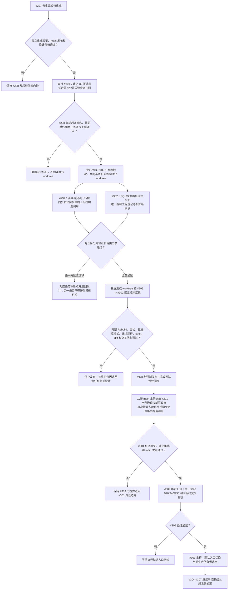

# 生产运行期消费者两路并行与自我治理串行汇合流程图 v0.5

更新时间：2026-07-18

## 依据

```text
规范/多工作树并发与集成规范.md
规范/详细设计/权威状态快照隔离恢复与运行期上下文一次发布详细设计.md
计划/20260718_PERSIST-S1-P0-B0_运行期关键路径值式公开合同代码实施切片_v0.1.md
计划/20260718_PERSIST-S1-P0-B1_运行期纯只读上行桥代码实施切片_v0.1.md
计划/20260718_PERSIST-S1-P0-B3_自我治理权威写路径改接代码实施切片_v0.1.md
计划/20260718_PERSIST-S1-P0-B4_SQL控制面板值式投影代码实施切片_v0.1.md
项目记忆/并行工作树登记表.md
JY-420 / JY-421
```

## 说明

本图替代 v0.4 的“三路并行”当前路线。静态复核确认 `自检.自我治理多轮.ixx` 同时实例化 `任务管理上行桥` 和 `自我治理领域路由`；#299 会改变前者构造合同，#301 会改变后者构造合同，因此两者存在真实消费者调用点依赖，不能在同一冻结基线上并行完整构建。

#297 尚待独立集成，#298 尚未实施，因此图中的 #299 / #302 两路批次仍只是依赖门控候选；只有 #298 正式进入 `main`、设计角色逐签名复核并登记共同冻结基线后，才能创建两个任务 worktree。

## 流程图



## 关键边界

```text
1. #298 是唯一公共接口提供者；#299 和 #302 在同一批次只消费 #298。
2. WB-P0B-01 只包含 #299 / #302；两者允许文件与公开 ABI 所有权互斥。
3. #299 定向修改自检.自我治理多轮.ixx，只同步任务管理上行桥的 B1 构造调用，不改自我治理领域路由语义。
4. #301 必须等待 #299 / #302 集成并从新 main 串行执行；届时可再次修改同一多轮自检，只同步 B3 路由构造和权威写验证。
5. 海中鱼巣.vcxproj 与 .filters 在两路批次只归 #302；#301 串行计划不修改工程文件。
6. 入口.cpp、统一阶段登记和中央治理文件不属于消费者任务；由后继 #309 串行拥有。
7. #302 的新自检由既有自检.控制面板按需投影.ixx 导入并调用，工程只登记模块；不得修改入口或统一运行器。
8. 920、940、950 仍统一由 #309 登记；任务分支不得提前登记阶段。
9. #300 / #214 继续暂停；线程不是动作来源，日志、统计、显示、SQL 和控制面板不裁决机器事实。
10. 当前没有共同冻结基线，不得把本设计称为已预授权执行批次。
```
