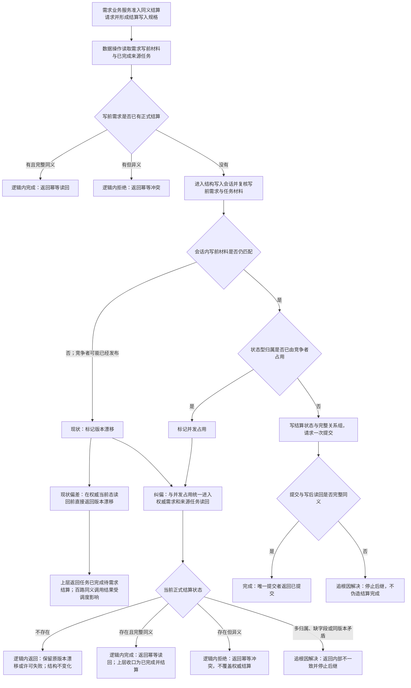

# 任务结果同义并发结算版本漂移归并现状与纠偏流程图

更新时间：2026-07-19

## 元数据

```text
图类型：现状流程图
代码版本：main@e94f95f0f2b81faba6e115107a3c7d8f6a73361a
覆盖文件：
  海中鱼巣/领域/数据操作.需求任务方法.ixx
  海中鱼巣/领域/服务.需求.ixx
  海中鱼巣/领域/组合.任务结果结算.ixx
  海中鱼巣/领域/自检.需求任务方法分层.ixx
  海中鱼巣/线程/自检.任务结果结算.ixx
逐行映射表：实施记录/20260719_任务结果同义并发结算版本漂移逐行代码映射表.md
输入契约表：实施记录/20260719_任务结果同义并发结算版本漂移输入契约与调用语境表.md
非成功审查表：实施记录/20260719_任务结果同义并发结算版本漂移非成功返回二分审查表.md
施工偏差清单：实施记录/20260719_任务结果同义并发结算版本漂移现状施工偏差清单.md
执行依据：计划/20260719_TASK-RESULT-STABILITY-S3_同义并发结算版本漂移幂等归并代码实施切片_v0.1.md
```

## 依据

```text
海中鱼巣/领域/数据操作.需求任务方法.ixx
海中鱼巣/领域/服务.需求.ixx
海中鱼巣/领域/组合.任务结果结算.ixx
海中鱼巣/领域/自检.需求任务方法分层.ixx
海中鱼巣/线程/自检.任务结果结算.ixx
实施记录/20260719_TASK-RESULT-STABILITY-S1_任务结果结算间歇失败候选对照诊断_Codex断点清单.md
实施记录/20260719_TASK-RESULT-STABILITY-S2_任务结果结算非空备份原子替换独立单轮诊断_Codex断点清单.md
```

## 说明

本图只处理同一需求、同一来源任务、同一实际状态、同一动态证据和同一幂等材料的并发结算。当前代码把会话内“写前材料已经被竞争者推进”记为 `版本漂移`，并在正式结算读回前直接返回；同一请求因命中时序不同，可能分别得到 `幂等读回` 或 `版本漂移`。纠偏目标是让无写入的并发退出统一经过权威当前态归并，不扩大为自动重试器或跨重启待结算队列。

## 流程图



## 关键边界

```text
1. 版本漂移本身不自动等于成功；只有当前权威正式结算完整匹配同一请求时才归并为幂等读回。
2. 当前仍未结算时保留原逻辑内版本漂移，不在数据操作层循环重试。
3. 当前已有异义正式结算时返回幂等冲突，不覆盖、不删除、不回滚。
4. 写后缺失、多归属或完整性矛盾属于追根因解决，不能用待结算提示掩盖。
5. 不修改服务公开 ABI、任务结果组合器、线程路由、阶段 610/760、入口或工程文件。
```
