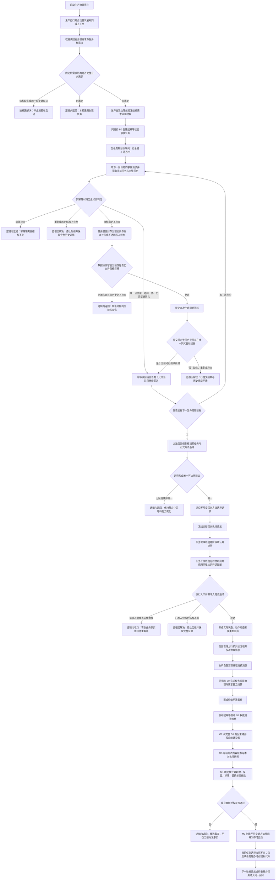

# 根需求任务筹办执行与方法学习生产闭环流程图

更新时间：2026-07-20

状态：目标态 v0.2 / JY-517 生命周期并发收口修订 / 依赖门控施工 / 不表示代码已实现

## 依据

```text
流程图/现状流程图/20260719_根需求任务筹办执行学习闭环现状流程图_v0.1.md
流程图/20260715_任务执行调度与强类型回执代码逻辑流程图_v0.1.md
流程图/20260716_因果用途观察与方法学习无环接线流程图_v0.2.md
规范/详细设计/任务执行调度与强类型回执详细设计.md
规范/详细设计/过期设计/因果用途观察与方法学习无环接线详细设计.md
实施记录/20260716_METHOD-LEARN-S0_方法学习算法与方法代际结构映射当前事实复核_Codex断点清单.md
实施记录/20260719_REAL-GENERATION-LOOP-S1_生产根需求承接与任务筹办代码实施_Codex断点清单.md（远端 R4 提交 06fda225）
D:\海中鱼巣\日志\验证\REAL-GENERATION-LOOP-S1\E260-WT-315-R4
```

## 目标口径

“建立根需求”在当前生产运行期中解释为：初始化并权威读回固定的安全根需求、服务根需求，且重复启动不得再创建第三个根。生产自我治理线程消费这些根需求；任务管理线程负责排队，任务工作线程负责执行，上行桥把强类型回执交回生产自我治理线程。线程只调度和搬运，全部机器事实仍由同一运行期租约取得的正式业务组合器写入。

学习采用 `O1 -> O2 -> M0 -> M1 -> M2` 分层。O1 是权威用途观察，不等于学习；只有独立授权后形成不可变新方法代际，并且只对后续任务筹办可见，才算学习闭环第一轮形成。

## 流程图



## 硬边界

```text
1. 不复用旧自我线程的“重新初始化两个根需求”路径作为生产消费者。
2. 根需求、任务、选择、执行、结果、结算、用途观察和方法代际必须属于同一运行期身份。
3. 任务管理线程和任务工作线程必须由后台线程自然消费；最终验收禁止由测试线程直接调用受控消费代替。
4. 消息、日志、统计投影和候选差异不得裁决机器事实。
5. O2 可清空重建；M1 候选不自动晋级；M2 必须消费独立授权。
6. 新代际不得改写当前任务已冻结的选择和执行来源。
7. 第一轮不接 SQL、控制面板、D455、体素、外部动作或跨重启恢复。
8. 生命周期请求保持“任务、目标阶段、幂等材料编号、发生时间戳”四字段；调用方不得携带预期旧版本。
9. 目标迁移已经唯一同义地进入完整历史时，即使当前任务已经继续前进，也必须幂等读回当前任务；不得把合法并发推进映射成内部不一致。
10. 只有目标历史不存在的写前当前性漂移可逻辑内返回；一旦本次提交已成立，历史缺失、重复或异义必须追根因。
```

## 完成声明边界

只有 #315 至 #322 均完成任务分支、独立集成、设计归档和最终只读覆盖审计后，才可声明“固定生产根需求到方法学习的新内核第一轮闭环已形成”。不得扩大为完整自我苏醒、通用自主学习、所有任务类型、外部动作或旧能力迁移完成。
