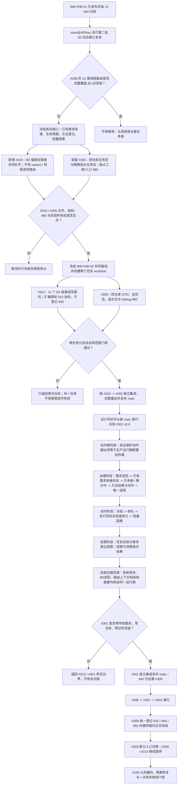

# 生产运行期 B3 合同补齐与仓库导出并行后串行改接流程图 v0.7

更新时间：2026-07-19

## 依据

```text
main@4f5f4ac60db77641bb90a17834e99a8e367a6b7a
海中鱼巣/领域/组合.运行期业务操作.ixx
海中鱼巣/装配.运行期业务.ixx
海中鱼巣/线程/自我治理领域路由.ixx
海中鱼巣/核心/主信息仓库.h
海中鱼巣/核心/节点仓库.h
海中鱼巣/核心/关系仓库.h
海中鱼巣/核心/索引仓库.h
JY-440 / JY-441
```

## 说明

本图替代 v0.6 的第二批及其后继路线。第一批 #299 / #304 已正式集成归档；第二批执行前逐调用点复核证明，#298 的 13 类线程可路由业务入口不包含自我治理旧链仍需要的已有需求承接、任务生命周期迁移、方法规格登记和轻量因果直接合同，因此 #301 不能按 v0.4 直接实施。

当前裁决是在不改变 14 / 11 variant 和既有 13 类线程路由的前提下，由新 #310 只补 B3 所需的强类型直接委托合同；#310 与文件、结构所有权互斥的 #305 并行。两者集成后，#301 再从新 main 串行完成按逻辑阶段的自我治理改接。

## 流程图



## 关键边界

```text
1. #298 已完成事实不回写；其 13 类线程业务入口和 14 / 11 variant 保持不变。
2. #310 只在既有顶层业务门面增加 B3 直接强类型委托，不新增平行 DTO，不暴露仓库、令牌、许可、执行器或会话。
3. #310 与 #305 可并行；#305 仍是本批工程、filters、入口和 Debug 980 的唯一所有者。
4. #301 不再与 #305 并行；必须消费 #310 已集成的正式接口，从新 main 串行实施。
5. #301 按治理、动作、结算、观察四阶段迁移逻辑，不机械复制旧服务调用；旧实例特征直接写链不得作为新运行期兜底。
6. 安全维护动作键必须与同一生产运行期配置的动作键同源；不得让路由登记的动作键与任务执行组合器支持键分叉。
7. #301 的动态由任务执行组合器形成，轻量因果由同运行期业务面基于该动态形成；线程不是动作来源。
8. 闭环与多轮自检不得用旧夹具仓库 / 服务读回新运行期句柄；根角色、结构数量、B0 读回和路由上下文必须来自同一租约。原外部夹具只保留其非权威统计、日志和显示职责。
9. #299 已形成的 B1 桥租约查询合同保持不变；#301 只改 B3 路由构造和权威写路径。
10. #306、#307、#302、#309、#303 继续串行；#300 / #214 继续暂停。
11. 任务分支完成不等于计划完成；必须独立集成、main 发布和设计归档。
```
