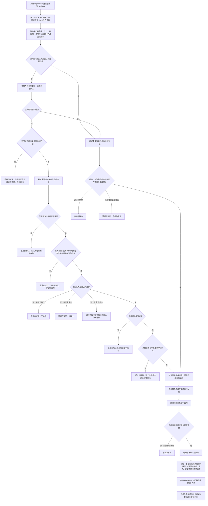

# 根需求任务筹办并发同义选择收口施工流程图

更新时间：2026-07-20

## 元数据

```text
图类型：施工流程图
绑定计划：计划/20260719_REAL-GENERATION-LOOP-S1_生产根需求承接与任务筹办代码实施切片_v0.1.md（正文 v0.7）
绑定详细设计：规范/详细设计/根需求任务筹办执行与方法学习生产闭环详细设计.md（正文 v0.3）
允许文件：固定恢复 23ca426 的十文件；生产语义只改 路由.根需求筹办.ixx，自检只改 自检.根需求筹办.ixx，另写 #315 专属实施记录
禁止文件：召回服务、组合器、任务服务、数据操作、其它领域/线程/入口/工程和中央设计治理均不得在固定恢复后继续修改
预期结构变化：不新增业务结构；只把并发线程已发布的同义完整当前选择作为权威幂等读回继续使用
执行前复核：新 worktree 必须从发布本设计包后的 origin/main 建立；R7 只读失效且不得复用或集成；固定源树使用 23ca426 的具名 blob
验证方式：两配置 Rebuild、两配置单轮、A01—A12、Release 输出隔离、Debug 严格连续 20/20、strict、diff、范围和恢复 blob 门禁
不得宣称：本图不表示代码已实现、分支已完成、已集成、#315 已完成、#316 已解锁或真实生成闭环已形成
```

## 依据

```text
流程图/现状流程图/20260720_根需求任务筹办并发同义选择收口现状流程图_v0.2.md
项目记忆/设计记录/20260720_REAL-GENERATION-LOOP-S1_R7并发同义选择逐行代码映射表.md
项目记忆/设计记录/20260720_REAL-GENERATION-LOOP-S1_R7并发同义选择输入契约与调用语境表.md
项目记忆/设计记录/20260720_REAL-GENERATION-LOOP-S1_R7并发同义选择非成功返回二分审查表.md
项目记忆/设计记录/20260720_REAL-GENERATION-LOOP-S1_R7并发同义选择现状施工偏差清单.md
R7@4160652079d7296264b902dfb98cc29eab855769
D:/海中鱼巣/日志/诊断/REAL-GENERATION-LOOP-S1-R7/E281-WT-315-R7
```

## 说明

目标不是放宽召回入口，也不是让组合器把所有失败当成成功。路由只在组合调用非成功后，通过同一 B0 权威重读任务和方法；只有读回选择完整、任务与方法当前性稳定、且选择的稳定身份、幂等材料和来源版本全部与本路由输入同义时，才把它认作“并发同义完成读回”。内部不一致优先，不能被现存选择掩盖。

## 流程图



## 全字段同义判定

```text
1. 选择材料完整，记录身份幂等主键等于配置.选择记录幂等主键。
2. 选择.任务等于本路由任务，选择.方法等于本路由方法。
3. 选择.幂等材料编号等于配置.选择幂等材料编号。
4. 选择来源任务生命周期关系 / 版本等于权威重读任务的当前生命周期关系 / 版本，且阶段仍为筹办中。
5. 选择来源方法生命周期关系 / 版本等于权威重读方法的当前活跃生命周期关系 / 版本。
6. 排序规则版本和召回请求规则版本分别等于配置值；来源候选数量保持完整材料要求的非零。
7. 任务来源需求仍是目标安全根需求，方法身份、登记根和活跃状态仍与本路由正式方法基线同义。
```

## 关键边界

```text
1. 不修改方法召回服务、需求任务方法组合器、任务服务或数据操作来放宽入口。
2. 不新增重试、等待、睡眠、第二次召回或第二次选择提交。
3. 权威读回只能承认完整且全字段同义的既有选择；异义选择属于当前性变化。
4. 内部不一致、读回不完整、当前选择半结构和有效输入下的意外无选择必须追根因。
5. 无候选、非唯一和权威任务 / 方法已经真实漂移仍是设计允许的逻辑内返回。
6. R7 只提供证据，不作为 R8 分支起点或可集成提交。
```

## 完成声明边界

施工图通过文档检查只说明计划口径完整。只有新任务分支按计划实现、验证、独立集成、设计归档后，才能声明 #315 完成并重算 #316；仍不得扩大为完整真实生成闭环完成。
