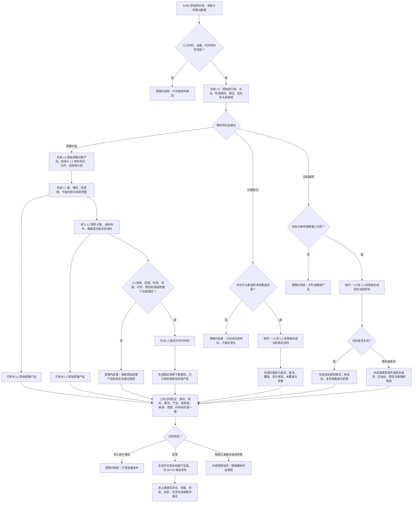

# DD-01 D455 材料成熟度与四类产品数据合同流程图

更新时间：2026-07-21

## 依据

```text
规范/6300_子规范_观察像素簇与存在候选分层_20260720.md
规范/6310_子规范_观察特征质量诊断与认知补偿_20260720.md
规范/6350_子规范_双目相机外设独占观察线程_20260720.md
规范/6360_子规范_相机外设综合工作流程_20260720.md
规范/详细设计/D455材料成熟度与四类产品数据合同详细设计.md
```

## 说明

本图只覆盖成熟度、产品形成和强类型合同验证。队列发布、任务域消费、方法执行和世界事实提交是 DD-02—DD-05 的后继边界。图中的产品全部是非权威外设材料。

## 流程图



## 关键边界

```text
成熟度、运行模式和产品类型是三个独立强类型维度。
原始逐簇产品只允许 L0—L2；稳定观察、扫描变化和目标跟踪只允许 L3。
识别没有外设产品直通入口。
L1 不覆盖 L0，L2 不覆盖 L1，L3 不覆盖 L2；后层只保留受控来源引用。
写入前不满足合同属于逻辑内拒绝；候选准备后出现内容矛盾属于内部逻辑错误。
产品值不是世界事实，DD-01 不授予队列消费、任务承接或领域写入权。
```
