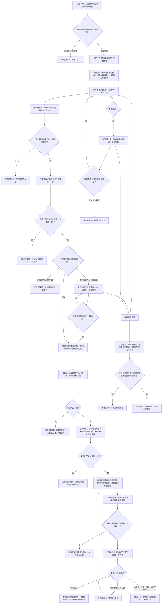

# DD-02 D455 外设报告队列分类视图与生产者生命周期流程图

更新时间：2026-07-21

## 依据

```text
规范/6320_子规范_外设观察特征与自我场景认知分层_20260720.md
规范/6340_子规范_外设独立控制线程与消息承接边界_20260720.md
规范/6350_子规范_双目相机外设独占观察线程_20260720.md
规范/6360_子规范_相机外设综合工作流程_20260720.md
规范/详细设计/D455材料成熟度与四类产品数据合同详细设计.md
规范/详细设计/D455外设报告队列分类视图与生产者生命周期详细设计.md
```

## 说明

本图覆盖每设备唯一生产者、材料保留、一个物理强类型队列、四类索引 / 只读视图、任务域唯一消费和生产者停止。任务匹配、冻结工作包、方法执行和世界事实提交由 DD-03—DD-05 承担。

## 流程图



## 关键边界

```text
同一设备同一时刻只有一个有效生产者占用；不同设备可以并发。
四类产品共享一个物理队列，只通过四类身份索引和非消费视图区分。
候选确认是报告可见和索引可见的唯一原子发布点。
只读视图不取得消费权；只有任务域持有唯一消费权并能认领、承接或终结。
确认前失败精确撤销；确认后读回矛盾属于内部逻辑错误，不能伪装成普通失败。
不可舍弃报告在队列满或停止时必须背压、承接或具名强制终结，不得静默丢弃。
线程不是生产权来源，报告和队列项不是世界事实。
```
