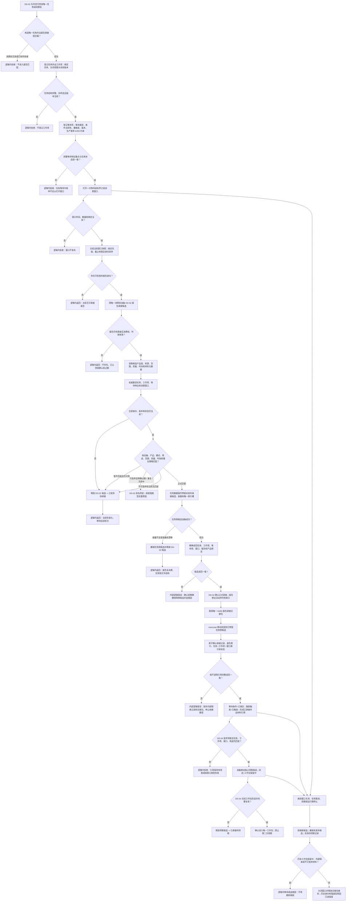

# DD-03 D455 任务域唯一消费与已承接材料引用流程图

更新时间：2026-07-21

## 依据

```text
规范/3200_根规范_任务_20260720.md
规范/5200_子规范_任务根据需求初始化_20260720.md
规范/5210_子规范_任务状态特征集合与阶段关联_20260720.md
规范/6320_子规范_外设观察特征与自我场景认知分层_20260720.md
规范/6340_子规范_外设独立控制线程与消息承接边界_20260720.md
规范/8100_子规范_自我线程与任务管理线程权责边界_20260720.md
规范/8200_子规范_自我内部循环实现_20260720.md
规范/详细设计/D455任务域唯一消费与已承接材料引用详细设计.md
```

## 说明

本图覆盖任务域唯一消费能力、工作项和等待特征、消费窗口、确定性报告匹配、任务侧候选预留、DD-02 交接包无失败安装、已承接引用、领取候选和窗口收口。冻结工作包、方法执行、领域提交和生产运行期连续调度由 DD-04—DD-06 承担。

## 流程图



## 关键边界

```text
唯一消费能力属于任务域组合器，不属于裸任务管理线程编号。
生命周期“等待中”只是投影；没有等待类型、条件当前性、重触发、等待版本和合法生产者时不能消费报告。
报告头等待项引用只作提示，任务侧必须权威重读任务、工作项、等待项和窗口。
DD-02 确认前允许释放、终结或撤销；确认后只能无失败发布，矛盾必须隔离并追根因。
已承接引用不复制产品和材料，不暴露交接包、裸指针、队列地址或消费权。
同一报告只绑定一个任务 / 工作项 / 窗口；同一已承接记录只进入一个工作包。
原始逐簇产品只能到任务域质量门 / 回查 / 诊断，不能取得方法材料资格。
任务工作线程、方法和自我线程均不得直接读取 DD-02 队列。
```
