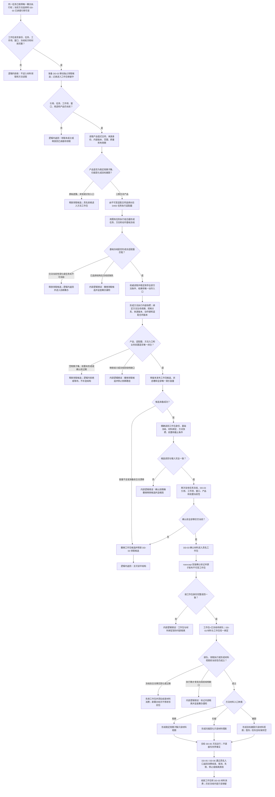

# DD-04 D455 冻结工作包与观察扫描跟踪方法入口流程图

更新时间：2026-07-21

## 依据

```text
规范/3200_根规范_任务_20260720.md
规范/3300_根规范_方法_20260720.md
规范/5230_子规范_任务筹办与执行边界_20260720.md
规范/5300_子规范_方法登记选择与执行规则_20260720.md
规范/5320_子规范_本能函数实现与返回边界_20260720.md
规范/6300_子规范_观察像素簇与存在候选分层_20260720.md
规范/6350_子规范_双目相机外设独占观察线程_20260720.md
规范/6360_子规范_相机外设综合工作流程_20260720.md
规范/8100_子规范_自我线程与任务管理线程权责边界_20260720.md
规范/8200_子规范_自我内部循环实现_20260720.md
规范/详细设计/D455冻结工作包与观察扫描跟踪方法入口详细设计.md
```

## 说明

本图覆盖同一任务已取得唯一筹办执行权后的 DD-03 材料领取、通用任务执行基础冻结、完整方法内容快照、三类产品到观察 / 扫描 / 跟踪入口的唯一映射、工作包候选、确认后无失败发布、执行前当前性、只读材料视图、失效和具名结束。方法真实执行与领域提交由 DD-05 承担，生产排队和持续调度由 DD-06 承担。

## 流程图



## 关键边界

```text
任务筹办执行权仍以任务稳定身份隔离；DD-04 不以线程编号或工作包锁替代它。
原始逐簇只供任务域质量门、回查和诊断；识别没有 D455 外设直通入口。
通用任务执行冻结不保存产品、交接包、队列、材料负载或消费权。
既有排队确认和目标状态值变化执行入口显式拒绝 D455 适配器；D455 排队由 DD-06 的工作包感知入口承担。
方法材料适配表只约束已选择方法的技术输入，不召回、不选择、不创建方法，也不扩展方法能力。
DD-03 确认前允许精确撤销；确认后没有普通失败，矛盾只能锁存内部隔离并追根因。
执行期发现冻结前已有的方法、动作、条件结果、映射或前置缺口属于筹办漏检，不得改写为任务失败或合法等待。
工作包发布后不可变；事实变化只能失效旧包并形成新筹办轮次和新工作包版本。
观察、扫描、跟踪视图是一次调用内只读投影，不确认存在、不写状态、不生成任务完成或需求满足。
```
