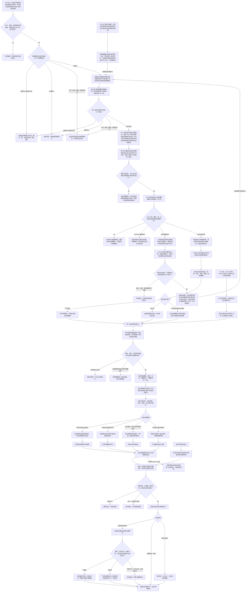

# DD-05 领域提交、任务验证与自我回流流程图

更新时间：2026-07-22

## 依据

```text
规范/4030_子规范_基础信息服务分层与领域写授权.md
规范/4040_子规范_不透明结构事务候选确认撤销与最后发布.md
规范/4050_子规范_入口拒绝逻辑内结果与内部逻辑错误.md
规范/4110_子规范_特征节点实现与字段边界_20260720.md
规范/4140_子规范_枚举型实例特征值合法来源_20260720.md
规范/4160_子规范_特征表达与判断收束规则_20260720.md
规范/5200_子规范_任务根据需求初始化_20260720.md
规范/5210_子规范_任务状态特征集合与阶段关联_20260720.md
规范/5230_子规范_任务筹办与执行边界_20260720.md
规范/5120_子规范_需求任务单目标与方法多结果归类_20260720.md
规范/5160_子规范_需求正式结算记录与唯一结论.md
规范/6340_子规范_外设独立控制线程与消息承接边界_20260720.md
规范/6350_子规范_双目相机外设独占观察线程_20260720.md
规范/8100_子规范_自我线程与任务管理线程权责边界_20260720.md
规范/8200_子规范_自我内部循环实现_20260720.md
规范/8210_子规范_自我动作验证闭环_20260720.md
规范/详细设计/领域提交任务验证与自我回流详细设计.md
规范/4170_子规范_特征批次发布记录与幂等账.md
```

## 身份与边界

这是实现面对的现行正式设计图。DD-05F0 先建立通用特征批次换代和不透明同会话参与能力，但不独立发布任务特征批次；DD-05F 分别让新任务与初始特征共同发布、既有任务与特征换代联合迁移；DD-05A 建立通用结果治理和上行；DD-05B 只在 #327 与 DD-05A 实际接口完成后接入 D455。生产连续调度属于 DD-06。

## 流程图



## 关键边界

```text
DD-05F0 只提供通用特征事务能力；不写任务语义、不暴露事务能力，也不先于任务结构独立发布任务特征批次。
批次身份、规则版本、完整有序项目和换代写前证据进入 4170 专用不可变侧账；不得写入特征值、槽位、宿主或来源主信息，也不得复用特征值原始材料侧表。
摘要只作非权威快速筛选；同义 / 冲突必须比较完整项目并与已发布结构互证。许可、版本、格式或读取不完整不能伪装成冲突。
结构执行边界在同一写入权内登记原始值和批次记录两个参与者；准备 / 确认按登记顺序，失败 / 显式撤销按逆序，最后共同发布；既有单参与者入口继续回归。
事务外幂等预读未找到不授予写入；取得核心唯一写入权后必须在第一结构写前重读 4170 侧账，同义 / 异义 / 异常零候选收口，只有仍未找到才形成候选。
授权桥是独立真实模块且不 import 项目领域或核心模块；只有特征体系、需求任务方法两个生产数据操作模块可以 import。特征模块不得 import、前置声明或跨模块 friend 需求任务方法数据操作，自检不得直接 import 桥。
来源版本只使用来源完整句柄版本并与当前记录复核；未知规则版本写前拒绝。调用方不提供可裁决摘要，运行期摘要清空、碰撞或重建不得改变完整比较。
4170 记录格式版本与业务规则版本分离；DD-05F0 当前只实现运行期侧账，快照导出、恢复候选和恢复发布由 DD-05F0R 后继设计治理，不能计入本切片完成。
新任务宿主、来源 / 治理锚点、初始生命周期、初始固定特征、状态段和来源证据共同发布；普通读取不得看见裸任务。
生命周期阶段只是任务状态投影；状态段只是两个固定特征的投影；缺完整特征快照不得进入结果治理。
原始回执只有一个消费者；任务管理上行桥只消费治理后材料。
完成回流必须有实际状态和恰一动态；等待、缺口按各自条件证据，不伪造材料。
独立世界事实变化使用独立封套并经过身份、去重、版本和当前性门禁。
任务完成、需求满足和价值结算分别裁决。
外设报告不是自我治理消息；D455 只能经工作包、方法运行、正式提交、任务治理读回后再结束工作包。
目标未达成、材料不足和合法等待是逻辑内结果；冻结前结构缺口和发布异常是内部逻辑错误。
```
