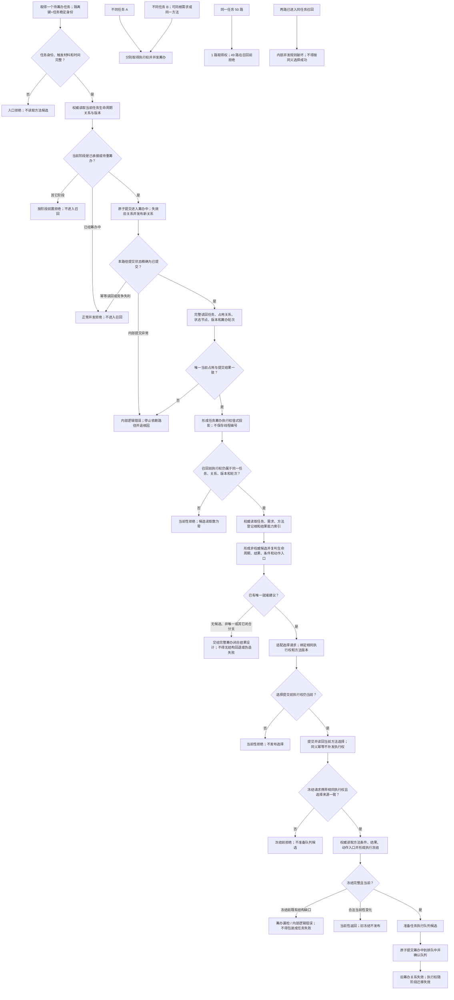

# 任务级唯一筹办执行权流程图

更新时间：2026-07-21

## 依据

```text
规范/0050_项目通用机器逻辑与禁止性规则总纲_20260721.md
规范/3200_根规范_任务_20260720.md
规范/5210_子规范_任务状态特征集合与阶段关联_20260720.md
规范/5230_子规范_任务筹办与执行边界_20260720.md
规范/5250_子规范_任务筹办按方法能力查找到就绪因果链_20260720.md
规范/5300_子规范_方法登记选择与执行规则_20260720.md
规范/详细设计/任务级唯一筹办执行权详细设计.md
```

## 说明

本图只覆盖任务级筹办执行权的取得、召回前拒绝、选择来源绑定、冻结前同权复核、排队迁移失效和并发分类。六类完整筹办闭合结果仍由后继设计收束；本图不把阶段枚举或幂等读回当作执行权。

## 流程图



## 关键边界

```text
执行权只由原子提交赢家取得；任务提交结果::成功() 不能替代精确 已提交 判断。
筹办中阶段本身不授予执行权；必须同时匹配任务、关系、状态、版本、轮次和当前性。
互斥锁只保护内存访问，线程编号不持久化，幂等读回不补发执行权。
同任务未取得者在候选读取前拒绝；双路径已进入召回属于内部错误。
不同任务可以并发，即使同根需求或选择同一方法。
冻结后进入排队中时旧筹办占用失效；重复筹办必须形成新轮次和新权值。
无候选、等待、子目标、能力缺口、目标完成和授权失效仍须形成正式闭合结果，本图不发明临时回退。
```
