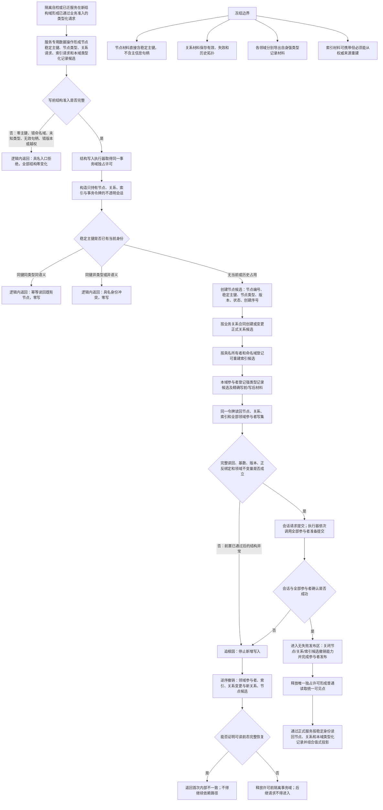

# NODE-TYPED-MIGRATION NT-P1 节点直接身份与事务底座施工流程图 v0.1

更新时间：2026-07-22

状态：施工目标设计图 / 受 NT-P1 详细设计和后继叶子计划门控 / 当前未实现

## 依据

```text
规范/0050_项目通用机器逻辑与禁止性规则总纲_20260721.md
规范/4010_子规范_统一仓库稳定句柄与通用关系索引边界.md
规范/4020_子规范_领域类型化数据记录与组合读取投影边界.md
规范/4030_子规范_基础信息服务分层与领域写授权.md
规范/4040_子规范_不透明结构事务候选确认撤销与最后发布.md
规范/4070_子规范_权威结构快照恢复候选与运行期原子发布.md
计划/20260722_NODE-TYPED-MIGRATION_NT-P1_节点身份与事务底座子计划_v0.1.md
规范/详细设计/NODE-TYPED-MIGRATION_NT-P1_节点直接身份与类型化记录事务底座详细设计.md
```

## 身份与边界

本图描述 NT-P1 的共享施工目标，不表示代码已经实现。领域服务先完成业务准入；服务专用数据操作只把值式请求送入不透明事务。关系表达拓扑，领域类型化记录只保存关系无法表达的本域原始值，索引只定位候选。

本图采用隔离新结构域：P1 不接默认生产装配、不读取旧域、不写旧域；P4 完成全部迁移与验证后才一次切换默认装配。

## 流程图



## 关键边界

```text
稳定主键是节点直接身份字段；索引物理键不是节点稳定主键的替身。
领域记录参与者必须是编译期或领域内强类型材料，不得汇总为跨领域无类型容器、字节包或任意槽位。
结构提交准备只读视图只暴露候选节点稳定主键、节点类型及正式结构读回，不暴露主信息句柄、I64 通用槽、仓库、令牌或锁。
普通读取只能在唯一独占许可释放后观察完整组合；确认本身不是公开发布。
已迁对象不得同时写主信息值槽和领域类型化记录；无法无歧义适配的旧入口在第一笔写入前拒绝。
```

## 非成功返回二分

```text
逻辑内返回：写前无效、身份冲突、同义幂等、权限或版本不满足；零写且不进入业务事务区。
追根因：写前已通过后，候选创建、完整读回、确认、撤销或发布异常；逆序撤销，无法闭合则隔离事务域。
```

## 当前未实现

```text
节点记录尚无直接稳定主键。
会话和执行器仍硬依赖主信息仓库。
提交准备视图仍读取候选主信息和候选 I64 值。
冻结材料仍以四仓和主信息值容器为中心。
因此必须先完成精确叶子计划与调用方迁移所有权，不能把本图当成已经接通的代码事实。
```
