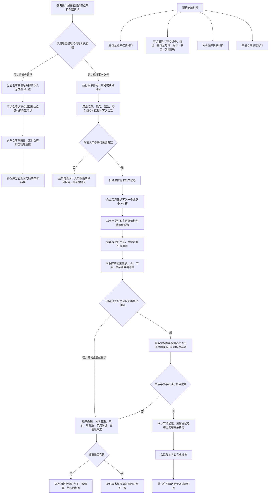

# NODE-TYPED-MIGRATION NT-P1 节点直接身份与事务底座现状流程图 v0.1

更新时间：2026-07-22

状态：当前实现事实图 / 基线 `main@1185e1b458b9c83244cd775dea3825931a134787` / 不得作为施工目标

## 依据

```text
海中鱼巣/核心/句柄.h
海中鱼巣/核心/节点仓库.h、节点仓库.cpp
海中鱼巣/核心/会话.结构写入.ixx
海中鱼巣/核心/执行器.结构写入.ixx
海中鱼巣/核心/关系仓库.h、索引仓库.h
海中鱼巣/核心/权威冻结材料.数据.h
计划/20260722_NODE-TYPED-MIGRATION_NT-P1_节点身份与事务底座子计划_v0.1.md
```

## 身份与边界

本图只描述基线代码实际执行路径。图中的“主信息”“I64 槽”和四仓冻结均是待迁现状，不因进入本图而取得现行规范授权。现行规范目标另见同主题施工流程图和详细设计。

## 流程图



## 当前实现的关键事实

```text
节点记录没有直接稳定主键；“主键”当前主要是索引仓库物理键。
节点仓库构造和节点创建均依赖主信息仓库或主信息句柄。
结构提交准备只读视图向参与者暴露候选节点主信息和候选 I64 值。
结构写入会话写集固定包含主信息候选与候选 I64 写集。
执行器有效性固定要求主信息、节点、关系、索引四仓。
权威冻结材料固定保存主信息、节点、关系、索引四仓。
普通事务的许可、完整读回、逆序撤销、撤销失败隔离和最后发布骨架可保留。
```

## 非成功返回二分

```text
逻辑内返回：无效回调、无效许可、无效句柄、未请求提交或显式撤销等协议允许结果；不得新增结构。
追根因：写前准入已经通过后，候选创建、读回、确认、撤销或发布不符合内部预期；必须撤销，撤销不闭合则隔离事务域。
```

## 禁止解释

```text
本图不证明主信息结构仍然合法。
本图不证明当前索引物理主键等同节点稳定主键。
本图不授权继续新增主信息句柄、拓扑锚点或无类型值槽。
本图不证明代码已经按 4010、4020、4040 或 4070 完成迁移。
```
