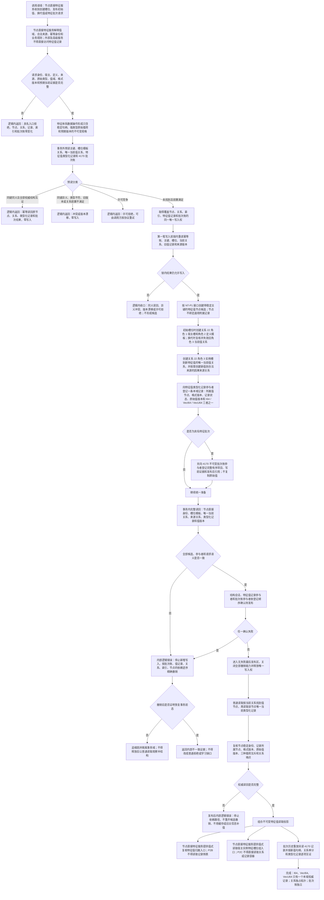

# NODE-TYPED-MIGRATION NT-P2A 特征值类型化记录迁移施工流程图

更新时间：2026-07-22

## 依据

```text
正式规范：规范/0050_项目通用机器逻辑与禁止性规则总纲_20260721.md
正式规范：规范/2100_根规范_特征值_20260720.md
正式规范：规范/4010_子规范_统一仓库稳定句柄与通用关系索引边界.md
正式规范：规范/4020_子规范_领域类型化数据记录与组合读取投影边界.md
正式规范：规范/4030_子规范_基础信息服务分层与领域写授权.md
正式规范：规范/4040_子规范_不透明结构事务候选确认撤销与最后发布.md
正式规范：规范/4110_子规范_特征节点实现与字段边界_20260720.md
正式规范：规范/4130_子规范_特征值三态比较底层逻辑_20260720.md
正式规范：规范/4140_子规范_枚举型实例特征值合法来源_20260720.md
正式规范：规范/4170_子规范_特征批次发布记录与幂等账.md
上级计划：计划/20260722_NODE-TYPED-MIGRATION_节点直接身份与领域类型化持久结构代码修订总计划_v0.1.md
阶段计划：计划/20260722_NODE-TYPED-MIGRATION_NT-P2_领域载荷与自我投影迁移子计划_v0.1.md
前置接口：NT-P1 形成的节点直接身份、稳定主键、领域记录参与者接线和统一事务合同
详细设计：规范/详细设计/NODE-TYPED-MIGRATION_NT-P2A_特征值类型化记录与当前关系迁移详细设计.md
```

## 身份与边界

本图是 NT-P2A 的施工目标图，只有 NT-P1 实际接口复核通过、叶子计划登记并正式派发后才能成为代码施工依据。图中候选接口是设计合同，不得描述为当前已实现。服务、数据操作、参与者和自检均属于具名“节点直接”隔离新域；现行默认特征模块保持只读，P4 前不得接入或跨域互查。

## 流程图



## 关键边界

```text
1. 特征值类型化记录是特征值域唯一原始值本体；一条记录只能承载 I64、VecI64、VecU64 三者之一，并保存所属值节点、格式版本、原始值版本和记录状态。
2. 宿主槽、定义模板和当前值统一使用关系 22 的角色 1 / 2 / 3；来源使用正式来源关系。类型化记录不得复制宿主、槽位、定义、当前关系或来源句柄形成跨域拓扑副本。
3. 节点稳定主键和完整句柄由 NT-P1 提供；P2A 不建立第二套记录编号、通用附属句柄、无类型槽位或跨领域值仓库。
4. `完整读取材料` 只是在读取时组合节点、关系和类型化记录的不可变值式投影，不持久化、不反向写入、不成为第二权威。
5. 4170 批次账继续独立保存发布幂等语义、顺序和写前 / 写后引用；它不复制原始值、不替代当前值关系，也不并入特征值记录。
6. 入口材料无效、同键异义、业务前置不足、许可竞争和写前版本漂移属于逻辑内返回；前置通过后写结构、读回、确认、撤销或发布异常属于内部逻辑错误。
7. 值变化默认形成新特征值节点与新记录并失效旧当前关系；若后继计划保留同节点记录换代，必须推进原始值版本、保存旧版本审计并证明只有一个当前记录，禁止原地静默覆写。
8. P2A 只迁移特征值本体和当前关系读写。旧特征服务兼容入口的最终退役由 P3 收口；快照、恢复注入和旧材料策略由 P4 负责。
9. 本图不授权在线热替换运行期上下文，不证明跨重启恢复、旧快照兼容或全仓旧主信息已经退役。
10. P2A 必须输出特征服务值式只读 `复核特征值归属` 合同，返回值节点、原始值版本、实例槽、抽象定义及关系 22 角色 2 / 3 证据；P2B 只能消费该合同，不得直接读取类型化记录容器或旧侧表。
11. P2A 必须输出特征服务值式只读 `读取宿主实例特征槽位组` 合同：按关系 22 角色 1 枚举指定宿主的实例槽，并逐槽读回角色 2 模板、角色 3 当前值和类型化原始记录，返回调用期不可变组；P2C 只能消费该合同，不得持久化第二份槽位列表或直接访问关系、索引、记录容器和事务能力。
12. 现行 `数据操作.特征体系`、`特征服务.h`、`特征值服务.h` 和旧原始材料参与者在本叶子只读；新域不得以回退、转发或双写方式读取旧域，逐调用点候选迁移由 P3 设计，默认切换由 P4 执行。
```
