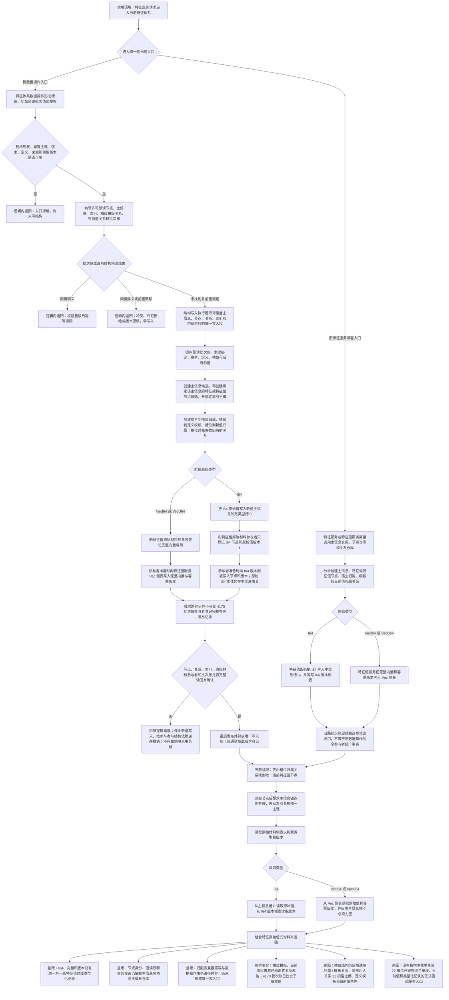

# NODE-TYPED-MIGRATION NT-P2A 特征值类型化记录迁移现状流程图

更新时间：2026-07-22

## 依据

```text
现状基线：main@1185e1b458b9c83244cd775dea3825931a134787
现行正式规范：0050、2100、4010、4020、4030、4040、4110、4130、4140、4170
现行设计门禁：计划/20260722_NODE-TYPED-MIGRATION_NT-P0_设计材料重建子计划_v0.1.md
现行阶段路由：计划/20260722_NODE-TYPED-MIGRATION_NT-P2_领域载荷与自我投影迁移子计划_v0.2.md
当前代码：海中鱼巣/领域/数据操作.特征体系.ixx
当前代码：海中鱼巣/领域/参与者.特征值原始材料.ixx
当前代码：海中鱼巣/领域/参与者.特征批次发布记录.ixx
当前代码：海中鱼巣/领域/特征值服务.h
当前代码：海中鱼巣/领域/特征服务.h
```

## 身份与边界

本图是 `main@1185e1b4` 的当前代码事实图，只说明迁移前实现怎样运行以及与现行规范的差距。它不是施工许可，不把旧主信息、旧侧表或兼容直写路径解释为现行规范允许。

## 流程图



## 关键边界

```text
1. 当前 I64 本体位于主信息槽 0，I64 侧表只保存原始值版本；VecI64 / VecU64 本体和版本位于另一侧表。这是已核代码事实，不是现行规范允许的目标结构。
2. 当前特征体系数据操作已把结构候选、原始材料参与者和 4170 批次账纳入同一执行器；该可复用事务语义必须保留，但参与材料需要改为单一领域类型化记录。
3. 旧特征服务与特征值服务仍有直接创建、直接关系写和原地值写入口；它们不等于 P2A 已接通，后续必须由 P2A / P3 明确迁移或封口。
4. 宿主到实例槽、实例槽到定义模板、实例槽到当前值以及新值到来源的联系已经由关系表达，不应迁入类型化记录；但前三项当前仍使用通用 `归属 / 模板`，尚未实现 4110 正式冻结的关系 22 角色 1 / 2 / 3。
5. 4170 批次账保存完整有序发布语义和结果引用，但不复制原始值，也不裁决当前值；P2A 不得把它并入特征值记录。
6. 入口无效、同键异义和写前版本漂移属于逻辑内返回；前置已通过后的候选、关系、参与者或读回异常属于内部逻辑错误并必须追根因收口。
7. 本图未证明任何代码迁移、旧主信息退役、旧兼容入口退役、快照恢复或跨重启能力。
8. 当前没有可供 P2B 只读消费的正式 `复核特征值归属` 值式服务入口；P2B 若直接读取主信息或特征值侧表属于越权。
9. 当前没有可供 P2C 只读消费的正式 `读取宿主实例特征槽位组` 值式服务入口；P2C 不得直接读取关系仓库、特征值侧表或未来类型化记录容器来拼装自我特征列表。
```
