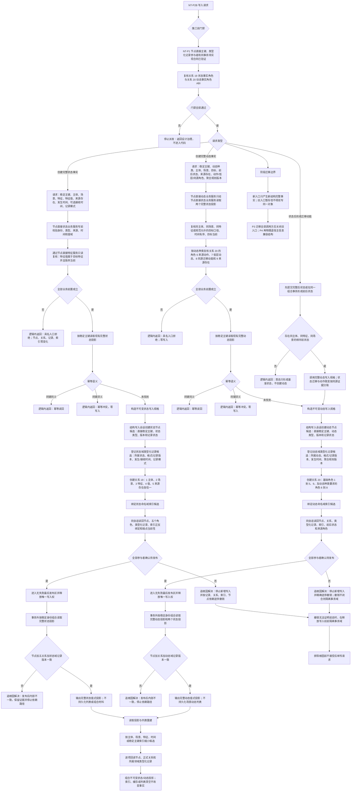

# NODE-TYPED-MIGRATION NT-P2B 状态动态完整事实迁移施工流程图

更新时间：2026-07-22

## 依据

```text
AGENTS.md
规范/0050_项目通用机器逻辑与禁止性规则总纲_20260721.md
规范/1160_根规范_状态节点_20260720.md
规范/1170_根规范_动态节点_20260720.md
规范/4010_子规范_统一仓库稳定句柄与通用关系索引边界.md
规范/4020_子规范_领域类型化数据记录与组合读取投影边界.md
规范/4030_子规范_基础信息服务分层与领域写授权.md
规范/4040_子规范_不透明结构事务候选确认撤销与最后发布.md
规范/4050_子规范_入口拒绝逻辑内结果与内部逻辑错误.md
规范/4210_子规范_动态信息分层获取与聚合_20260720.md
规范/4220_子规范_动作动态与因果账本边界_20260720.md
计划/20260722_NODE-TYPED-MIGRATION_节点直接身份与领域类型化持久结构代码修订总计划_v0.2.md
计划/20260722_NODE-TYPED-MIGRATION_NT-P1_节点身份与事务底座子计划_v0.1.md
计划/20260722_NODE-TYPED-MIGRATION_NT-P2_领域载荷与自我投影迁移子计划_v0.2.md
流程图/20260722_NODE-TYPED-MIGRATION_NT-P2B_状态动态完整事实迁移现状流程图_v0.2.md
```

## 身份与边界

本图是 NT-P2B 目标施工设计，不是代码执行许可。4010、4210、4220 已冻结关系 19/20 的精确角色、端点、基数和动态种类组合；执行前必须完成 NT-P1 与 P2A 预冻结待实现接口合同 S0。提供者代码尚未汇合不阻止 P2B 形成候选，真实接线和完整验证由 #352 完成。本图全部目标服务和数据操作属于隔离节点直接新域，现行默认状态动态模块保持只读。

## 流程图



## 正式关系映射

下表是 4010、4210、4220 已冻结、由本设计直接消费的关系合同：

| 正式关系类型 | 角色 | 方向 | 当前基数 | 端点 |
| --- | --- | --- | --- | --- |
| 19 状态事实角色 | 1 主体 | 状态 -> 存在 | 恰一 | 存在 |
| 19 状态事实角色 | 2 场景 | 状态 -> 场景 | 恰一 | 场景 |
| 19 状态事实角色 | 3 特征 | 状态 -> 特征 | 恰一 | 特征 |
| 19 状态事实角色 | 4 值 | 状态 -> 特征值 | 恰一 | 特征值 |
| 19 状态事实角色 | 5 来源存在 | 状态 -> 来源存在 | 恰一 | 存在 |
| 20 动态事实角色 | 1 主体 | 动态 -> 主体 | 恰一 | 存在 |
| 20 动态事实角色 | 2 场景 | 动态 -> 场景 | 恰一 | 场景 |
| 20 动态事实角色 | 3 被改变目标 | 动态 -> 目标 | 恰一 | 特征或特征值 |
| 20 动态事实角色 | 4 前状态 | 动态 -> 状态 | 恰一 | 完整状态 |
| 20 动态事实角色 | 5 后状态 | 动态 -> 状态 | 恰一 | 完整状态 |
| 20 动态事实角色 | 6 来源动作 | 动态 -> 方法 | 动作致变恰一；其它为零 | 合法方法动作入口 |
| 20 动态事实角色 | 7 来源低层动态 | 动态 -> 动态 | 原子为零；聚合至少一项 | 完整低层动态，可多项 |
| 20 动态事实角色 | 8 同源状态迁移动能 | 动态 -> 动态 | 动作致变恰一；其它为零 | 同主体/场景/端点迁移动能 |
| 20 动态事实角色 | 9 来源存在 | 动态 -> 来源存在 | 恰一 | 存在 |

场景状态/动态列表分别由关系 19 角色 2 和关系 20 角色 2 的反向关系索引生成，不再为新事实写一条场景到事实的 `运行期临时` 权威关系。旧 `运行期临时` 关系只作为待退役旧代事实证据，不进入新结构。

## 关键边界

```text
完整状态事实 = 状态节点 + 主体/特征/值/场景/来源正式关系 + 状态域类型化记录。
完整动态事实 = 动态节点 + 关系 20 基础角色 1—5、9 + 按动态种类成立的角色 6—8 + 动态域类型化记录。
发生时间、接收时间、记录模式和聚合规则版本等非拓扑值只进入所属领域记录；关系端点不得复制进记录。
状态值是特征值节点关系，不再是状态记录中的 I64；其原始值由 P2A 的特征值域记录唯一承载。
列表、场景目录、按主体历史和当前状态选择都是可重建投影，不建立持久数组或第二权威账。
旧入口可以在阶段内保留编译兼容，但同一对象不得同时写旧槽和新记录；P3 必须迁移调用方并关闭旧写入口。
现行 `数据操作.状态动态`、`服务.状态/动态`、`组合.状态动态` 和旧兼容头在本叶子只读；P3 只形成隔离新域调用候选，P4 才切换默认装配和现行调用方。
```

## 中途非成功返回二分

- 逻辑内返回：输入身份/类型/版本/来源/时间不合法，同键异义，首态没有相邻前状态，或规范允许的许可竞争与当前性漂移；必须在第一笔写入前闭合且零业务变化。
- 追根因解决：前置通过后节点、关系、类型化记录、索引、确认、撤销、最后发布或事务外完整读回不符合预期；停止依赖路径，按 4040 撤销或隔离，不得降级成候选为空、等待或普通缺口。

## 完成声明边界

本图完成只证明 NT-P2B 目标过程和施工门禁已表达。关系角色规范前置已经闭合；合同 S0 和正式派发完成后可以形成实现候选，但真实提供者尚未汇合、代码尚未完整构建，因此不得声明状态 / 动态迁移完成。
