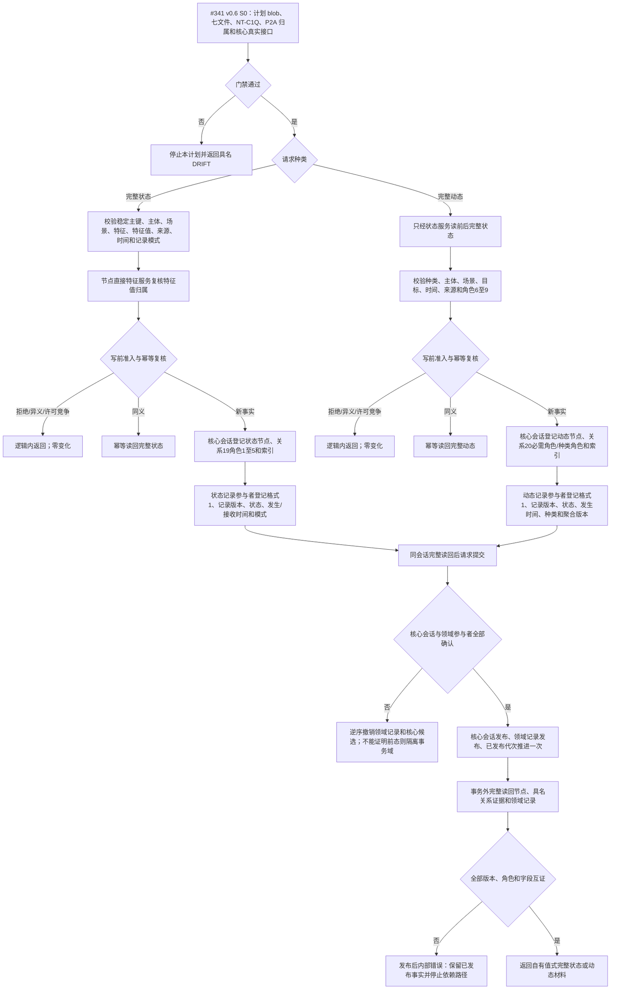
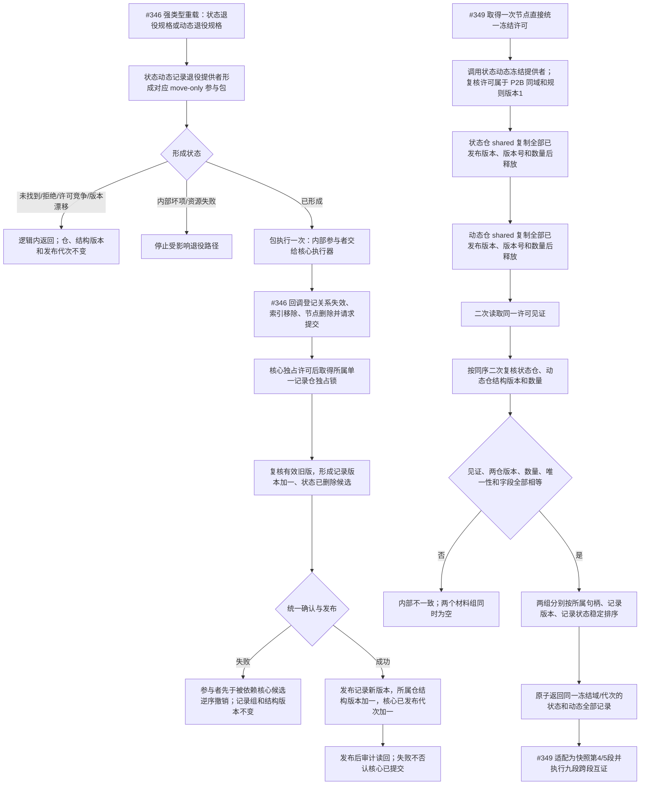

# NODE-TYPED-MIGRATION NT-P2B 状态动态完整事实迁移施工流程图 v0.3

更新时间：2026-07-24

## 依据

```text
规范/0050_项目通用机器逻辑与禁止性规则总纲_20260721.md
规范/1160_根规范_状态节点_20260720.md
规范/1170_根规范_动态节点_20260720.md
规范/4010_子规范_统一仓库稳定句柄与通用关系索引边界.md
规范/4020_子规范_领域类型化数据记录与组合读取投影边界.md
规范/4040_子规范_不透明结构事务候选确认撤销与最后发布.md
规范/4210_子规范_动态信息分层获取与聚合_20260720.md
规范/4220_子规范_动作动态与因果账本边界_20260720.md
规范/详细设计/NODE-TYPED-MIGRATION_NT-P2B_状态动态完整事实类型化迁移详细设计.md
计划/20260722_NODE-TYPED-MIGRATION_NT-P2_领域载荷与自我投影迁移子计划_v0.4.md
计划/20260722_NODE-TYPED-MIGRATION_NT-P2B_状态动态完整事实代码实施切片_v0.6.md
```

## 身份与边界

本图完整替代 v0.2 作为 #341 v0.6 的施工图。它冻结状态 / 动态事实写读、`状态动态记录退役参与包/v1` 和 `状态动态冻结提供者/v1` 的调用顺序。#341 只形成七个白名单代码文件的候选；#346 唯一消费退役包，#349 唯一取得统一冻结许可，#352 负责工程接线、构建和运行验证。

## 状态与动态完整事实



关系 19 固定为主体、场景、特征、值、来源存在五个必需角色；关系 20 固定为主体、场景、被改变目标、前状态、后状态、来源存在六个必需角色，并按动态种类约束来源动作、来源低层动态和同源状态迁移动能。记录不复制这些端点。

## 退役参与包与同代次冻结



## 唯一锁序和生命周期

```text
退役：
  核心事务域独占许可
  -> 状态记录仓或动态记录仓中的一个独占锁
  -> 发布或完整撤销
  -> 释放

冻结：
  #349 已持有统一冻结许可
  -> 状态记录仓 shared，复制后释放
  -> 动态记录仓 shared，复制后释放
  -> 状态记录仓 shared 二次复核，释放
  -> 动态记录仓 shared 二次复核，释放

禁止：
  P2B 再取第二冻结权；
  同时持有状态仓和动态仓锁；
  包公开参与者、仓、候选、锁、令牌或许可；
  #349 反向读取 P2B 私仓；
  发布后用候选撤销否认已发布事实。
```

## 结果与验证边界

- 冻结提供者状态 ABI：`1=已形成`、`2=入口拒绝`、`3=资源失败`、`0x8000=内部不一致`。
- 两仓结构版本从 1 开始，只在对应仓真实发布时恰加一；幂等、拒绝、确认、撤销和读取不推进。
- 记录数量覆盖当前、历史、已失效和已删除全部已发布版本；合法空仓仍同时返回两个空组。
- 状态 / 动态节点退役固定新增 `已删除` 记录版本；`已失效` 只用于另有正式换代规则的旧记录。
- #341 v0.6 只做候选级静态、源码专项检查和 Git 白名单验证；不构建、不运行、不声明 #346 / #349 已接线或能力完成。
