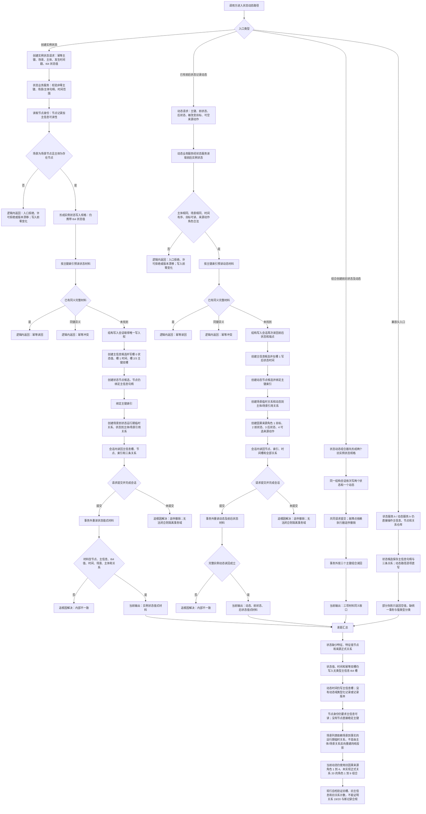

# NODE-TYPED-MIGRATION NT-P2B 状态动态完整事实迁移现状流程图

更新时间：2026-07-22

## 依据

```text
AGENTS.md
计划/计划索引.md
计划/20260722_NODE-TYPED-MIGRATION_节点直接身份与领域类型化持久结构代码修订总计划_v0.1.md
计划/20260722_NODE-TYPED-MIGRATION_NT-P2_领域载荷与自我投影迁移子计划_v0.1.md
规范/0050_项目通用机器逻辑与禁止性规则总纲_20260721.md
规范/1160_根规范_状态节点_20260720.md
规范/1170_根规范_动态节点_20260720.md
规范/4010_子规范_统一仓库稳定句柄与通用关系索引边界.md
规范/4020_子规范_领域类型化数据记录与组合读取投影边界.md
规范/4030_子规范_基础信息服务分层与领域写授权.md
规范/4040_子规范_不透明结构事务候选确认撤销与最后发布.md
规范/4050_子规范_入口拒绝逻辑内结果与内部逻辑错误.md
规范/4210_子规范_动态信息分层获取与聚合_20260720.md
规范/4220_子规范_动作动态与因果账本边界_20260720.md
代码基线：main@1185e1b458b9c83244cd775dea3825931a134787
海中鱼巣/领域/服务.状态.ixx
海中鱼巣/领域/服务.动态.ixx
海中鱼巣/领域/组合.状态动态.ixx
海中鱼巣/领域/数据操作.状态动态.ixx
海中鱼巣/领域/状态服务.h
海中鱼巣/领域/动态服务.h
海中鱼巣/领域/自检.状态动态分层.ixx
```

## 身份与边界

本图是 `main@1185e1b4` 的只读代码事实图，不是目标施工图。工作树中的上述代码文件相对该基线无差异；图中保留当前四仓、主信息句柄、I64 槽位和兼容头直写路径，只用于证明迁移差距，不为旧结构提供继续扩展许可。

## 流程图



## 关键边界

```text
当前主模块路径已经具备领域服务、专用数据操作、结构写入会话、写前幂等复核、同会话读回和统一提交外形；这些是可保留的调用与事务骨架。
当前状态完整性只验证主信息槽值、时间、场景、主体和三条关系，没有状态特征、特征值节点或来源关系。
当前动态已经用旧关系表达主体、场景、被改变目标、前后状态和可选来源动作，但时间仍在主信息槽中；这些关系不满足 4210/4220 已冻结的关系 20 角色组合。
`状态服务.h`、`动态服务.h` 是仍可直接写旧仓库的兼容路径；本图不把它们解释为新结构入口。
前置不满足、同键异义、许可竞争或当前性漂移属于逻辑内返回且必须保持写前零变化；前置通过后的创建、关系、读回、撤销或发布异常属于追根因解决。
```

## 当前差距与禁止宣称

```text
现状图只证明旧代码路径和差距，不证明 NT-P1 或 NT-P2B 已实施。
不得声明状态/动态已经具备领域类型化记录、完整关系角色、节点直接稳定主键或可恢复结构。
不得把主信息 I64 槽换名后继续保留为无类型权威容器。
不得用当前场景临时关系列表、索引命中、日志或自检输出替代完整事实读回。
```
