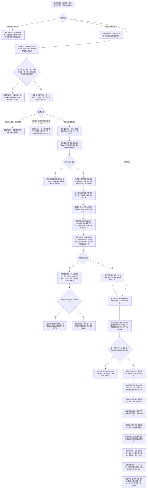

# NODE-TYPED-MIGRATION NT-P2C 自我内部世界与事实投影迁移施工流程图

更新时间：2026-07-22

## 依据

```text
正式规范：0050、1130—1170、4010—4040、4070、4110、4210、4220、7130。
上级计划：#338 / DQ-230 / NODE-TYPED-MIGRATION，NT-P0、NT-P2。
真实前置：NT-P1 节点直接身份与正式关系 0—23 ABI；NT-P2A 宿主实例槽值式组读取；NT-P2B 主体状态/动态值式组读取。P2C 专属消费关系 19—22。
```

## 身份与边界

本图是 NT-P2C 的施工目标图，不是当前实现事实。只有预冻结待实现接口合同 S0、独立叶子计划、队列登记和真实派发全部完成后，执行窗口才可据此形成候选；提供者实现尚未汇合不构成启动门控，真实接线和完整验证由 #352 完成。全部目标服务、数据操作、初始化和读取组合属于隔离节点直接新域；现行默认系统角色、自我线程和运行期装配保持只读。

## 流程图



## 关键边界

```text
1. 自我所在场景与自我内部世界是两个语义不同的场景；自我可以是前者成员，绝不能是后者成员。
2. 关系 21 只拥有内部世界和成员；实例槽统一由关系 22 承载，状态/动态投影统一消费关系 19/20。
3. P2C 不读取 P2A/P2B 的仓库、索引或记录容器，只消费领域服务返回的不可变值式组。
4. 空成员、空状态或空动态是合法空投影；多个当前自我、多个内部世界、缺必需关系或自包含环是内部结构错误。
5. 系统角色清单可以作为启动回执或缓存，但每次完整性裁决必须回到节点、关系和领域记录。
6. P2C 新建节点直接系统角色回执和候选初始化器，不修改现行系统角色清单、默认运行期上下文或自我线程；P3 只形成新域调用候选，P4 才一次切换默认装配。
6. 本图不实现生产恢复；P4 才负责从完整快照隔离重建并一次发布运行期上下文。
```
