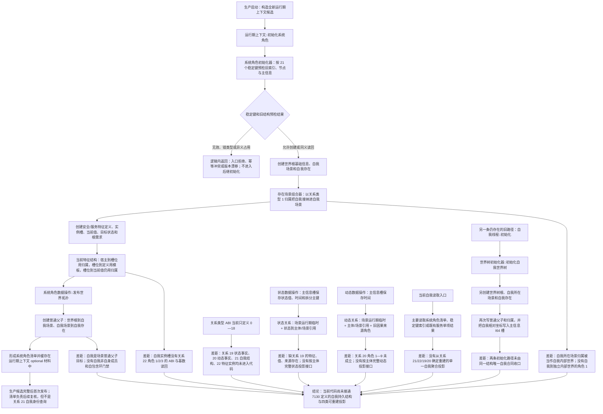

# NODE-TYPED-MIGRATION NT-P2C 自我内部世界与事实投影迁移现状流程图

更新时间：2026-07-22

## 依据

```text
当前事实基线：main@1185e1b458b9c83244cd775dea3825931a134787
代码证据：
- 海中鱼巣/领域/初始化.系统角色.ixx
- 海中鱼巣/领域/数据操作.系统角色.ixx
- 海中鱼巣/领域/系统角色清单.数据.h
- 海中鱼巣/领域/数据操作.存在场景.ixx
- 海中鱼巣/领域/数据操作.特征体系.ixx
- 海中鱼巣/领域/数据操作.状态动态.ixx
- 海中鱼巣/领域/初始化.世界树.ixx
- 海中鱼巣/线程/自我线程.ixx
- 海中鱼巣/核心/句柄.h

差距裁决依据：规范 4010、4020、4110、4210、4220、7130。
```

## 身份与边界

本图是 `main@1185e1b4` 的代码现状图，只证明当前调用和结构事实，不表示这些结构符合现行规范，也不得作为绕过 NT-P1、NT-P2A、NT-P2B 和后继叶子计划的施工许可。

## 流程图



## 关键边界

```text
1. 当前“自我场景”是现有启动结构中的场景身份，不得因名称相近就解释为 7130 的自我内部世界。
2. 当前系统角色清单和运行期 optional 材料是实现材料；它们不能替代关系 21 对唯一自我、内部世界和成员的结构裁决。
3. 当前自我槽位虽然已有宿主、模板和当前值三段语义，但关系类型和唯一性合同仍不是关系 22。
4. 当前状态/动态可以逐项读回旧材料，但缺少关系 19/20 的完整角色，不能据此宣称自我状态/动态投影已接通。
5. 本图没有运行构建或程序；全部判断来自指定基线的只读代码扫描。
```
