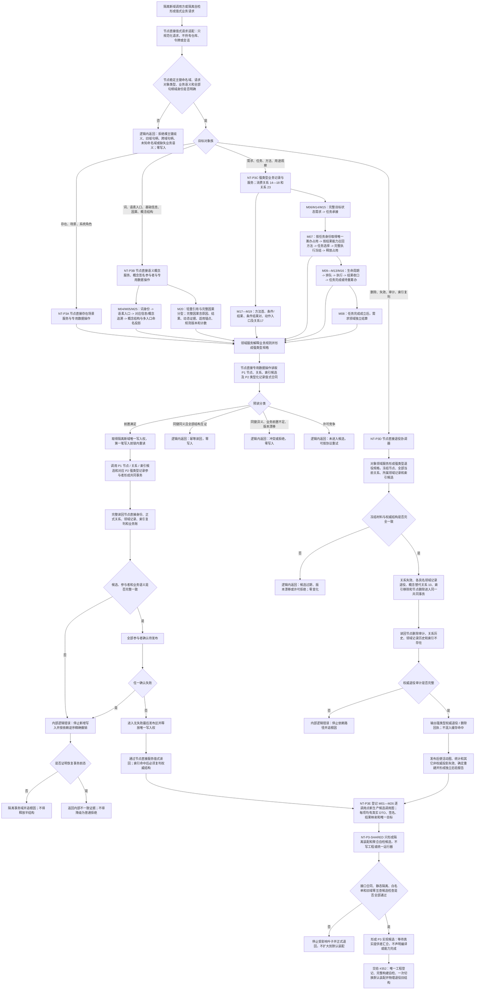

# NODE-TYPED-MIGRATION NT-P3 服务兼容删除审计迁移施工流程图

更新时间：2026-07-23

## 依据

```text
AGENTS.md
计划/20260722_NODE-TYPED-MIGRATION_节点直接身份与领域类型化持久结构代码修订总计划_v0.4.md
计划/20260722_NODE-TYPED-MIGRATION_NT-P3_服务兼容删除审计收口子计划_v0.4.md
规范/0050_项目通用机器逻辑与禁止性规则总纲_20260721.md
规范/4010_子规范_统一仓库稳定句柄与通用关系索引边界.md
规范/4020_子规范_领域类型化数据记录与组合读取投影边界.md
规范/4030_子规范_基础信息服务分层与领域写授权.md
规范/4040_子规范_不透明结构事务候选确认撤销与最后发布.md
规范/4050_子规范_入口拒绝逻辑内结果与内部逻辑错误.md
规范/4060_子规范_非权威缓存统计失效与确定重建.md
规范/7100_子规范_存在概念与实例创建最小闭环_20260720.md
规范/7130_子规范_自我内部世界成员特征与事实读取投影.md
规范/7140_子规范_概念身份生命周期退役删除与活动投影分账.md
规范/4330_子规范_因果用途观察证据账与阶段推进.md
NT-P1、NT-P2A、NT-P2B、NT-P2C 详细设计形成的隔离新域候选合同
详细设计：规范/详细设计/NODE-TYPED-MIGRATION_NT-P3_服务兼容删除审计迁移详细设计.md
```

## 身份与边界

本图是 NT-P3 的施工目标图。2200、2210、1190、5210、5230、5300、7200、7210、7140 已闭合词 / 入口、因果、任务筹办执行、方法结构和概念分账规则；精确叶子计划登记为 `可执行` 且执行窗口对当前计划段自行完成 S0 后，本图才成为该计划段的代码施工依据。P3 只能建立具名“节点直接”隔离新域服务、专用数据操作、值式请求适配和新生产候选调用图；默认入口、旧装配、旧服务头、旧生产调用方的切换及物理删除统一由 P4 完成。

## 流程图



## 关键边界

```text
1. P3 的所有生产候选模块必须具名“节点直接”新域；同形节点句柄必须通过独立仓库类型、互异仓库身份或具名运行域校验机械拒绝跨域，不能只靠调用约定。
2. 请求适配只做值式输入校验、命名域消歧和结果映射；不得暴露或保存仓库、事务令牌、结构会话、参与者和写锁，也不得回读旧域补项。
3. P3 不复制 P1 的节点 / 关系 / 索引算法，不复制 P2 的领域记录；它只在领域服务解释业务规则后，通过专用数据操作编排已有强类型接口。
4. 每个领域记录参与者必须强类型；删除路径不得重新建立“通用记录退役包”或用 variant / 无类型槽容纳不同领域事实。
5. 权威退役在同一事务中覆盖关系失效、具名领域记录退役、索引移除和节点删除；概念删除还必须同事务创建或复用删除后新增的直接关系 10。缓存、活动快照和统计只在发布后失效与重建，不参与权威完成裁决。
6. M04—M05、M07—M13、M16—M20、M25 必须具备真实 DTO、签名、结果分类和唯一叶子所有者，不得再用“形成缺口记录”冒充可切换映射。
7. 同一任务只有取得任务身份唯一筹办占用的路径可以召回、选择和冻结；第二路径在召回前正常拒绝。任务完成与需求结算、方法运行与任务完成分别裁决。
8. 采用多个独立 worktree 时 P3 叶子可按合同并行；采用长期执行通道时逐计划段施工。两种形态都保持文件和接口所有权互斥，工程 XML 和统一自检运行器只归 #352。
9. P3 只形成可由隔离自检到达的新生产候选调用图。入口.cpp、旧默认装配、旧服务头、旧生产调用方、旧仓库和旧句柄的切换及物理删除只由 P4 完成。
10. 本图不证明 P1—P3 已实施，不证明默认生产已切换，也不证明完整快照恢复或旧材料退役完成。
```
