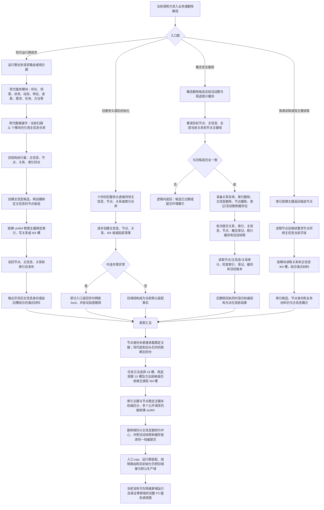

# NODE-TYPED-MIGRATION NT-P3 服务兼容删除审计迁移现状流程图

更新时间：2026-07-22

## 依据

```text
AGENTS.md
计划/20260722_NODE-TYPED-MIGRATION_节点直接身份与领域类型化持久结构代码修订总计划_v0.2.md
计划/20260722_NODE-TYPED-MIGRATION_NT-P3_服务兼容删除审计收口子计划_v0.2.md
规范/0050_项目通用机器逻辑与禁止性规则总纲_20260721.md
规范/4010_子规范_统一仓库稳定句柄与通用关系索引边界.md
规范/4020_子规范_领域类型化数据记录与组合读取投影边界.md
规范/4030_子规范_基础信息服务分层与领域写授权.md
规范/4040_子规范_不透明结构事务候选确认撤销与最后发布.md
规范/4050_子规范_入口拒绝逻辑内结果与内部逻辑错误.md
规范/4060_子规范_非权威缓存统计失效与确定重建.md
代码基线：main@1185e1b458b9c83244cd775dea3825931a134787
海中鱼巣/领域/数据操作.*.ixx、服务.*.ixx 与十四份旧服务头
海中鱼巣/领域/服务.概念安全删除.ixx
海中鱼巣/领域/组合.运行期业务操作.ixx
海中鱼巣/领域/组合.运行期只读查询.ixx
海中鱼巣/线程/路由.运行期业务请求.ixx
海中鱼巣/装配.运行期业务.ixx
海中鱼巣/启动.运行期上下文.ixx
海中鱼巣/入口.cpp
```

## 身份与边界

本图是 `main@1185e1b4` 的只读代码事实图，不是目标施工图。当前工作树中的代码相对该基线零差异；未提交正式规范与设计 WIP 只用于解释目标，不改写本图中的代码事实。图中出现的主信息、旧物理主键和旧服务头只证明迁移差距，不取得继续扩展许可。

## 流程图



## 关键边界

```text
最新限定扫描得到 11 个仍引用主信息仓库的数据操作模块、17 个使用数据操作层的现代服务模块和 14 个旧服务头；这些集合彼此职责不同，不能继续沿用旧计划中的“7/13”数量。
现代服务外形已经具备类型化请求、服务专用数据操作、结构执行器和组合器骨架，但其底层仍创建主信息并绑定裸物理主键。
旧服务头、旧初始化、自我治理旧路由和入口装配仍是当前默认域；NT-P3 不得直接切换或删除它们。
当前概念安全删除保留了关系和节点审计思路，但删除包仍包含已退出的主信息，并把概念登记、活动快照和统计缓存与权威结构混在同一提交结论中。
入口拒绝和具名候选过期属于逻辑内返回；前置通过后的写集、审计、撤销或发布不一致必须追根因解决。
```

## 当前差距与禁止宣称

```text
本图不证明 NT-P1、P2 或 P3 已实施，也不证明新域服务已经可编译。
不得把现代模块名称解释为其已经符合节点直接身份规范。
不得把索引命中、活动快照、统计缓存、日志或删除回执解释为权威结构本身。
不得在 P4 前把旧默认调用方改接隔离新域，或让新旧域句柄、关系、索引和读取投影互查。
```
