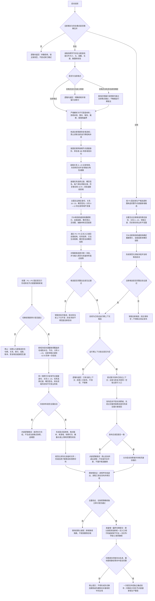

# NODE-TYPED-MIGRATION NT-P4 统一快照恢复退役施工流程图

更新时间：2026-07-22

## 施工元数据

```text
图类型：施工流程图
绑定正式规范：0050、4010、4020、4040、4070、4110、4210、4220、5210、5230、5300、7130、7140
绑定计划：计划/20260722_NODE-TYPED-MIGRATION_NT-P4_恢复退役与全仓验收子计划_v0.2.md
绑定详细设计：规范/详细设计/NODE-TYPED-MIGRATION_NT-P4_统一快照恢复退役验收详细设计.md
允许文件：由 P4 叶子计划按冻结、解析装载、旧材料、最终切换四类精确登记；共享装配只归最终切换叶子
禁止文件：P1—P3 未固定接口、未登记业务语义、外设/显示/SQL/日志；禁止在旧默认域继续新增生产事实
预期结构变化：新域统一冻结与恢复接通，默认装配一次切换，旧主信息及旧默认域物理退役
执行前复核：FREEZE / RESTORE / LEGACY 候选开发读取预冻结合同；CUTOVER 最终执行读取 P1—P3 和 P4 固定候选、旧默认/新候选零互通、文件所有权和模块图
验证方式：Debug/Release、跨进程导出恢复再导出、完整自我读回、故障矩阵、静态零命中、独立覆盖审计
不得宣称：本施工图自身不证明代码已实施、恢复已接通或旧结构已退役
```

## 流程图



## 关键边界

```text
1. P1—P3 只构造具名“节点直接”隔离新域；P4 最终切换前，旧默认域和新候选域在身份、关系、索引、读取、账本、恢复候选与装配上精确零互通。
2. 一次统一冻结必须覆盖命名域 ABI / 高水位、节点、关系 0—23、任务选择、概念签名、全部具名领域记录、历史事实、失效关系和 4170；不得按仓库不同时间分别导出后拼接。
3. 索引、成员 / 槽位 / 状态 / 动态列表、概念登记数组、活动快照、抽象树、召回组、统计缓存和组合投影不作为必需权威段；恢复后只从权威候选确定重建，无事件账统计恢复为空。
4. 序列化只是快照材料编码，不取得机器事实身份；严格解析在任何大规模分配前检查长度、数量、溢出、重复、缺段、校验和和尾随字节。
5. 旧快照只能离线无歧义迁移后作为全新当前格式候选重新准入，或明确拒绝；生产恢复入口不猜测旧主信息槽语义。
6. 全新与恢复只在候选形成方式上不同；全新候选须通过全量互证、投影确定重建和规范化初始冻结，恢复候选还须再冻结与输入相等，二者验证后才进入同一个“空宿主首次发布已验证上下文”入口；不存在恢复替换、清空或在线热切换入口。
7. 恢复失败保持宿主和当前上下文不变，并返回失败；不得自动构造全新候选继续启动。
8. 发布后读回发生在启动消费者之前；不一致属于内部逻辑错误，只能停止进程，不把已发布结构回滚成半旧半新。
9. 完整跨重启恢复必须读回唯一自我、内部世界、关系 19—23、关系 16 选择角色、概念签名、关系 9—12及全部类型化记录和历史。
10. 默认装配切换、旧生产入口 / 影子权威读取不可达、旧仓库 / 句柄 / 字段 / 文件和工程登记删除属于同一最终切换提交；不得让 main 出现可构建但双域生产并列的中间状态。
```
