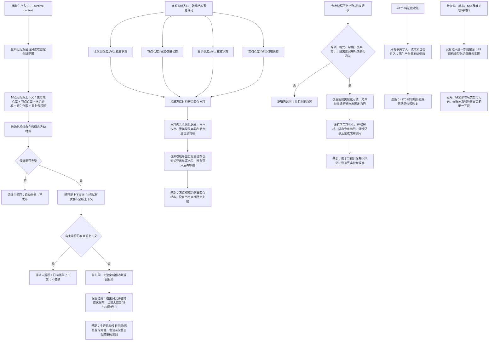

# NODE-TYPED-MIGRATION NT-P4 统一快照恢复退役现状流程图

更新时间：2026-07-22

## 依据

```text
图类型：现状流程图
代码版本：main@1185e1b458b9c83244cd775dea3825931a134787，并读取当前未提交正式规范 WIP
覆盖文件：核心/权威冻结材料.数据.h、核心/仓库快照服务.h、核心四仓库导出、启动.运行期上下文.ixx、装配.运行期业务.ixx、启动.生产运行期.ixx、入口.cpp、领域/参与者.特征批次发布记录.ixx
覆盖函数：四个导出权威状态、评估恢复请求、尝试首次发布全新上下文、生产运行期会话::启动
函数结构图谱：规范/详细设计/函数结构知识图谱/20260722_NODE-TYPED-MIGRATION_NT-P4_函数结构知识图谱.md
输入契约与偏差清单：规范/详细设计/NODE-TYPED-MIGRATION_NT-P4_统一快照恢复退役验收详细设计.md
依据实施记录：无；当前代码与 Git 事实只作差距证据
验证输出：本图形成阶段未构建、未运行程序
不得作为施工许可：是
不得宣称：统一快照、恢复导入、完整自我跨重启恢复或旧结构退役已经实现
```

## 身份与边界

本图只描述当前旧结构域的冻结、恢复评估和全新运行期首发事实。P1—P3 的隔离新域目标尚未成为当前代码事实；本图不得把设计 WIP 画成已实现接口。

## 流程图



## 关键边界

```text
1. 当前 `权威冻结材料` 是主信息、节点、关系、索引四仓值式副本；它不是 4070 定义的完整快照。
2. 当前节点冻结记录仍保存主信息句柄，不保存节点直接稳定主键；主信息冻结仍保存拓扑锚点和无类型值容器。
3. 当前索引被直接放入冻结聚合，但没有“丢弃索引后由权威结构重建”的恢复能力。
4. 当前全仓精确生产导入/隔离装载相关接口为零；四仓导出自检没有跨上下文导入后再导出等价验证。
5. 当前 `仓库快照服务` 不读取文件或数据库，不执行长度/数量/校验和解析，也不构造运行期上下文。
6. 当前 4170 明确“不实现快照或恢复”；P2 计划中的特征值、状态和动态类型化记录也尚未成为代码。
7. 当前宿主拒绝第二次发布和不存在恢复/清空/替换入口是应保留的安全边界，不是恢复缺口本身。
8. 当前生产入口只有全新上下文模式；恢复失败回退全新尚不存在，后继设计必须继续禁止。
9. 当前代码目录约 90 个文件命中主信息句柄/仓库等旧符号；该数量只对应本基线，P4 开工前必须在 P3 固定提交上重扫。
```
