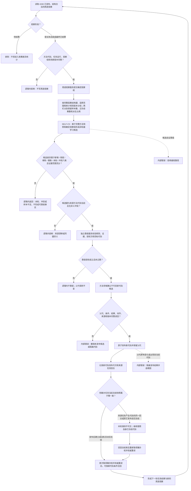

# METHOD-LEARNING：用途观察学习晋级后继回合施工流程图 v0.1

更新时间：2026-07-23

## 依据

- `规范/4330_子规范_因果用途观察证据账与阶段推进.md`
- `规范/5330_子规范_学习相关本能函数边界_20260720.md`
- `规范/5340_子规范_方法学习晋级新代际与任务回合同轮隔离.md`
- `规范/8210_子规范_自我动作验证闭环_20260720.md`
- `规范/详细设计/方法学习候选晋级新代际与后继回合详细设计.md`
- `计划/20260723_SELF-D0_节点直接自我治理闭环设计链重建计划_v0.1.md`

## 施工元数据

| 项 | 冻结内容 |
| --- | --- |
| 图类型 | 待实施目标流程图；不是当前代码流程 |
| 绑定详细设计 | `规范/详细设计/方法学习候选晋级新代际与后继回合详细设计.md` |
| 绑定计划 | #353 设计计划；后继 #358 |
| 允许文件 | SELF-C5 合同和 #358 叶子计划最终白名单 |
| 禁止文件 | 原地改父代、候选自证晋级、任务执行回合反写、共享装配、工程和入口 |
| 预期结构变化 | 用途观察分栏、可重建统计、非权威候选、独立授权、不可变新代际和任务级可见性 |
| 执行前复核 | 核对 4330 三阶段、5330 输入、5340 同轮隔离、发布代次和来源任务回合 |
| 验证方式 | 待结算排除、差异六类、授权拒绝、父代保留、同轮不可见和不同任务分别可见 |
| 不得宣称 | 统计、候选、授权或单次发布均不证明方法好用或学习闭环完成 |

## 身份与边界

本图冻结 `SELF-C5 / v0.1`。它是正式施工设计图，但不证明代码已实现。用途观察、统计和候选不是方法事实；晋级必须独立授权，新代际不可变并只对后继筹办回合可见。

## 关键边界

1. 观察统计和候选可重建，清空它们不改变方法事实。
2. 晋级授权是独立正式事实，方法领域是新代际唯一发布者。
3. 父代保留，新代际不得原地覆盖父代。
4. 产生候选的同一任务回合继续使用原冻结代际。
5. 恢复不自动形成候选、授权或再次晋级。
6. 不保存一个共享“最早可见筹办轮次”；各任务依据当前冻结快照、发布代次、来源任务回合和是否重新取得筹办权分别裁决。发布后建立或没有活动旧冻结的新任务，在首次筹办权威重读时可见。
